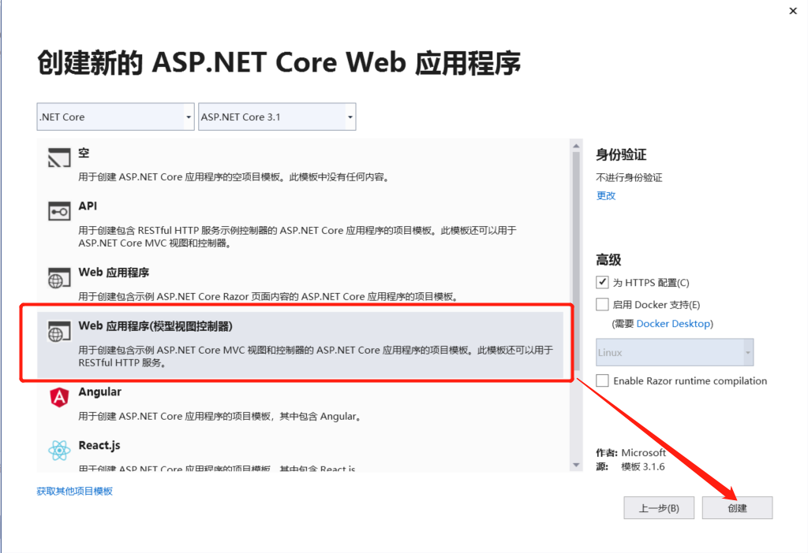
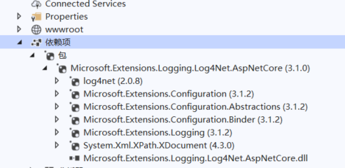
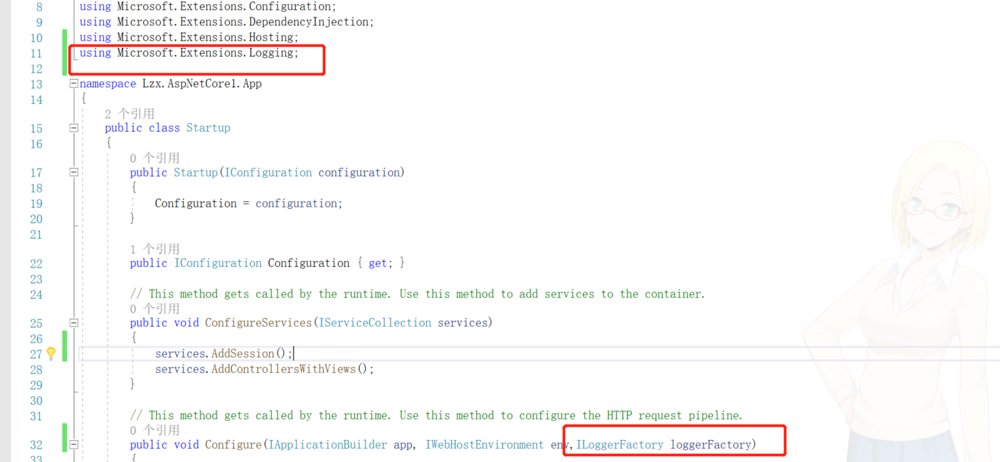
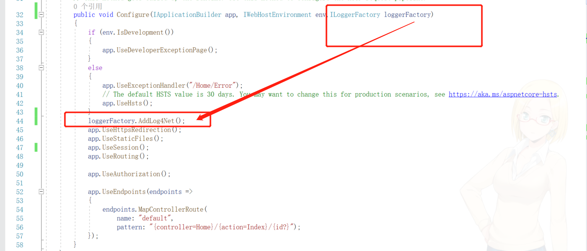
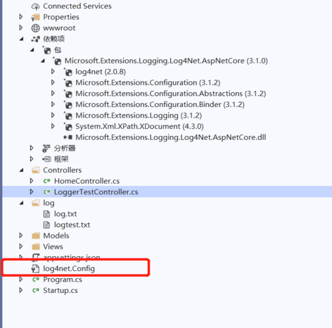
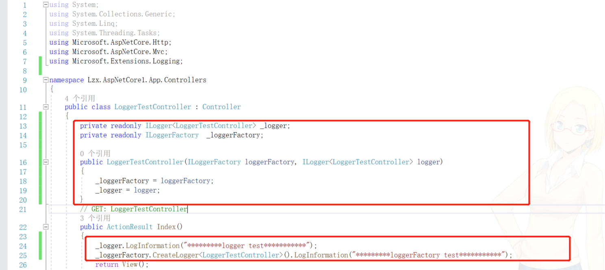
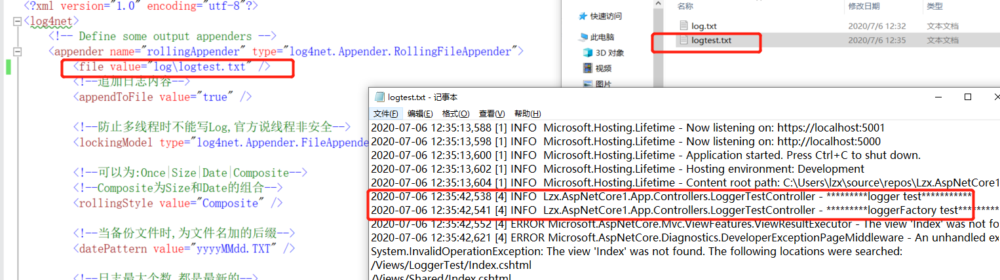

# NetCore开发第一步 Log4Net日志引入

**发布日期:** 2020-07-06  
**原文链接:** https://www.cnblogs.com/morec/p/13254259.html  
**标签:** 无

---

1、新建一个带mvc模板的项目：



2、引入Microsoft.Extensions.Logging.Log4Net.AspNetCore包，不要引入错了。

引入后后包的结果如下：



3、Startup类的Configure方法加入参数 ILoggerFactory loggerFactory，

命名空间为using Microsoft.Extensions.Logging，

Configure方法下面增加一行，loggerFactory.AddLog4Net();

AddLog4Net方法默认会读取配置文件名为log4net.Config的文件，当然可以自定义文件名，如loggerFactory.AddLog4Net("MyTestLog4.Config");配置文件名则必须命名MyTestLog4.Config。



 

4、配置文件内容如下：

```

```
<?xml version="1.0" encoding="utf-8"?>
<log4net>
 <!-- Define some output appenders -->
 <appender name="rollingAppender" type="log4net.Appender.RollingFileAppender">
 <file value="log\logtest.txt" />
 <!--追加日志内容-->
 <appendToFile value="true" />

 <!--防止多线程时不能写Log,官方说线程非安全-->
 <lockingModel type="log4net.Appender.FileAppender+MinimalLock" />

 <!--可以为:Once|Size|Date|Composite-->
 <!--Composite为Size和Date的组合-->
 <rollingStyle value="Composite" />

 <!--当备份文件时,为文件名加的后缀-->
 <datePattern value="yyyyMMdd.TXT" />

 <!--日志最大个数,都是最新的-->
 <!--rollingStyle节点为Size时,只能有value个日志-->
 <!--rollingStyle节点为Composite时,每天有value个日志-->
 <maxSizeRollBackups value="20" />

 <!--可用的单位:KB|MB|GB-->
 <maximumFileSize value="3MB" />

 <!--置为true,当前最新日志文件名永远为file节中的名字-->
 <staticLogFileName value="true" />

 <!--输出级别在INFO和ERROR之间的日志-->
 <filter type="log4net.Filter.LevelRangeFilter">
 <param name="LevelMin" value="ALL" />
 <param name="LevelMax" value="FATAL" />
 </filter>
 <layout type="log4net.Layout.PatternLayout">
 <conversionPattern value="%date [%thread] %-5level %logger - %message%newline"/>
 </layout>
 </appender>
 <root>
 <priority value="ALL"/>
 <level value="ALL"/>
 <appender-ref ref="rollingAppender" />
 </root>
</log4net>
```

```


5、新建LoggerTestController控制器，构造函数依赖注入写入日志类，写入测试内容：



至此已完成日志的基本配置。写入日志如下：

当然这整个的文本都是Log4net写入的，由框架写入。



---

*本文档由博客园下载器自动生成*
