# Typora使用教程

**发布日期:** 2021-07-02  
**原文链接:** https://www.cnblogs.com/morec/p/14962201.html  
**标签:** 无

---

# Typora是一款轻便简洁的Markdown编辑器，支持即时渲染技术，这也是与其他Markdown编辑器最显著的区别。即时渲染使得你写Markdown就想是写Word文档一样流畅自如，不像其他编辑器的有编辑栏和显示栏。 优点:

- 简洁美观

- 实时预览

- 扩展语法

- 跨平台

- 免费

使用教程:

# 模式切换

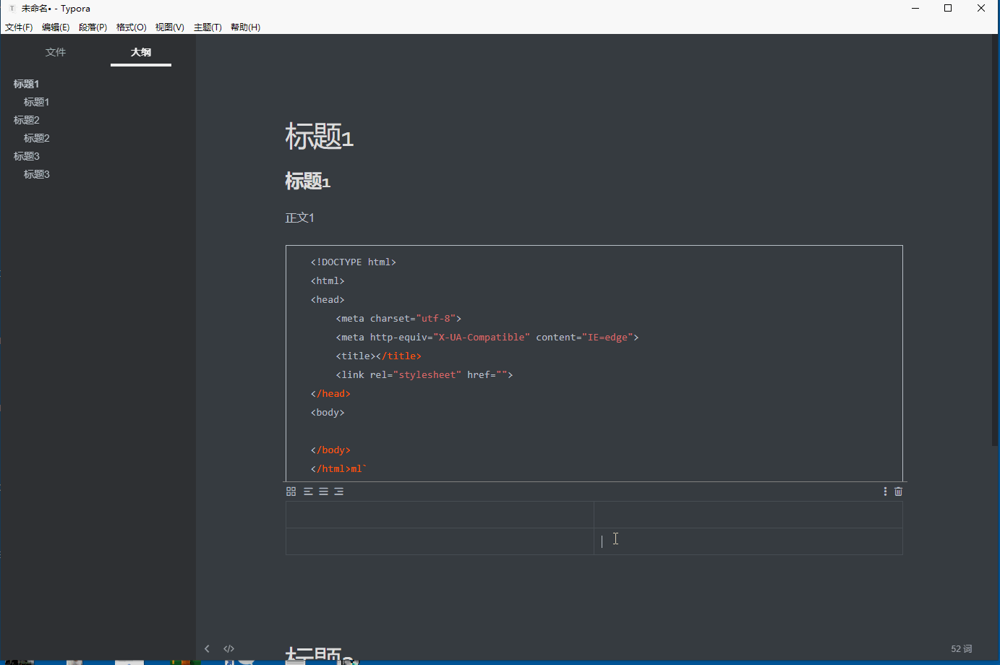

# 文字处理

1.标题 标题一共有六级,是用“#”实现的，标题前面加一个“#”，代表一级标题；依次类推，标题前面加六个“#”代表六级标题；一共有六级标题，编辑各种文档完全够用,左侧的目录会根据输入的标题自动生成响应的层级。
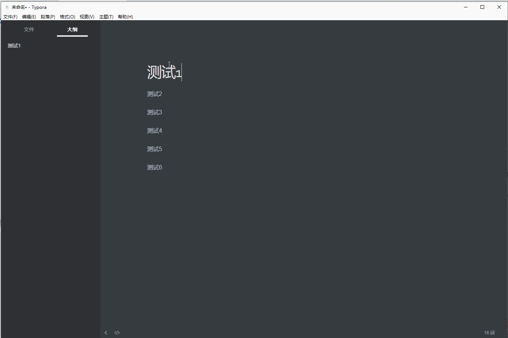

2.强调 在要强调内容前后分别加两个“*”号。
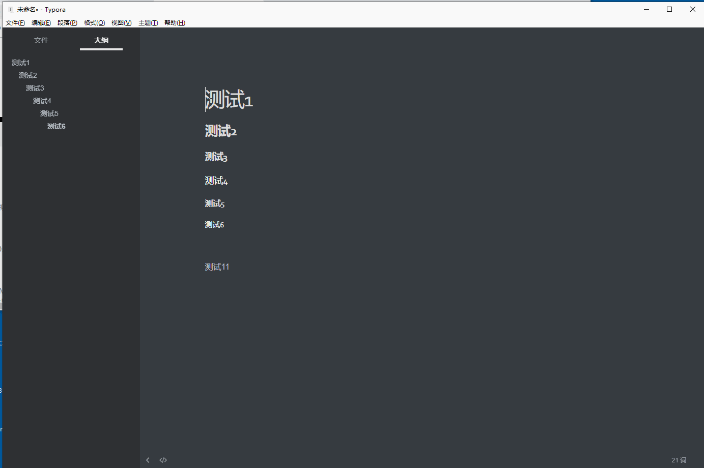

3.斜体 前后分别加一个“*”号。
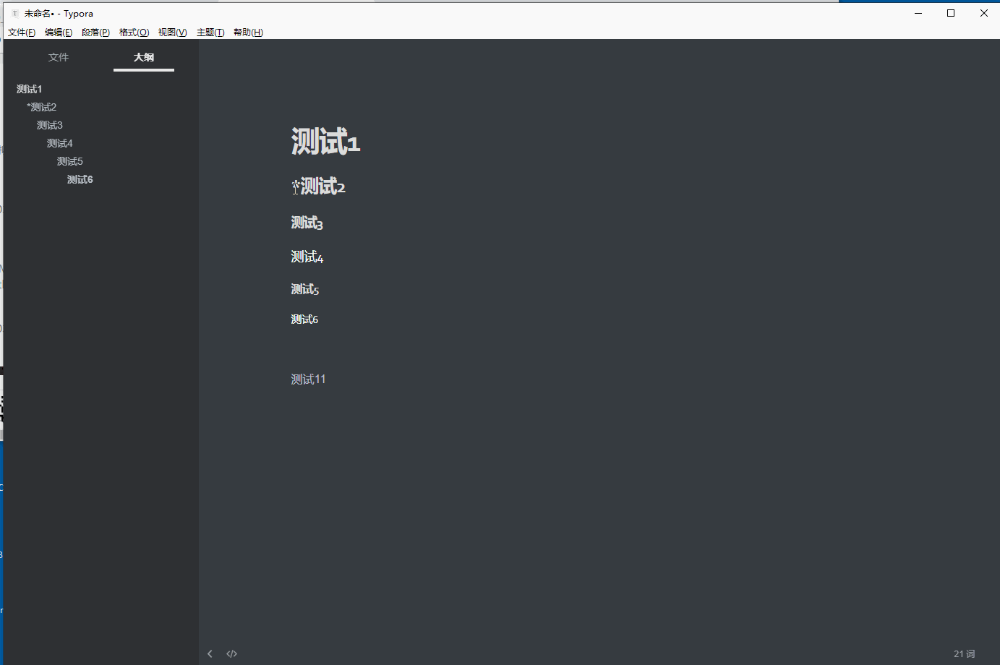

4.删除线 内容前后分别加上两个“~”号。

# list列表处理

1.有序列表 输入数字“1”+“.”+空格 ， 自动开始有序列表。
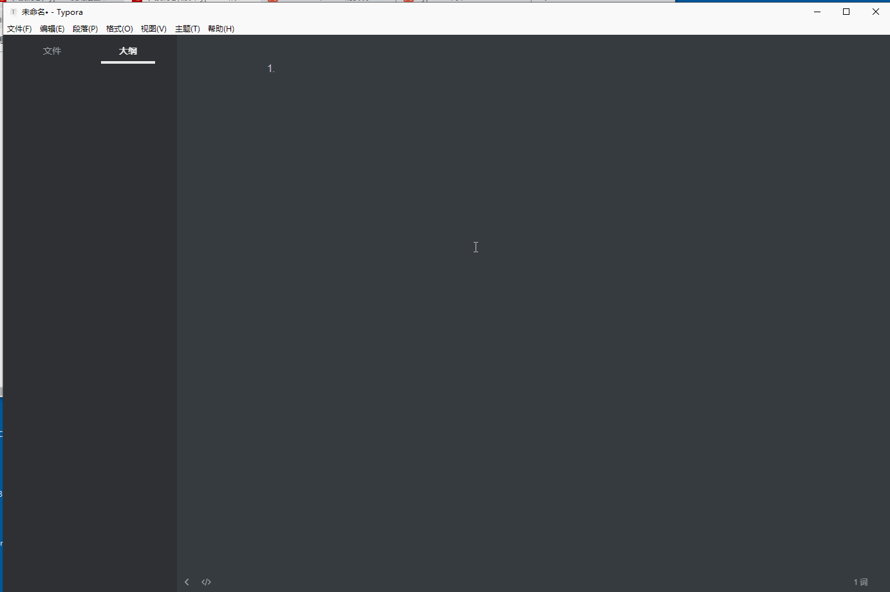

2.无序列表 输入“+”或“-”或“*”+空格，自动开始无序列表。
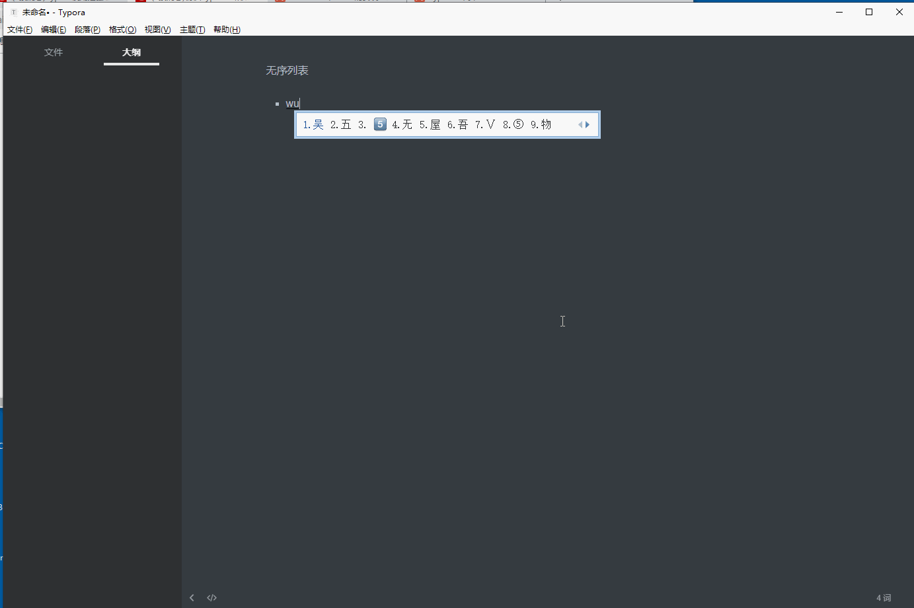

3.table表格 Ctrl+T,在弹出的对话框中选择行列数，自动生成列表。 还可以很方便地对表格进行编辑。
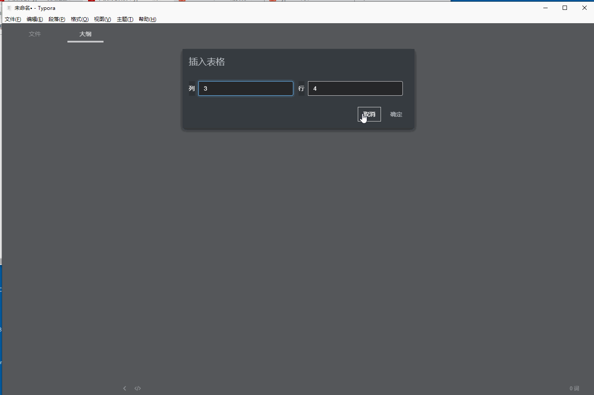

当然还有另外一种建立表格的方式用'|'分隔然后回车创建表格,使用ctrl+回车新添一行

4.分割线 输入三个或三个以上“-”（“*”），再按回车键，即出现一条分割线。
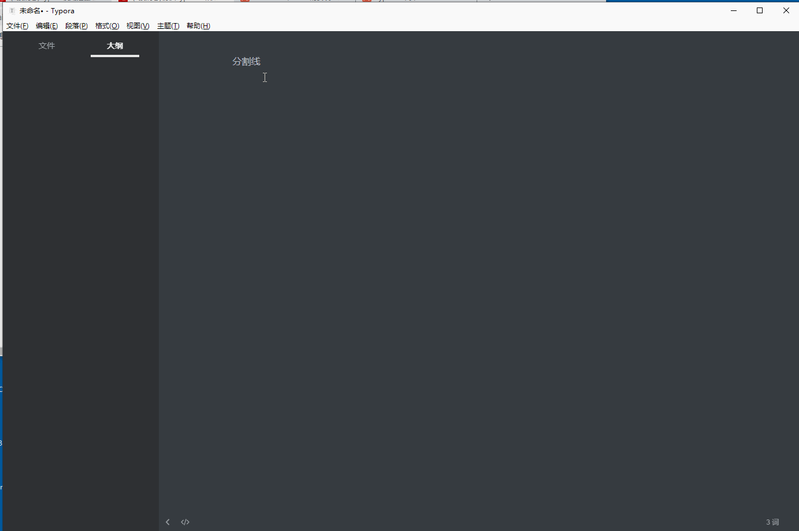

5.插入 插入本地图片：直接把图片拖入即可； 插入网络图片：![图片标题]（图片链接）。
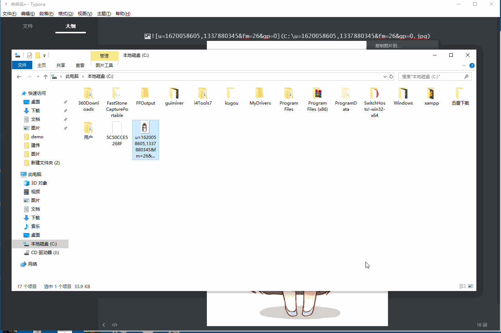

6.链接 [链接提示]+(链接地址)。
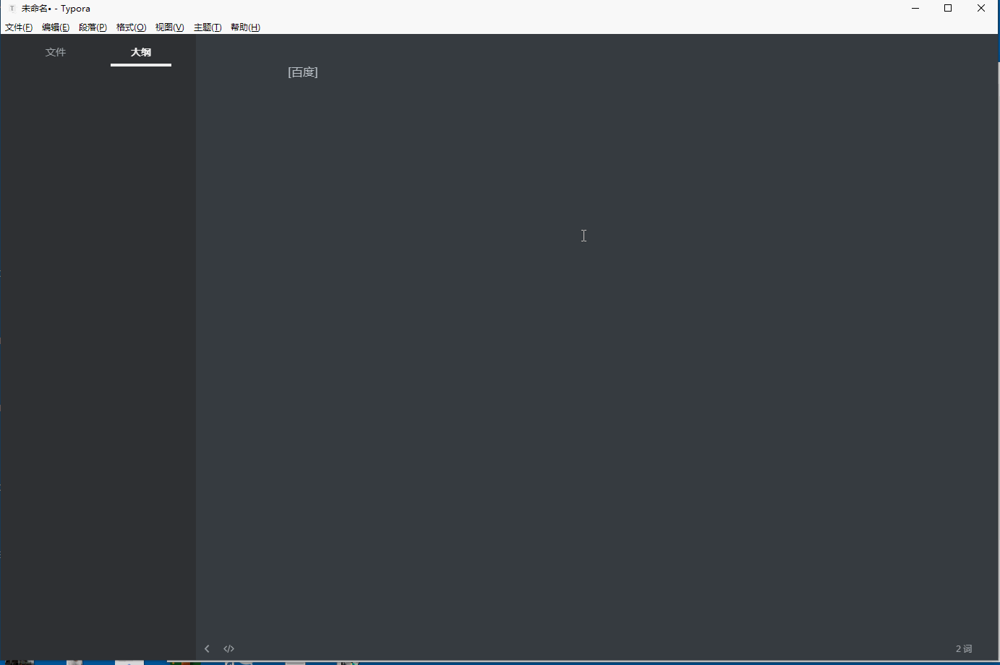

7.数学公式 “$$”+回车。
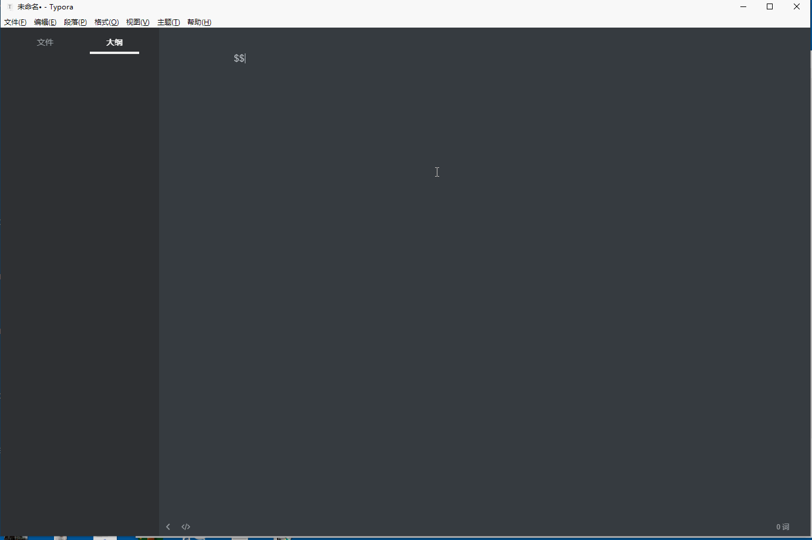

8.代码 行内代码：代码的两端各加一个“`”号，（在Tab键上面，英文输入法）。 代码块：输入三个“~”，按回车键，即可选择编程语言。
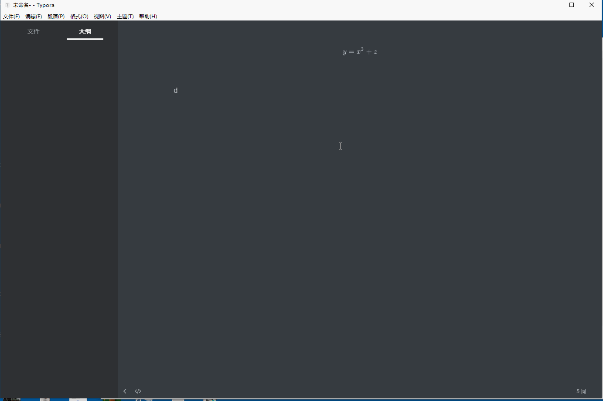

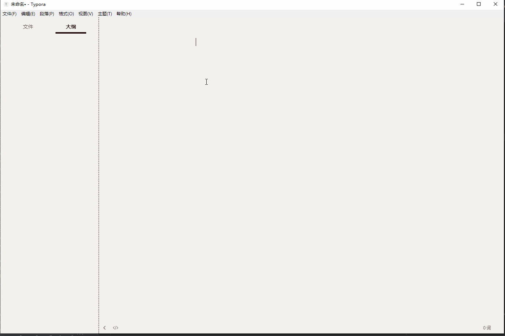

# 导出多种格式文件

typora 的文件导入/导出功能使用 Pandoc 把 Markdown 源码转换成不同的文件格式，所以我们如果想使用文件导入/导出功能，必须先安装 Pandoc。
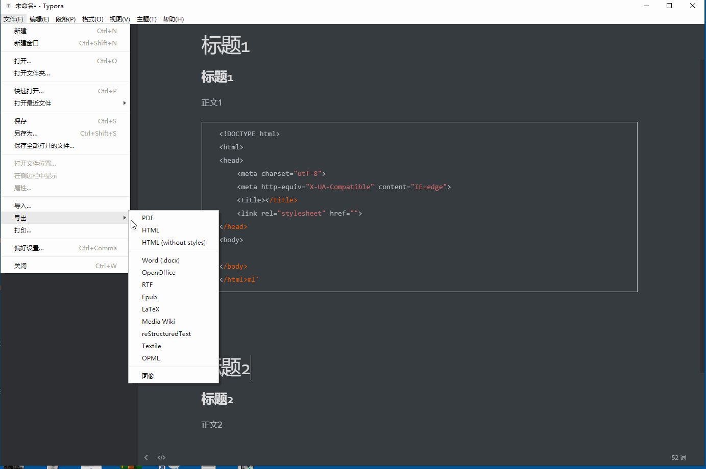

来源: https://www.typora.net/527.html

---

*本文档由博客园下载器自动生成*
