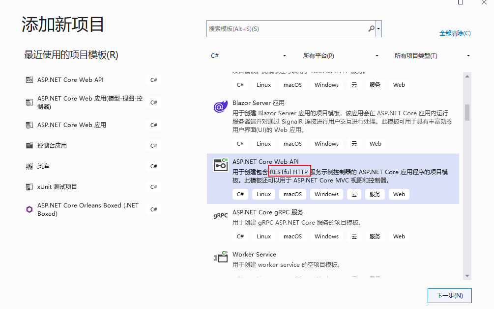
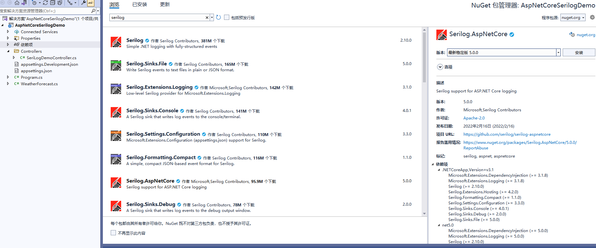
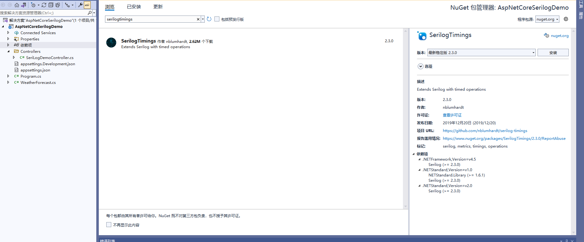
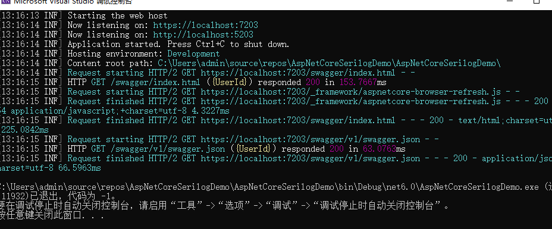
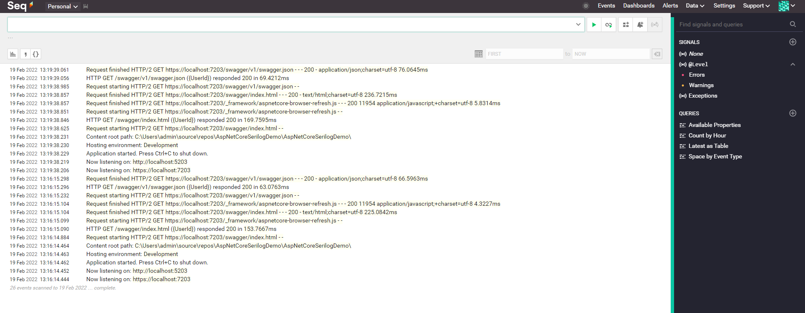
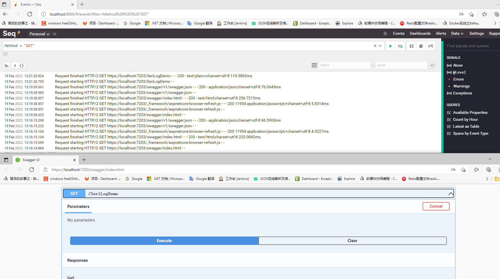
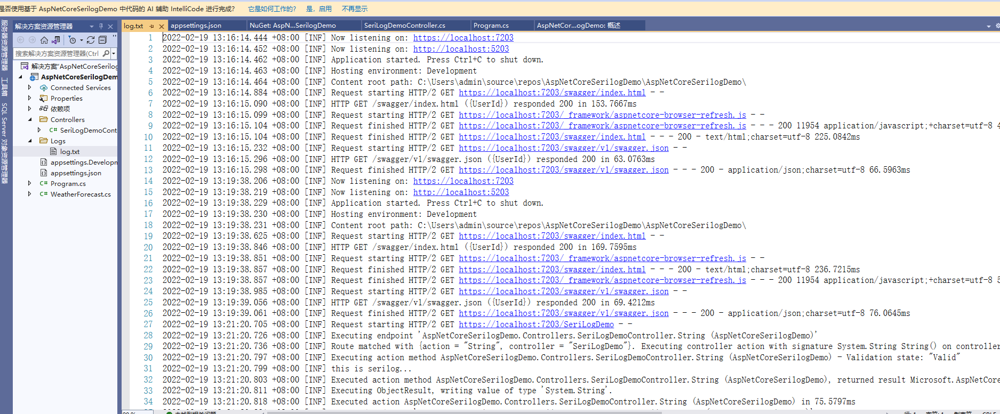
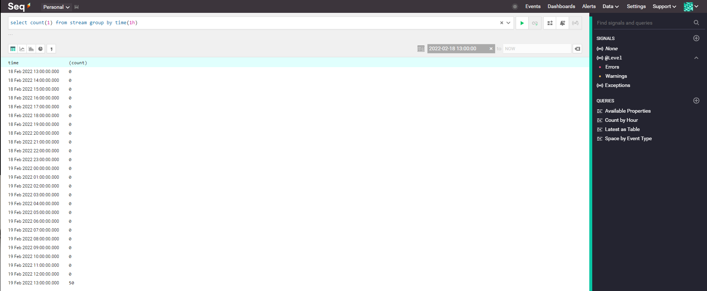

# aspnetcore 使用serilog日志

**发布日期:** 2022-02-19  
**原文链接:** https://www.cnblogs.com/morec/p/15912373.html  
**标签:** 无

---

```html
<div>而在实际项目开发中，使用第三方日志框架来记录日志也是非常多的，首先一般基础的内置日志记录器在第三方日志框架中都有实现，然后很多第三方日志框架在功能上更强大和丰富，能满足我们更多的项目分析和诊断的需求。常用的有log4net,更复杂的elk，项目中有用到exceptionless。下面说的是serilog：

</div>
```

首先建个aspnetcorewebapi6.0的项目



安装组件：





[Seq — centralized structured logs for .NET, Java, Node.js (datalust.co)](https://datalust.co/seq)


```csharp
using Serilog;
using Serilog.Events;

// Setup serilog in a two-step process. First, we configure basic logging
// to be able to log errors during ASP.NET Core startup. Later, we read
// log settings from appsettings.json. Read more at
// https://github.com/serilog/serilog-aspnetcore#two-stage-initialization.
// General information about serilog can be found at
// https://serilog.net/
```

Log.Logger = new LoggerConfiguration()
 .MinimumLevel.Override("Microsoft", LogEventLevel.Information)
 .Enrich.FromLogContext()
 .WriteTo.Console()
```
 .CreateBootstrapLogger();

```

try
```css
{
 Log.Information("Starting the web host");
 var builder = WebApplication.CreateBuilder(args);
 // Full setup of serilog. We read log settings from appsettings.json
```

 builder.Host.UseSerilog((context, services, configuration) => configuration
 .ReadFrom.Configuration(context.Configuration)
 .ReadFrom.Services(services)
```
 .Enrich.FromLogContext());
 // Add services to the container.

 builder.Services.AddControllers();
 // Learn more about configuring Swagger/OpenAPI at https://aka.ms/aspnetcore/swashbuckle
 builder.Services.AddEndpointsApiExplorer();
 builder.Services.AddSwaggerGen();

 var app = builder.Build();

 // Configure the HTTP request pipeline.
```

 app.UseSerilogRequestLogging(configure =>
```css
 {
 configure.MessageTemplate = "HTTP {RequestMethod} {RequestPath} ({UserId}) responded {StatusCode} in {Elapsed:0.0000}ms";
 });
 // Configure the HTTP request pipeline.
```

 if (app.Environment.IsDevelopment())
```css
 {
 app.UseSwagger();
 app.UseSwaggerUI();
 }

 app.UseHttpsRedirection();

 app.UseAuthorization();

 app.MapControllers();

 app.Run();
}
```

catch
(Exception ex)
```css
{
 Log.Fatal(ex, "Host terminated unexpexctedly");
}
```

finally
```css
{
 Log.CloseAndFlush();
}

{
 //"Logging": {
 // "LogLevel": {
 // "Default": "Information",
 // "Microsoft.AspNetCore": "Warning"
 // }
 //},
 "Serilog": {
```

 "Using": [ "Serilog.Sinks.Console", "Serilog.Sinks.File", "Serilog.Sinks.Seq" ],
 "MinimumLevel": "Information",
```python
 // Where do we want to write our logs to? Choose from a large number of sinks:
 // https://github.com/serilog/serilog/wiki/Provided-Sinks.
```

 "WriteTo": [
```css
 {
```

 "Name": "Console"
```css
 },
 {
```

 "Name": "File",
```css
 "Args": { "path": "Logs/log.txt" }
 },
 {
```

 "Name": "Seq",
```css
 "Args": { "serverUrl": "http://localhost:8888" }
 }
```

 ],
 "Enrich": [ "FromLogContext", "WithMachineName", "WithThreadId" ],
```css
 "Properties": {
```

 "Application": "AspNetCoreSerilogDemo"
```css
 }
 },
```

 "AllowedHosts": "*"
```css
}

```

运行结果如下，已替换系统自带information：





请求跟踪分析：

```csharp
using Microsoft.AspNetCore.Mvc;

namespace AspNetCoreSerilogDemo.Controllers
{
```

 [ApiController]
 [Route("[controller]")]
```csharp
 public class SeriLogDemoController : ControllerBase
 {

 private readonly ILogger<SeriLogDemoController> _logger;

 public SeriLogDemoController(ILogger<SeriLogDemoController> logger)
 {
 _logger = logger;
 }

```

 [HttpGet]
```csharp
 public string String()
 {
 _logger.LogInformation("this is serilog...");
 return "Suscess";
 }
 
 }
}

```



 配置文件里面输出路径有"Using": [ <span class="pl-s"><span class="pl-pds">"Serilog.Sinks.Console<span class="pl-pds">", <span class="pl-s"><span class="pl-pds">"Serilog.Sinks.File<span class="pl-pds">", <span class="pl-s"><span class="pl-pds">"Serilog.Sinks.Seq<span class="pl-pds">" ],所以同样会输出到日志文件中,指定路径和文件名：</span></span></span></span></span></span></span></span></span>

```html
<span class="pl-s"><span class="pl-pds"><span class="pl-pds"><span class="pl-s"><span class="pl-pds"><span class="pl-pds"><span class="pl-s"><span class="pl-pds"><span class="pl-pds"></span></span></span></span></span></span></span></span></span>

```

 

更多更详细功能参考:

[Serilog — simple .NET logging with fully-structured events](https://serilog.net/)

[Seq — centralized structured logs for .NET, Java, Node.js (datalust.co)](https://datalust.co/seq)

示例代码：

[exercise/AspNetCoreSerilogDemo at master · liuzhixin405/exercise (github.com)](https://github.com/liuzhixin405/exercise/tree/master/AspNetCoreSerilogDemo)

---

*本文档由博客园下载器自动生成*
