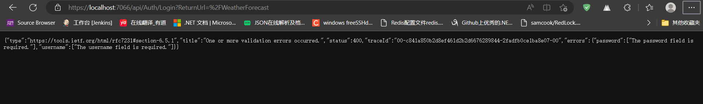
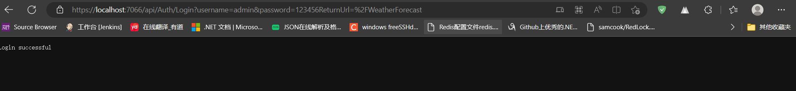
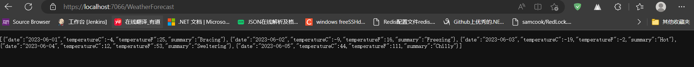
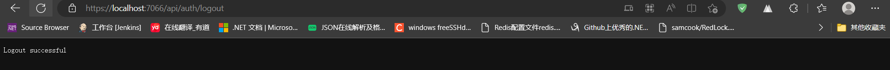
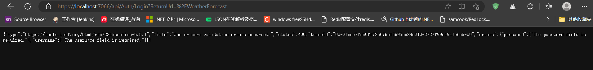

# aspnetcore最最简单的接口权限认证

**发布日期:** 2023-05-31  
**原文链接:** https://www.cnblogs.com/morec/p/17445328.html  
**标签:** 无

---

五月一眨眼就过去，就当凑个数吧。

场景：

一个小小的项目，需要一个后台，就展示几个列表，连用户表、角色表等都不需要设计。

之前有写过identityserver4和jwt4的demo

```
([exercisebook/IdentityServer4&Serilog at main · liuzhixin405/exercisebook · GitHub](https://github.com/liuzhixin405/exercisebook/tree/main/IdentityServer4%26Serilog)

```

[exercisebook/授权/授权一/JwtToken at main · liuzhixin405/exercisebook · GitHub](https://github.com/liuzhixin405/exercisebook/tree/main/%E6%8E%88%E6%9D%83/%E6%8E%88%E6%9D%83%E4%B8%80/JwtToken)),

但是这样一个项目中上这些肯定是大材小用。

微软提供的还有一个就是cookie,既然够简单，那么什么也不用设计，尽量做到最简单，而且后期还可以通过表设计来完善这个的后台登录模块。

首先我们要实现的就是接口代码的授权：

 [Authorize]
 [ApiController]
 [Route("[controller]")]
```csharp
 public class WeatherForecastController : ControllerBase
 {
 private static readonly string[] Summaries = new[]
 {
```

 "Freezing", "Bracing", "Chilly", "Cool", "Mild", "Warm", "Balmy", "Hot", "Sweltering", "Scorching"
```css
 };

 private readonly ILogger<WeatherForecastController> _logger;

 public WeatherForecastController(ILogger<WeatherForecastController> logger)
 {
 _logger = logger;
 }

 [Authorize(Roles = "Admin")] // 要求"Admin"角色的授权
```

 [HttpGet(Name = "GetWeatherForecast")]
```csharp
 public IEnumerable<WeatherForecast> Get()
 {
```

 return Enumerable.Range(1, 5).Select(index => new WeatherForecast
```css
 {
```

 Date = DateOnly.FromDateTime(DateTime.Now.AddDays(index)),
 TemperatureC = Random.Shared.Next(-20, 55),
 Summary = Summaries[Random.Shared.Next(Summaries.Length)]
```css
 })
 .ToArray();
 }
 }

```

上面的特性使得WeatherForecastController接口需要权限才能访问，而GetWeatherForecast接口需要Admin角色就可以访问。

下面就通过program来配置及安全中心和授权策略：

```csharp
using Microsoft.AspNetCore.Authentication.Cookies;

namespace auth_cookie
{
 /// <summary>
 /// 一个简单的Cookie身份验证和授权示例
 /// </summary>
 public class Program
 {
 public static void Main(string[] args)
 {
 var builder = WebApplication.CreateBuilder(args);

 // Add services to the container.

 builder.Services.AddControllers();
 // 配置Cookie身份验证
```

 builder.Services.AddAuthentication(CookieAuthenticationDefaults.AuthenticationScheme)
 .AddCookie(options =>
```css
 {
 options.Cookie.Name = "YourAuthCookie"; // 设置Cookie的名称
 options.LoginPath = "/api/Auth/Login"; // 设置登录路径
 });

 // 配置授权服务
```

 builder.Services.AddAuthorization(options =>
```css
 {
 options.AddPolicy("RequireAdminRole", policy => policy.RequireRole("Admin"));
 });
 // Learn more about configuring Swagger/OpenAPI at https://aka.ms/aspnetcore/swashbuckle
 builder.Services.AddEndpointsApiExplorer();
 builder.Services.AddSwaggerGen();

 var app = builder.Build();

 // Configure the HTTP request pipeline.
```

 if (app.Environment.IsDevelopment())
```css
 {
 app.UseSwagger();
 app.UseSwaggerUI();
 }

 app.UseHttpsRedirection();
 app.UseAuthentication(); // 启用身份验证
 app.UseAuthorization(); // 启用授权

 app.MapControllers();

 app.Run();
 }
 }
}

```

上面的代码够简单的吧，核心代码也就这几行。指定默认的scheme为cookie，写好注释。指定策略RequireAdminRole，要求角色Admin，都可以很灵活的多配置，通过数据库，配置文件等。

```
 // 配置Cookie身份验证
```

 builder.Services.AddAuthentication(CookieAuthenticationDefaults.AuthenticationScheme)
 .AddCookie(options =>
```css
 {
 options.Cookie.Name = "YourAuthCookie"; // 设置Cookie的名称
 options.LoginPath = "/api/Auth/Login"; // 设置登录路径
 });

 // 配置授权服务
```

 builder.Services.AddAuthorization(options =>
```css
 {
 options.AddPolicy("RequireAdminRole", policy => policy.RequireRole("Admin"));
 });

```

这样不算晚，还需要一个登录和登出的授权的接口，而且接口路径写好了，/api/Auth/Login

```csharp
using Microsoft.AspNetCore.Authentication.Cookies;
using Microsoft.AspNetCore.Authentication;
using Microsoft.AspNetCore.Http;
using Microsoft.AspNetCore.Mvc;
using System.Security.Claims;

namespace auth_cookie.Controllers
{
```

 [Route("api/[controller]")]
 [ApiController]
```csharp
 public class AuthController : ControllerBase
 {
 //[HttpPost("login")]
 [HttpGet("login")] //方便测试
 public async Task<IActionResult> Login(string username, string password)
 {
 // 执行验证用户名和密码的逻辑
 //这里可以和存到数据库的用户和密码进行比对
```

 if(username != "admin" && password != "123456")
```css
 {
 return BadRequest("Invalid username or password");
 }
 // 如果验证成功，创建身份验证Cookie
 var claims = new List<Claim>
 {
```

 new Claim(ClaimTypes.Name, username),
```
 new Claim(ClaimTypes.Role, "Admin") // 添加用户角色
 };

 var claimsIdentity = new ClaimsIdentity(
 claims, CookieAuthenticationDefaults.AuthenticationScheme);

```

 await HttpContext.SignInAsync(
 CookieAuthenticationDefaults.AuthenticationScheme,
 new ClaimsPrincipal(claimsIdentity),
```
 new AuthenticationProperties());

 return Ok("Login successful");
 }

 //[HttpPost("logout")]
```

 [HttpGet("logout")]
```csharp
 public async Task<IActionResult> Logout()
 {
 await HttpContext.SignOutAsync(CookieAuthenticationDefaults.AuthenticationScheme);
 return Ok("Logout successful");
 }
 }
}

```

上面的核心代码根据我们配置的做的设置，一一对应，要不然就无权访问WeatherForecastController了：

```javascript
 var claims = new List<Claim>
 {
```

 new Claim(ClaimTypes.Name, username),
```
 new Claim(ClaimTypes.Role, "Admin") // 添加用户角色
 };

 var claimsIdentity = new ClaimsIdentity(
 claims, CookieAuthenticationDefaults.AuthenticationScheme);

下面看看效果，访问 ：https://localhost:7066/WeatherForecast，会自动跳转到https://localhost:7066/api/Auth/Login?ReturnUrl=%2FWeatherForecast

```



```
我们指定一下用户名和密码 https://localhost:7066/api/Auth/Login?username=admin&password=123456ReturnUrl=%2FWeatherForecast

```



```
再来访问 https://localhost:7066/WeatherForecast

```



```
退出登录，https://localhost:7066/api/auth/logout

```



再来访问 

```csharp
```
https://localhost:7066/WeatherForecast
```

```


配合前端的后台管理，一个很简单的后台登陆就这样ok了。

源代码：

[exercisebook/授权/授权三/auth_cookie at main · liuzhixin405/exercisebook · GitHub](https://github.com/liuzhixin405/exercisebook/tree/main/%E6%8E%88%E6%9D%83/%E6%8E%88%E6%9D%83%E4%B8%89/auth_cookie)

---

*本文档由博客园下载器自动生成*
