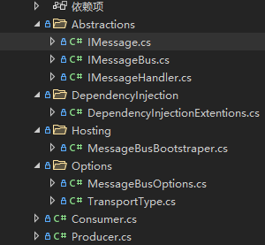
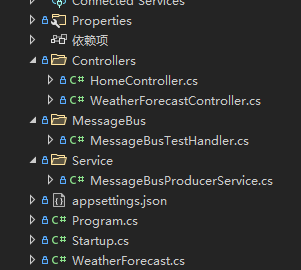

# aspnetcore项目中kafka组件封装

**发布日期:** 2021-09-03  
**原文链接:** https://www.cnblogs.com/morec/p/15222587.html  
**标签:** 无

---

前段时间在项目中把用到kafka组件完全剥离开出来，项目需要可以直接集成进去。源代码如下：

[liuzhixin405/My.Project (github.com)](https://github.com/liuzhixin405/My.Project)

组件结构如下，代码太多不一一列举，可以去git上看：

使用规则如下：

1、新建消费事件和生产服务

2、program中引入即可

 .UseMessageBus(
 (serviceProvider) => new List<IProducer>() { new Producer<SendOrderEvent>() }
 ,
 (serviceProvider) => new List<IConsumer>() { new Consumer<SendOrderEvent, MessageBusTestHandler>($"{ConstDefine.Messagebus_SendOrderTopic}", "SendOrderPersistence") }

 )

---

*本文档由博客园下载器自动生成*
