# centos7虚拟机部署netcore3.1服务供局域网访问

**发布日期:** 2020-10-27  
**原文链接:** https://www.cnblogs.com/morec/p/13883816.html  
**标签:** 无

---

如果买了亚马逊、腾讯、阿里等服务器，基本上几分钟就可以跑aspnetcore，外网访问分分钟。但是便宜点的服务器访问速度就没那么理想。这时候就需要考虑零成本的虚拟机部署了，当然这个基本都是局域网做测试用，这时候遇到最大待解决的问题就是网络访问。

首选虚拟机我选VMware® Workstation 15 Pro，版本15.5.6 build-16341506。linux选择CentOS-7-x86_64-DVD-1908.iso。安装过程就不介绍了。

1、首先进入虚拟机设置，设置网络链接NAT模式。

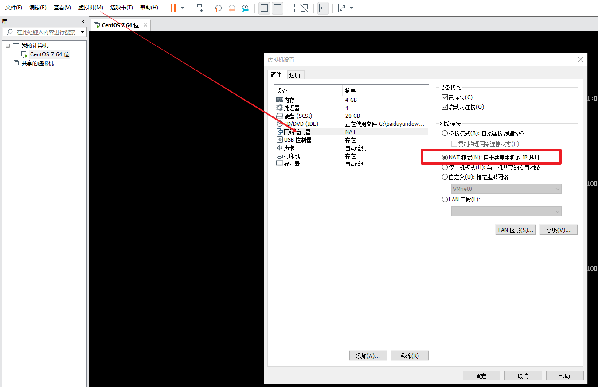

 2、打开虚拟机编辑菜单下虚拟网络编辑器，选择VMnet8。更改设置可以不用点，基本无做ip需更改

，只需要记住几个ip。

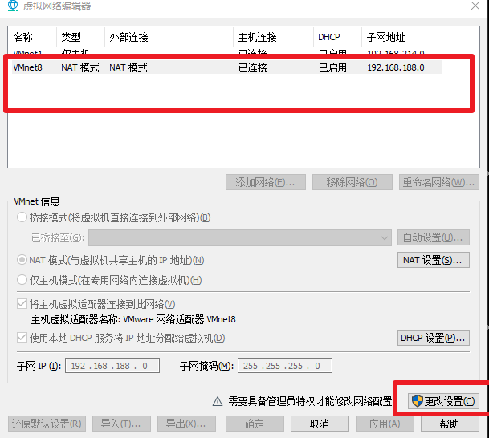

3、记住起始ip段，centos设置ip需要在这个区间内。DHCP设置有的帖子说去掉勾选，我看用到区间ip，所以没有去掉勾选。

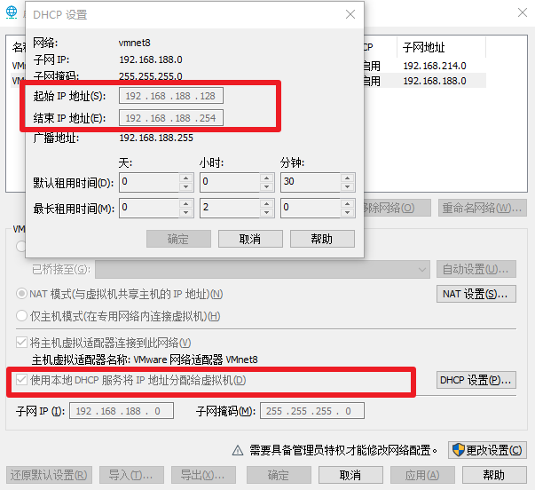

 4、接下来设置虚拟机静态ip，切入到对应路径下，找到ifcfg-ens33文件。不同系统版本文件或者文件夹路径可能有所不同。

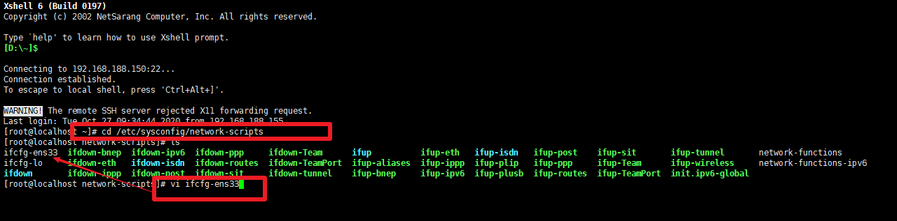

 5、修改ifcfg-ens33 文件如下内容：BOOTPROTO改成static，ONBOOT改成yes。下面的全部是添加的内容。其中ip就是上面第三步的ip区间段，除开DNS是手动设置，其他都是按照上面查询出来的设置的。

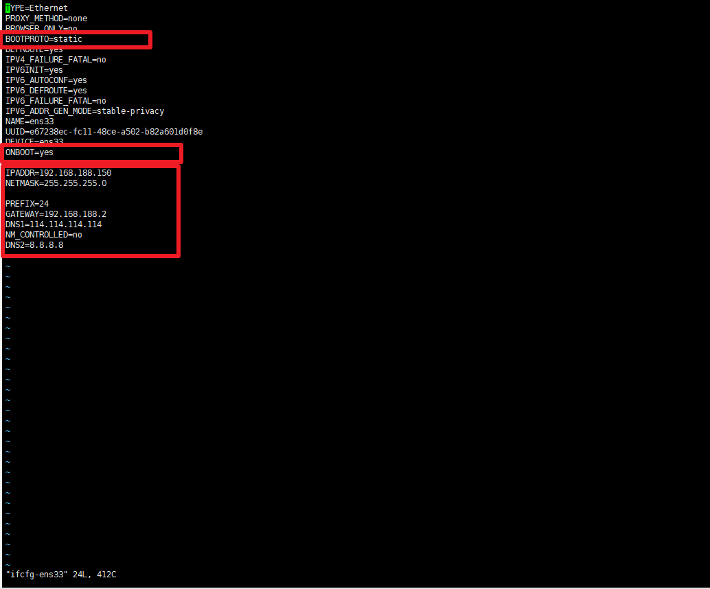

 6、下面设置本地的ip。打开控制面板\网络和 Internet\网络和共享中心，点击更改适配器设置。对应第二步的VMnet8做设置。其中ip不能是centos的ip，但是在第三步的区间内。

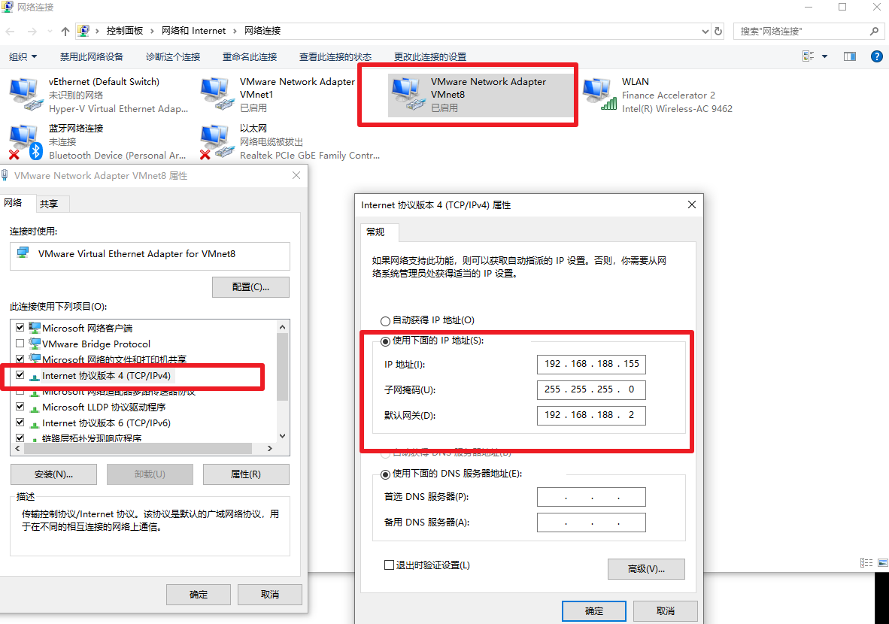

7、先测试下centos的外网访问，ping www.baidu.com。(如果访问不了，需要重启一下系统。)如果外网访问不了，上面步骤一步一步检查。注意虚拟机的ip和主机可以是192.168，但是第三个ip段不要一样以防冲突。实际前两段根据自己电脑显示ip做设置。

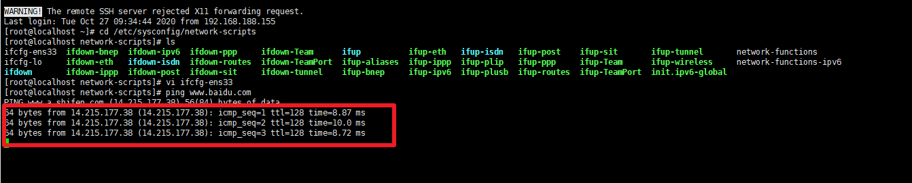

8、 安装netcore对应环境，参照文档如下：

https://docs.microsoft.com/zh-cn/dotnet/core/install/linux-centos，如下命令执行一遍。前提必须能连接外网，ping通baidu。

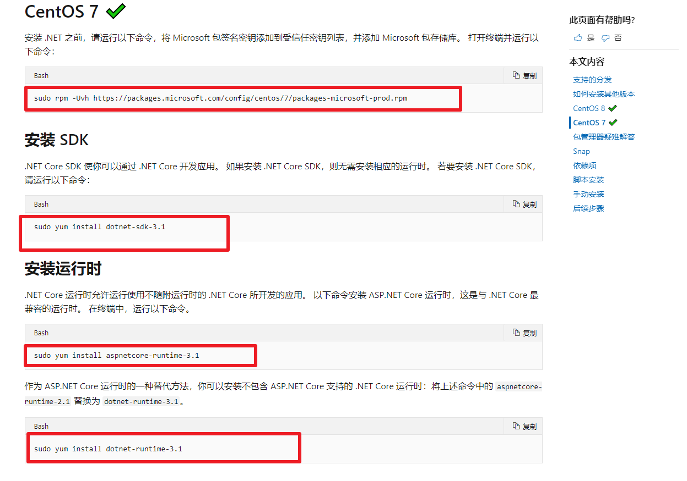

 9、指定ip和端口，ip地址是centos设置地址，端口自行设置。我这里直接关闭了防火墙。有关知识参考：https://jingyan.baidu.com/article/ff42efa9fd8c1cc19e2202bb.html

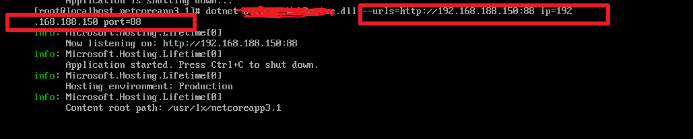

 10、 关键设置，虚拟ip和本地的做映射，供局域网访问 。

目前可以在主机访问192.168.188.150:88，但是外面没法访问。这次需要做第二步的更改设置，启用编辑。

重点：主机端口就是局域网需要访问设置的端口，虚拟机ip就是部署的ip+port，设置完毕！

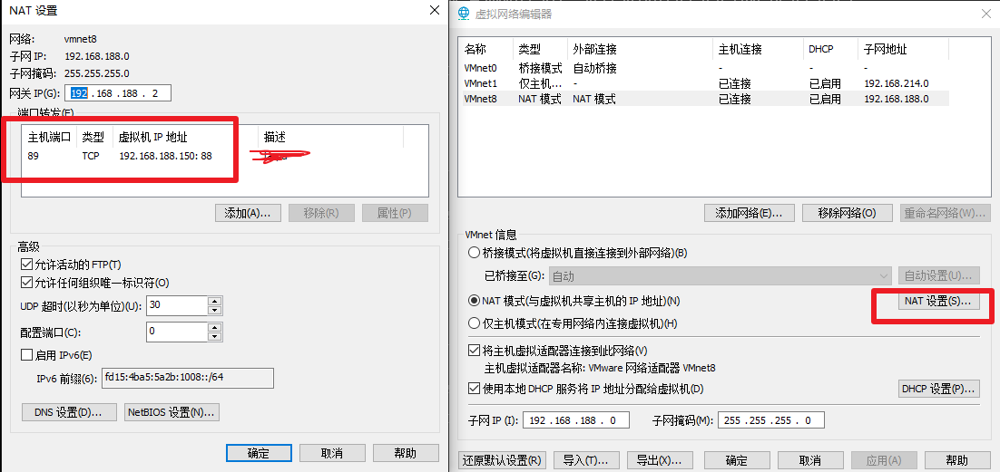

 11、局域网访问，首先cmd主机，ipconfig查找自己的ip地址，加上自己设置的端口89就会访问到centos部署的netcore3.1项目。别忘了还有一步，可以关闭防火墙。也可以增加一个入站规则，新增89端口入站。

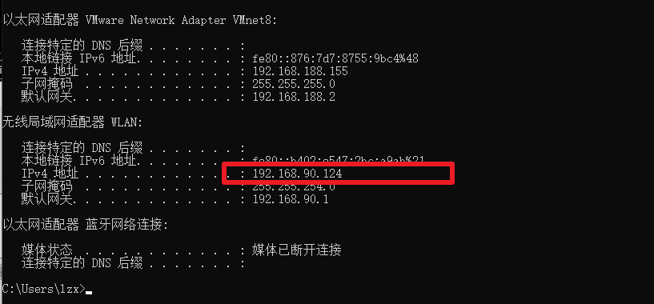

 

 12、总结：

centos部署的项目ip是192.168.188.150:88,最后访问的ip是192.168.90.124:89

---

*本文档由博客园下载器自动生成*
