# firebase studio硬刚cursor,送免费云服务可跑32b大模型

**发布日期:** 2025-04-22  
**原文链接:** https://www.cnblogs.com/morec/p/18841977  
**标签:** 无

---

# 谷歌IDX提供免费高配云服务器（16核CPU，64G内存，300G硬盘），无需绑卡，只需一个能正常使用的谷歌账号。这是一个非常强大的开发环境，特别适合运行大型AI模型和开发工作。

## 一、Google IDX的优势

- 强大的硬件配置：16核CPU、64G内存、300G硬盘空间

- 完全免费：无需信用卡，只需谷歌账号

- 预装多种开发环境：支持多种编程语言和框架

- 云端开发：随时随地访问，无需担心本地硬件限制

- AI模型部署：足够强大运行32B参数量的大模型

## 二、适用场景

- AI开发与实验：

- 运行Ollama等本地大模型（如qwen2.5-coder:32b）

- 使用Cursor、RooCode、Continue等AI编程助手

- 进行机器学习模型训练和部署

- 开发环境：

- Web开发（前后端）

- 移动应用开发

- 数据分析与可视化

- 学习与研究：

- 学习新技术而无需配置本地环境

- 进行计算密集型研究

## 

有些agent想使用还是需要本地模型比较大token比较多才能跑，比如下面这些本地模型，白嫖一个qwen2.5-coder:32b到本地不是更爽。
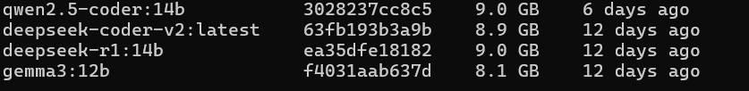

下面介绍如何白嫖

访问https://studio.firebase.google.com/ 登录谷歌账号，该勾选的勾选，进到下面界面:

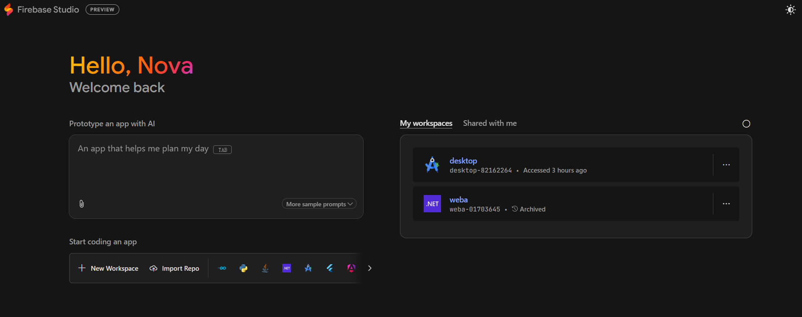

 进入newworkspce可以创建的应用太多了

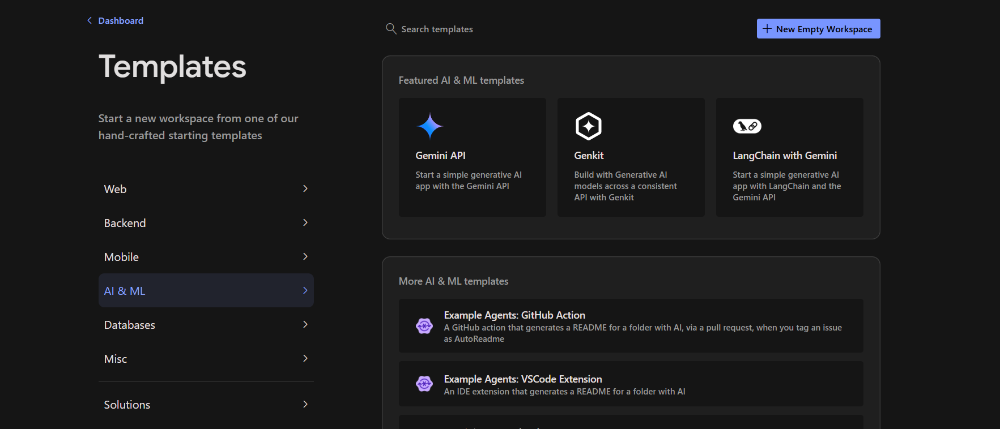

 不废话，开胃菜，我首先建了一个netcore，

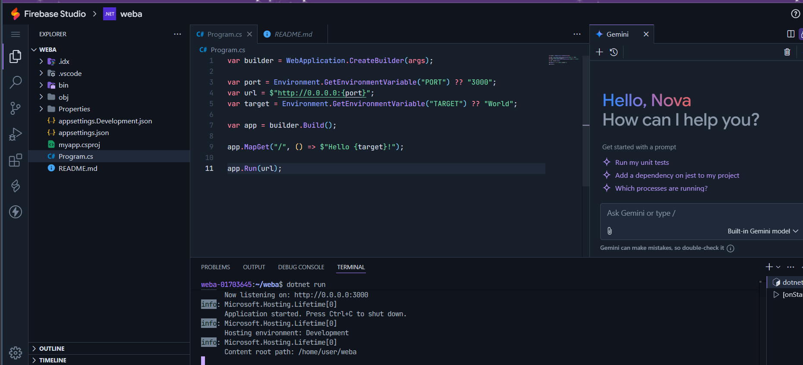

 拷贝地址访问如下：

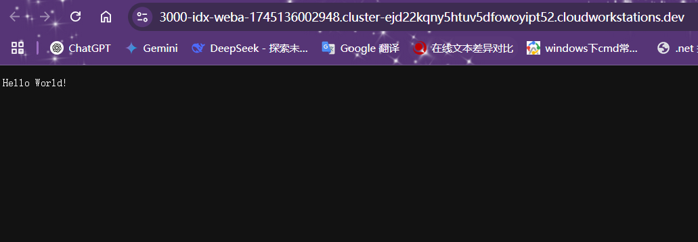

下面就是白嫖一个linux，点击android studio cloud

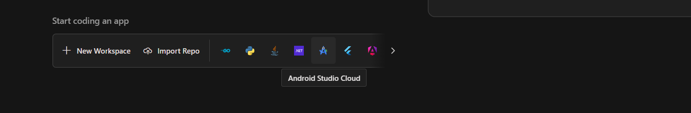

 取个名字，稍等几分钟

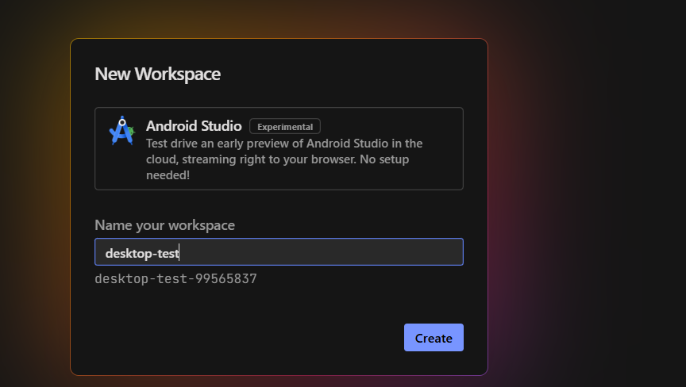

随便点一个

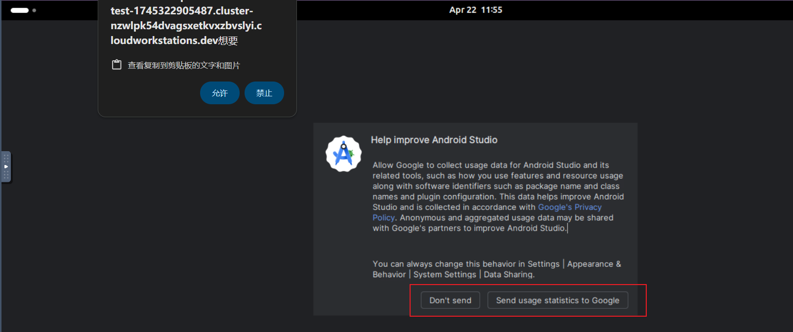

叉掉android studio新建界面，然后按照下图

 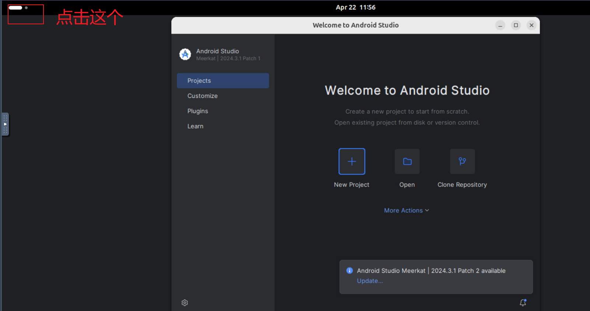

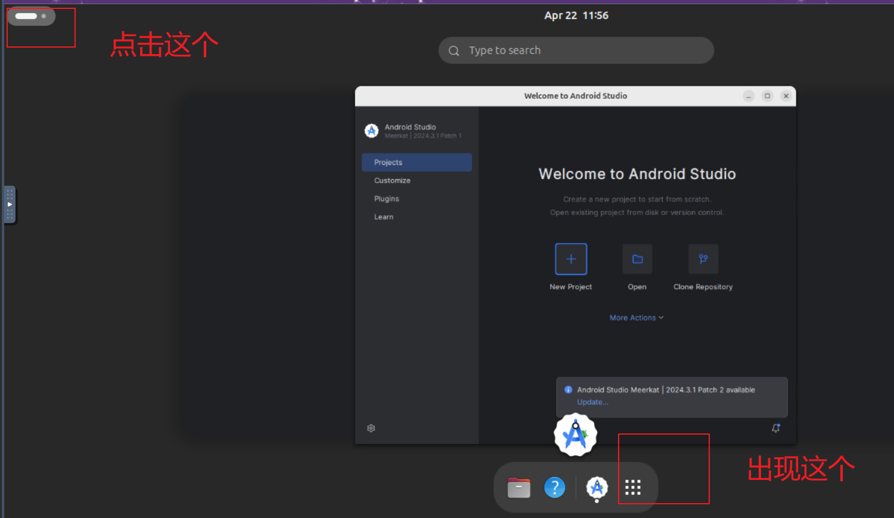

 linux这就出来了，配置什么的自己看少不少你的。

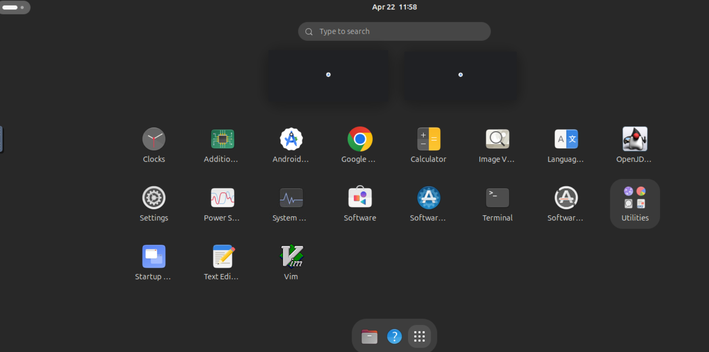

一个ubuntu系统，软件系统升级，系统语言，中文输入法略， 然后通过Terminal安装ollama

```csharp
# 下载
wget https://github.com/ollama/ollama/releases/download/v0.6.5/ollama-linux-amd64.tgz 到home下面，自己新建目录xxxx,然后解压进去。
# 修改文件属性
chmod +x /home/xxxx/bin/ollama

# 将路径加入用户PATH中(推荐)
export PATH=/home/xxxx/bin:$PATH

# 启动
ollama serve
先运行起来，再新建一个控制台
```
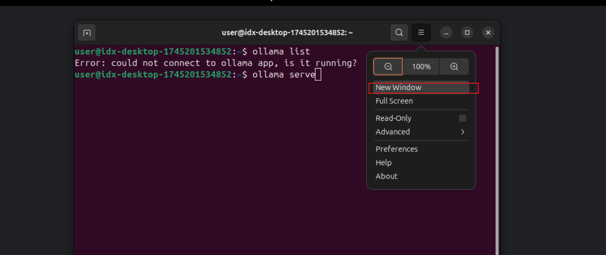

```csharp
等下装个中文输入法问他中国话
```
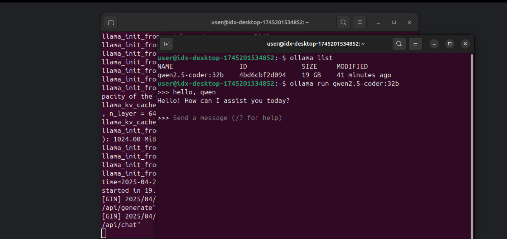

## 三、注意事项与限制

- 系统重启：服务器会每2小时自动重启一次，但所有文件和程序都会保留

- 数据持久性：建议定期备份重要数据 

- 网络访问：可以配置为外网访问，但需要额外设置

- 资源监控：使用<span class="markdown-inline-code leading-[1.4]">htop等工具监控系统资源使用情况</span>

- 可持续性：这是一项测试服务，Google可能随时调整政策

---

*本文档由博客园下载器自动生成*
