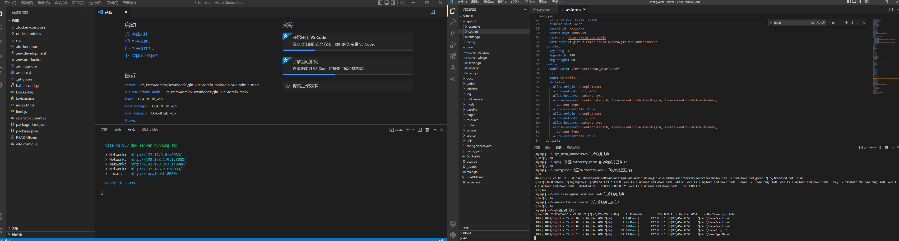
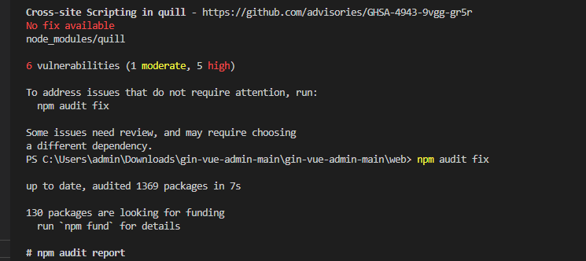
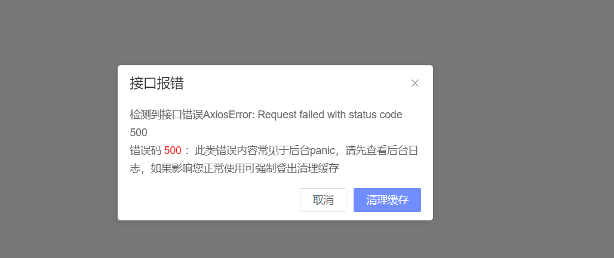
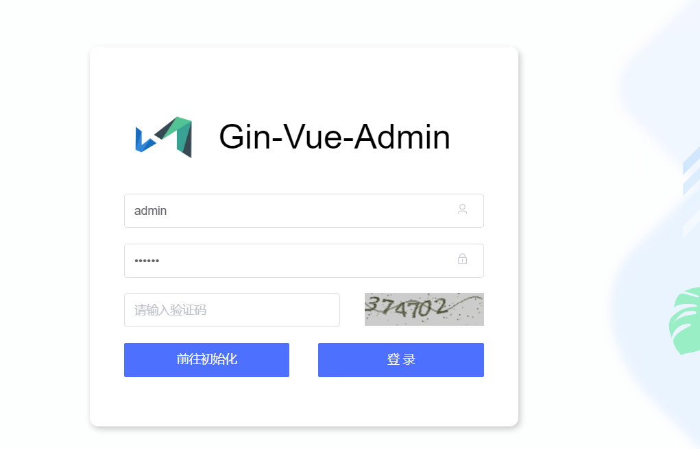
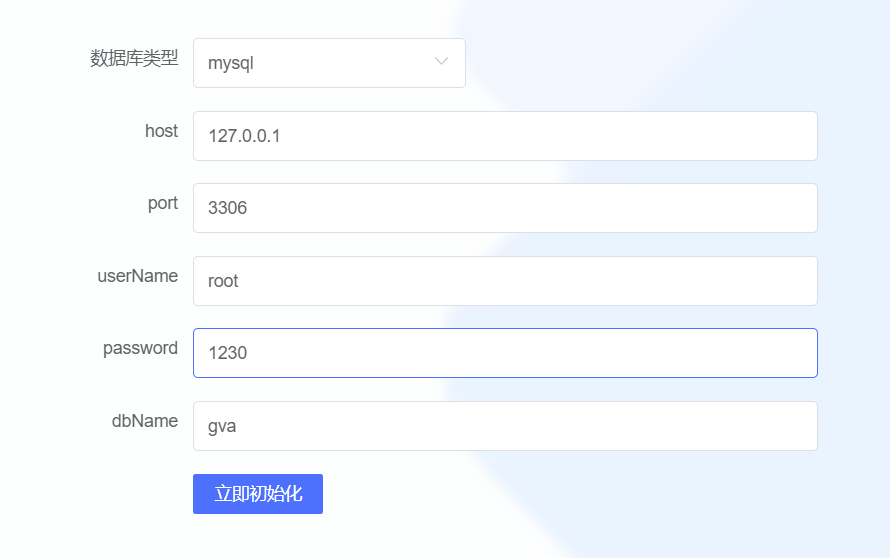
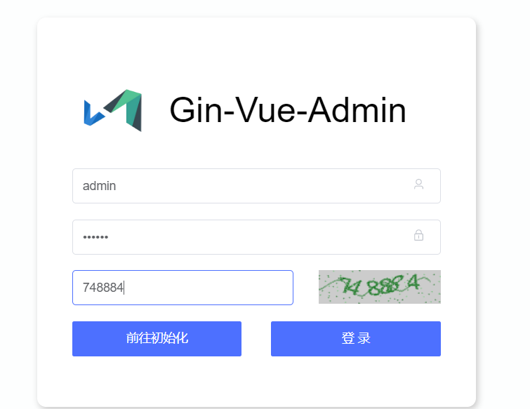
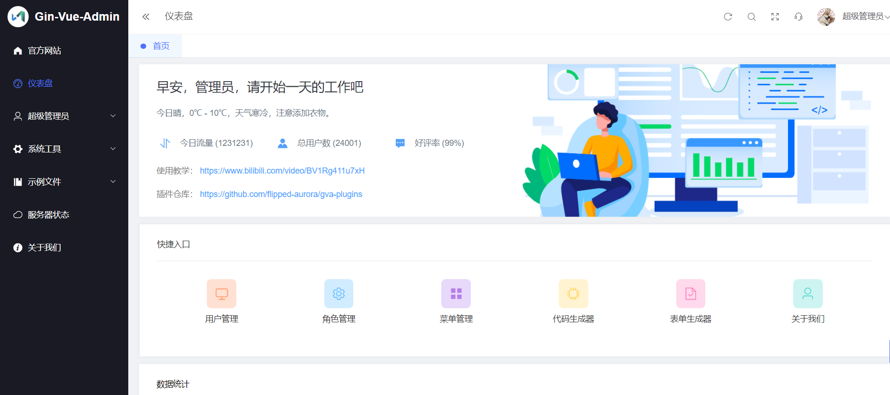
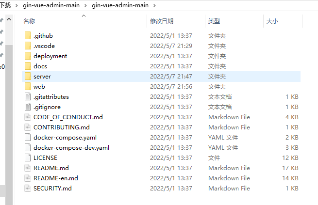

# gogin web框架部署学习

**发布日期:** 2022-05-07  
**原文链接:** https://www.cnblogs.com/morec/p/16244405.html  
**标签:** 无

---

首先去git上面找了一个gin框架拿来学习gin web开发：

[flipped-aurora/gin-vue-admin: 基于vite+vue3+gin搭建的开发基础平台（已完成setup语法糖版本），集成jwt鉴权，权限管理，动态路由，显隐可控组件，分页封装，多点登录拦截，资源权限，上传下载，代码生成器，表单生成器等开发必备功能，五分钟一套CURD前后端代码。 (github.com)](https://github.com/flipped-aurora/gin-vue-admin)

1.下载代码，2.解压文件 3.用vscode分别打开server和web文件夹。

4.go mod tidy初始化go的依赖项

5.执行命令go run main.go

我这里有一个报错[github.com/flipped-aurora/gin-vue-admin/server]2022/05/07 - 22:02:22.451 ?[31merror?[0m C:/Users/admin/Downloads/gin-vue-admin-main/gin-vue-admin-main/server/core/server.go:47 listen tcp :8888: bind: An attempt was made to access a socket in a way forbidden by its access permissions.

百度了一下，大概是8888端口受限，需要防火墙-》高级设置-》出站规则，把tcp udp所有端口都开放了（先试试效果，后面再针对性8888开放），重启电脑发现还是一样报错。打开cmd,输入 netstat -nao | findstr 8888，原来是端口被占用了。停掉了seq服务，再执行go run main.go，成功运行。

6.vscodeweb下面执行了npm i,好像失败了，按照提示 执行了npm audit fix --force 又按照下面提示执行了npm audit fix，结果还是没有变化，不管了试试npm run serve,不明觉厉的成功运行起来了。

7. 清理缓存

8. 前往初始化数据库

9.输入验证码登录

10.开始代码的学习吧！

部署比想象中的顺利，上面git下载地址附带有详细的安装和学习教程和视频的，有需要可以对着学习。

---

*本文档由博客园下载器自动生成*
