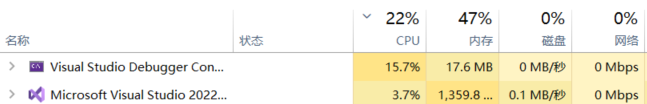
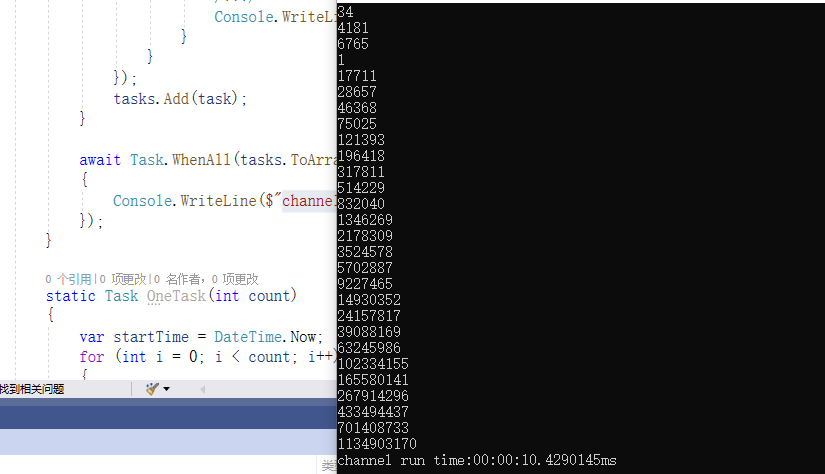
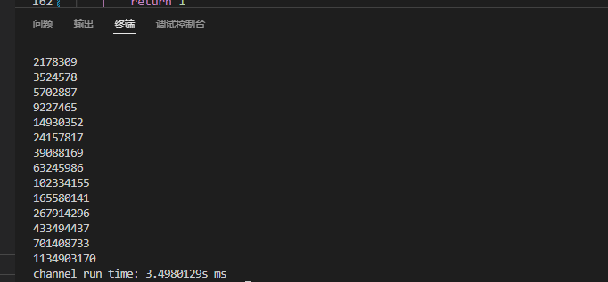

# go和c#实现斐波那契数列

**发布日期:** 2022-05-09  
**原文链接:** https://www.cnblogs.com/morec/p/16250917.html  
**标签:** 无

---

首先通过C#实现斐波那契数列：

```csharp
using System.Threading.Channels;

namespace App001
{
 internal class Program
 {

```

 static async Task Main()
```css
 {
 var count = 45;
 await SomeTask(count); //channel run time:00:00:10.0122552ms
 //await OneTask(count); //run time:00:00:23.1586639ms 
 Console.Read(); //多次运行结果类似
 }

```

 static async Task SomeTask(int count)
```css
 {
 var startTime = DateTime.Now;
 var channel = Channel.CreateUnbounded<long>();
 for (int i = 0; i < count; i++)
 {
 await channel.Writer.WriteAsync(i);
 }
 channel.Writer.Complete();

 List<Task> tasks = new List<Task>();
 for (int i = 0; i < 10; i++)
 {
 var task = Task.Factory.StartNew(async () =>
 {
```

 while (await channel.Reader.WaitToReadAsync())
```css
 {
 if (channel.Reader.TryRead(out var result))
 {
 /***/
 Console.WriteLine(Fib(result));
 }
 }
 });
 tasks.Add(task);
 }

```

 await Task.WhenAll(tasks.ToArray()).ContinueWith(t =>
```css
 {
 Console.WriteLine($"channel run time:{ DateTime.Now.Subtract(startTime)}ms");
 });
 }

```

 static Task OneTask(int count)
```css
 {
 var startTime = DateTime.Now;
 for (int i = 0; i < count; i++)
 {
 Console.WriteLine(Fib(i));
 }
 Console.WriteLine($"run time:{ DateTime.Now.Subtract(startTime)}ms");
 return Task.CompletedTask;
 }

```

 static long Fib(long n)
```css
 {
```

 if (n <= 2)
```
 return 1;
```

 else
```
 return Fib(n - 1) + Fib(n - 2);
 }
 }
}

```

这里是一个任务cpu和内存占用情况：



这里是十个任务cpu和内存占用情况：


结果：



下面是go实现斐波那契的代码：

```css
func main() {
```

 startTime := time.Now()
 jobs := make(chan int, 100)
 results := make(chan int, 100)
```css
 for count := 0; count < 10; count++ {
```

 go worker(jobs, results)
```css
 }

 for i := 0; i < 45; i++ {
```

 jobs <- i
```css
 }

```

 close(jobs)

```css
 for j := 0; j < 45; j++ {
```

 fmt.Println(<-results)
```css
 }
```

 endTime := time.Now()
 fmt.Println("channel run time:", endTime.Sub(startTime), "ms")
```css
}

func worker(jobs <-chan int, results chan<- int) {
 for n := range jobs {
```

 results <- fib(n)
```css
 }
}

func fib(n int) int {
 if n <= 2 {
```

 return 1
```css
 }
```

 return fib(n-1) + fib(n-2)
```css
}

```

cpu和内存占用情况：


运行结果：



代码示例：

[exercise/斐波那契Test at master · liuzhixin405/exercise (github.com)](https://github.com/liuzhixin405/exercise/tree/master/%E6%96%90%E6%B3%A2%E9%82%A3%E5%A5%91Test)

[go/concurrencyTest at main · liuzhixin405/go (github.com)](https://github.com/liuzhixin405/go/tree/main/concurrencyTest)

---

*本文档由博客园下载器自动生成*
