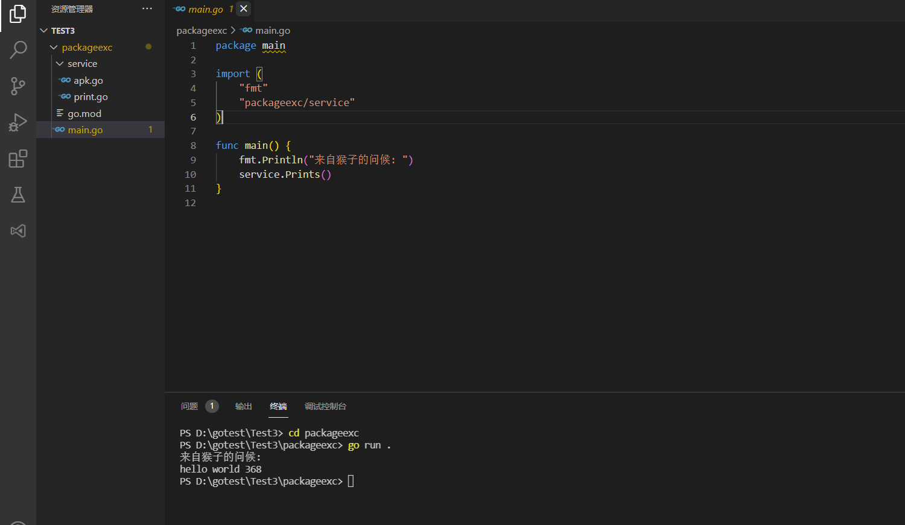
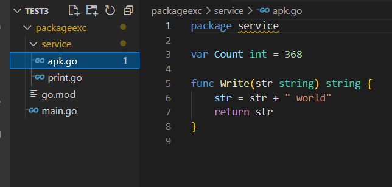
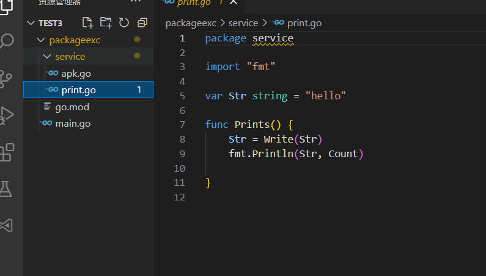
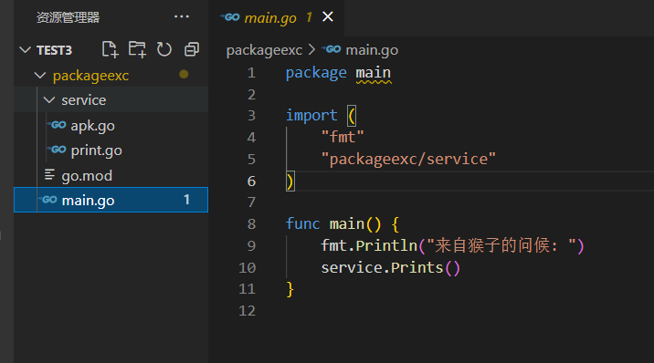
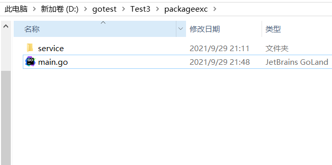
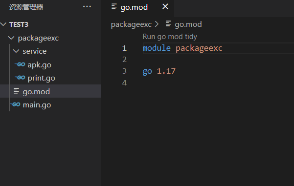
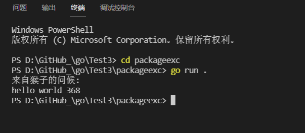

# go语言package使用

**发布日期:** 2021-09-29  
**原文链接:** https://www.cnblogs.com/morec/p/15354613.html  
**标签:** 无

---

近期接触go感觉package包之间引用很麻烦，很绕圈子。下面一起理一理这个package咋用

关于package：

1、不限于一个文件，可以多个文件组成一个package

2、不要求package的名称和所在目录名相同，但是最好保持相同，方便管理

3、每个子目录中只能存在一个package，否则编译报错

4、package是以绝对路径GOPATH来寻址，不要用相对路径来import

文件结构如下

 

首先 service文件夹下面有两个go文件，对于**第一点**service包可以有多个文件所以apk.go和print.go是一个包，相互之间可以直接调用，只需要方法名或者字段名是大写即可。对于**第二点**service包名可以不是service，我这里是保持一致：

 main.go文件和所在目录如下，：

 想要程序能能通过go run .或者 go run main.go运行，首先需要通过go mod命令来建立一个之间引用。

命令如下：go mod init packageexc 

即可生成go.mod文件，如下：

 最后执行: go run . 执行路径要在main.go文件夹下。显示：

关于go.mod最后说两点：

1、第一行 module packageexc中的packageexc跟main.go中import的packageexc/service前面的packageexc一致即可，可以手动更改成别的。

2、上面一点加深， 如果main.go中import的packageexc/service前面的packageexc 改成了 xxx/service,不用上面的就需要先删除go mod后再次执行 go mod init xxx即可。

github地址：

[go/Test3/packageexc at main · liuzhixin405/go (github.com)](https://github.com/liuzhixin405/go/tree/main/Test3/packageexc)

---

*本文档由博客园下载器自动生成*
