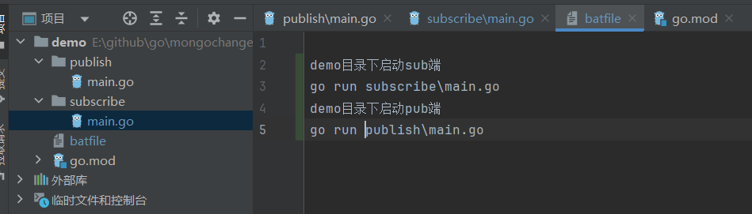
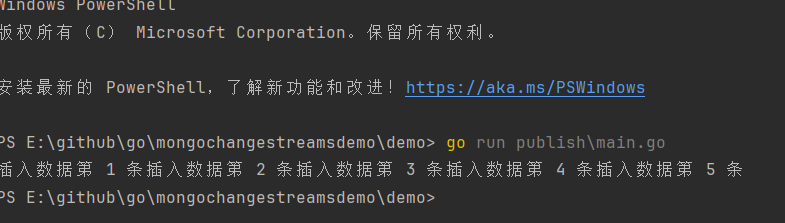
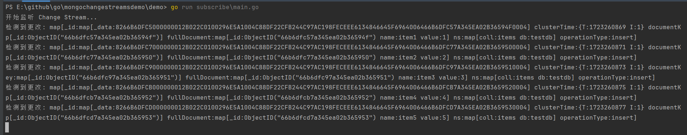
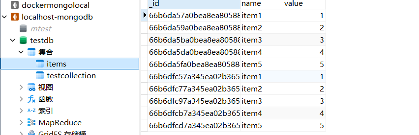
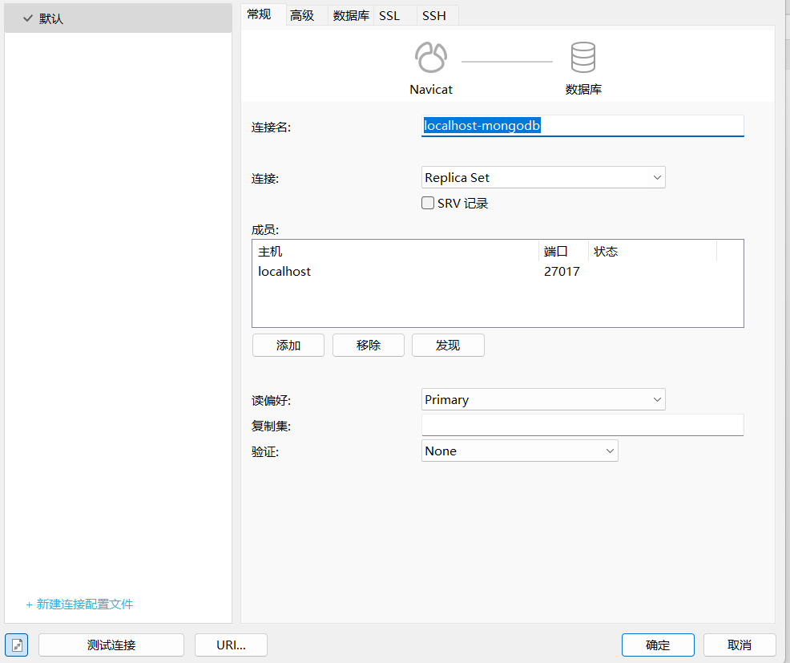
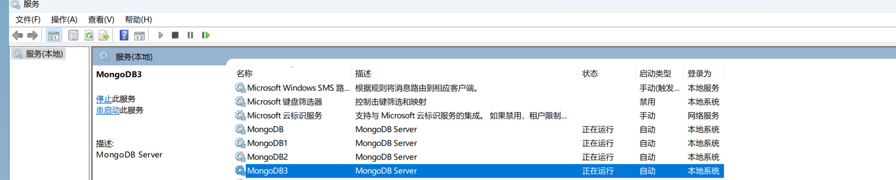

# mongo变更流使用及windows下副本集五分钟搭建

**发布日期:** 2024-08-10  
**原文链接:** https://www.cnblogs.com/morec/p/18352124  
**标签:** 无

---

mongodb的变更流解释:

```
变更流（Change Streams）允许应用程序访问实时数据变更，从而避免事先手动追踪 oplog 的复杂性和风险。应用程序可使用变更流来订阅针对单个集合、数据库或整个部署的所有数据变更，并立即对它们做出响应。由于变更流采用聚合框架，因此，应用程序还可对特定变更进行过滤，或是随意转换通知。([Change Streams - MongoDB Manual v5.0](https://www.mongodb.com/zh-cn/docs/v5.0/changeStreams/))

```

使用场景,需要websocket推送实时数据的时候，我们把数据写入mongo的同时,websocket实时监听mongo数据，拿到后推送到订阅组用户。

这里只做一端新增另一端服务监听测试，及windows下副本集快速搭建流程。



sub端代码

```csharp
```
package main

import (
```

 "context"
 "fmt"
 "go.mongodb.org/mongo-driver/bson"
 "go.mongodb.org/mongo-driver/mongo"
 "go.mongodb.org/mongo-driver/mongo/options"
 "log"
)

```css
func main() {
 // 设置 MongoDB 客户端mongo单机模式不支持这种监听 单机报错 2024/08/10 11:18:54 (Location40573) The $changeStream stage is only supported on replica sets
 clientOptions := options.Client().ApplyURI("mongodb://localhost:27017")
```

 client, err := mongo.Connect(context.TODO(), clientOptions)
```css
 if err != nil {
```

 log.Fatal(err)
```css
 }
```

 defer client.Disconnect(context.TODO())

```
 // 获取数据库和集合
```

 collection := client.Database("testdb").Collection("items")

```
 // 设置 Change Stream
 pipeline := mongo.Pipeline{}
```

 changeStreamOptions := options.ChangeStream().SetFullDocument(options.UpdateLookup)
 changeStream, err := collection.Watch(context.TODO(), pipeline, changeStreamOptions)
```css
 if err != nil {
```

 log.Fatal(err)
```css
 }
```

 defer changeStream.Close(context.TODO())

 fmt.Println("开始监听 Change Stream...")

```
 // 读取 Change Stream
 for changeStream.Next(context.TODO()) {
 var changeEvent bson.M
 if err := changeStream.Decode(&changeEvent); err != nil {
```

 log.Fatal(err)
```css
 }

```

 fmt.Printf("检测到更改: %+v\n", changeEvent)
```css
 }

 if err := changeStream.Err(); err != nil {
```

 log.Fatal(err)
```css
 }
}
```

```

pub端代码

```
package main

import (
```

 "context"
 "fmt"
 "time"

 "go.mongodb.org/mongo-driver/bson"
 "go.mongodb.org/mongo-driver/mongo"
 "go.mongodb.org/mongo-driver/mongo/options"
)

```css
func main() {
 // 设置 MongoDB 客户端
 clientOptions := options.Client().ApplyURI("mongodb://localhost:27017")
```

 client, err := mongo.Connect(context.TODO(), clientOptions)
```css
 if err != nil {
```

 fmt.Println("连接 MongoDB 失败:", err)
 return
```css
 }
```

 defer client.Disconnect(context.TODO())

```
 // 获取数据库和集合
```

 collection := client.Database("testdb").Collection("items")

```
 // 插入数据
 for i := 1; i <= 5; i++ {
 item := bson.D{{"name", fmt.Sprintf("item%d", i)}, {"value", i}}
```

 _, err := collection.InsertOne(context.TODO(), item)
```css
 if err != nil {
```

 fmt.Println("插入数据失败:", err)
 return
```css
 }
 //fmt.Printf("插入数据: %+v\n", item)
```

 fmt.Printf("插入数据第 %d 条", i)
```
 time.Sleep(2 * time.Second) // 模拟一些延迟
 }
}

```

执行结果 pub端



 执行结果 sub端



数据库不用新建集合，自动生成很方便







下面是windows下安装副本集步骤一字不拉

```
https://www.mongodb.com/try/download/community 下载zip包解压 bin目录同级创建data-data4(data内部需要创建好db目录）,log-log4 
```

MongoDB shell version v5.0.28 
注意 data目录下没有db文件夹net start MongoDB执行服务起不来 192.168.2.6 本机ip
mongod.exe --config "E:\mongodb\mongod.conf" --serviceName "MongoDB" --serviceDisplayName "MongoDB" --install

mongod.exe --config "E:\mongodb\mongod1.conf" --serviceName "MongoDB1" --serviceDisplayName "MongoDB1" --install

mongod.exe --config "E:\mongodb\mongod2.conf" --serviceName "MongoDB2" --serviceDisplayName "MongoDB2" --install

mongod.exe --config "E:\mongodb\mongod3.conf" --serviceName "MongoDB3" --serviceDisplayName "MongoDB3" --install

net start MongoDB
net start MongoDB1
net start MongoDB2
net start MongoDB3

bin目录下打开cmd执行mongo.exe 

```css
rs_conf={_id:"rs",
```

members:[
```css
{_id:0,host:"192.168.2.6:27017",priority:1}, 
{_id:1,host:"192.168.2.6:27018",priority:2}, 
{_id:2,host:"192.168.2.6:27019",priority:3}, 
{_id:4,host:"192.168.2.6:27020", arbiterOnly:true}
]}

```

返回这个代表成功:
```css
{
```

 "_id" : "rs",
 "members" : [
```css
 {
```

 "_id" : 0,
 "host" : "192.168.2.6:27017",
 "priority" : 1
```css
 },
 {
```

 "_id" : 1,
 "host" : "192.168.2.6:27018",
 "priority" : 2
```css
 },
 {
```

 "_id" : 2,
 "host" : "192.168.2.6:27019",
 "priority" : 3
```css
 },
 {
```

 "_id" : 4,
 "host" : "192.168.2.6:27020",
 "arbiterOnly" : true
```css
 }
```

 ]
```css
}

```

rs.initiate(rs_conf) 执行配置
```css
{"ok":1}
```

rs.status() 查看状态
```css
{
```

 "set" : "rs",
 "date" : ISODate("2024-08-10T02:40:20.391Z"),
 "myState" : 2,
 "term" : NumberLong(2),
 "syncSourceHost" : "192.168.2.6:27019",
 "syncSourceId" : 2,
 "heartbeatIntervalMillis" : NumberLong(2000),
 "majorityVoteCount" : 3,
 "writeMajorityCount" : 3,
 "votingMembersCount" : 4,
 "writableVotingMembersCount" : 3,
```css
 "optimes" : {
 "lastCommittedOpTime" : {
```

 "ts" : Timestamp(1723257616, 1),
 "t" : NumberLong(2)
```css
 },
```

 "lastCommittedWallTime" : ISODate("2024-08-10T02:40:16.003Z"),
```css
 "readConcernMajorityOpTime" : {
```

 "ts" : Timestamp(1723257616, 1),
 "t" : NumberLong(2)
```css
 },
 "appliedOpTime" : {
```

 "ts" : Timestamp(1723257616, 1),
 "t" : NumberLong(2)
```css
 },
 "durableOpTime" : {
```

 "ts" : Timestamp(1723257616, 1),
 "t" : NumberLong(2)
```css
 },
```

 "lastAppliedWallTime" : ISODate("2024-08-10T02:40:16.003Z"),
 "lastDurableWallTime" : ISODate("2024-08-10T02:40:16.003Z")
```css
 },
```

 "lastStableRecoveryTimestamp" : Timestamp(1723257586, 1),
```css
 "electionParticipantMetrics" : {
```

 "votedForCandidate" : true,
 "electionTerm" : NumberLong(2),
 "lastVoteDate" : ISODate("2024-08-10T02:39:15.909Z"),
 "electionCandidateMemberId" : 2,
 "voteReason" : "",
```css
 "lastAppliedOpTimeAtElection" : {
```

 "ts" : Timestamp(1723257547, 5),
 "t" : NumberLong(1)
```css
 },
 "maxAppliedOpTimeInSet" : {
```

 "ts" : Timestamp(1723257547, 5),
 "t" : NumberLong(1)
```css
 },
```

 "priorityAtElection" : 1,
 "newTermStartDate" : ISODate("2024-08-10T02:39:15.997Z"),
 "newTermAppliedDate" : ISODate("2024-08-10T02:39:16.928Z")
```css
 },
```

 "members" : [
```css
 {
```

 "_id" : 0,
 "name" : "192.168.2.6:27017",
 "health" : 1,
 "state" : 2,
 "stateStr" : "SECONDARY",
 "uptime" : 2677,
```css
 "optime" : {
```

 "ts" : Timestamp(1723257616, 1),
 "t" : NumberLong(2)
```css
 },
```

 "optimeDate" : ISODate("2024-08-10T02:40:16Z"),
 "lastAppliedWallTime" : ISODate("2024-08-10T02:40:16.003Z"),
 "lastDurableWallTime" : ISODate("2024-08-10T02:40:16.003Z"),
 "syncSourceHost" : "192.168.2.6:27019",
 "syncSourceId" : 2,
 "infoMessage" : "",
 "configVersion" : 1,
 "configTerm" : 2,
 "self" : true,
 "lastHeartbeatMessage" : ""
```css
 },
 {
```

 "_id" : 1,
 "name" : "192.168.2.6:27018",
 "health" : 1,
 "state" : 2,
 "stateStr" : "SECONDARY",
 "uptime" : 85,
```css
 "optime" : {
```

 "ts" : Timestamp(1723257616, 1),
 "t" : NumberLong(2)
```css
 },
 "optimeDurable" : {
```

 "ts" : Timestamp(1723257616, 1),
 "t" : NumberLong(2)
```css
 },
```

 "optimeDate" : ISODate("2024-08-10T02:40:16Z"),
 "optimeDurableDate" : ISODate("2024-08-10T02:40:16Z"),
 "lastAppliedWallTime" : ISODate("2024-08-10T02:40:16.003Z"),
 "lastDurableWallTime" : ISODate("2024-08-10T02:40:16.003Z"),
 "lastHeartbeat" : ISODate("2024-08-10T02:40:19.059Z"),
 "lastHeartbeatRecv" : ISODate("2024-08-10T02:40:20.083Z"),
 "pingMs" : NumberLong(0),
 "lastHeartbeatMessage" : "",
 "syncSourceHost" : "192.168.2.6:27017",
 "syncSourceId" : 0,
 "infoMessage" : "",
 "configVersion" : 1,
 "configTerm" : 2
```css
 },
 {
```

 "_id" : 2,
 "name" : "192.168.2.6:27019",
 "health" : 1,
 "state" : 1,
 "stateStr" : "PRIMARY",
 "uptime" : 85,
```css
 "optime" : {
```

 "ts" : Timestamp(1723257616, 1),
 "t" : NumberLong(2)
```css
 },
 "optimeDurable" : {
```

 "ts" : Timestamp(1723257616, 1),
 "t" : NumberLong(2)
```css
 },
```

 "optimeDate" : ISODate("2024-08-10T02:40:16Z"),
 "optimeDurableDate" : ISODate("2024-08-10T02:40:16Z"),
 "lastAppliedWallTime" : ISODate("2024-08-10T02:40:16.003Z"),
 "lastDurableWallTime" : ISODate("2024-08-10T02:40:16.003Z"),
 "lastHeartbeat" : ISODate("2024-08-10T02:40:19.060Z"),
 "lastHeartbeatRecv" : ISODate("2024-08-10T02:40:20.022Z"),
 "pingMs" : NumberLong(0),
 "lastHeartbeatMessage" : "",
 "syncSourceHost" : "",
 "syncSourceId" : -1,
 "infoMessage" : "",
 "electionTime" : Timestamp(1723257555, 1),
 "electionDate" : ISODate("2024-08-10T02:39:15Z"),
 "configVersion" : 1,
 "configTerm" : 2
```css
 },
 {
```

 "_id" : 4,
 "name" : "192.168.2.6:27020",
 "health" : 1,
 "state" : 7,
 "stateStr" : "ARBITER",
 "uptime" : 85,
 "lastHeartbeat" : ISODate("2024-08-10T02:40:19.059Z"),
 "lastHeartbeatRecv" : ISODate("2024-08-10T02:40:20.092Z"),
 "pingMs" : NumberLong(0),
 "lastHeartbeatMessage" : "",
 "syncSourceHost" : "",
 "syncSourceId" : -1,
 "infoMessage" : "",
 "configVersion" : 1,
 "configTerm" : 2
```css
 }
```

 ],
 "ok" : 1,
```css
 "$clusterTime" : {
```

 "clusterTime" : Timestamp(1723257616, 1),
```css
 "signature" : {
```

 "hash" : BinData(0,"AAAAAAAAAAAAAAAAAAAAAAAAAAA="),
 "keyId" : NumberLong(0)
```css
 }
 },
```

 "operationTime" : Timestamp(1723257616, 1)
```css
}

```

demo代码链接

[go/mongochangestreamsdemo/demo at main · liuzhixin405/go (github.com)](https://github.com/liuzhixin405/go/tree/main/mongochangestreamsdemo/demo)

mongo配置链接

[config/mongo windows集群 at main · liuzhixin405/config (github.com)

```
](https://github.com/liuzhixin405/config/tree/main/mongo%20windows%E9%9B%86%E7%BE%A4)

备注: c#代码监听数据库变化需要连接副本 "Connection": "mongodb://localhost:27017,localhost:27018,localhost:27019"，只27017不会获得更新数据。具体原因可能是封装类库有关，暂没有深究。

```

---

*本文档由博客园下载器自动生成*
