# net core下链路追踪skywalking安装和简单使用

**发布日期:** 2021-06-26  
**原文链接:** https://www.cnblogs.com/morec/p/14933728.html  
**标签:** 无

---

当我们用很多服务时，各个服务间的调用关系是怎么样的？各个服务单调用的顺序\时间性能怎么样?服务出错了，到底是哪个服务引起的？这些问题我们用什么方案解决呢，以前的方式是各个系统自己单独做日志，出了问题从暴出问题的服务开始一个一个服务的排查，耗时耗力，有些日志不全的，还不一定查得出来。好在现在有Skywalking链路追踪系统，可以不用写任何代码，就追踪到各个服务间的调用关系和性能状态等。

本文将从0开始搭建两个webapi项目，使用Skywalking来追踪他们之间的调用关系及响应时间。开发环境为VisualStudio2019

1.1.安装skywalking

安装skywalking会遇到好多坑，首先安装不一定成功，访问8080端口监控页面会出现很多问题。即使监控页面正常了，netcore程序也有可能监控不到，因为链接11800会失败，多数因为skwwalking和elasticsearch版本的问题引起的。因为存储多数选择是elasticsearch，所以这里是以这个为主。像下面通过docker-compose来安装。

文件如下：

version: '3.3'
services:
 elasticsearch:
 image: docker.elastic.co/elasticsearch/elasticsearch:7.5.0
 container_name: elasticsearch
 restart: always
 ports:
 - 9200:9200
 environment:
 - discovery.type=single-node
 - bootstrap.memory_lock=true
 - "ES_JAVA_OPTS=-Xms256m -Xmx256m"
 ulimits:
 memlock:
 soft: -1
 hard: -1
 oap:
 image: apache/skywalking-oap-server:7.0.0-es7
 container_name: oap
 depends_on:
 - elasticsearch
 links:
 - elasticsearch
 restart: always
 ports:
 - 11800:11800
 - 12800:12800
 environment:
 SW_STORAGE: elasticsearch7
 SW_STORAGE_ES_CLUSTER_NODES: elasticsearch:9200
 ui:
 image: apache/skywalking-ui:7.0.0
 container_name: ui
 depends_on:
 - oap
 links:
 - oap
 restart: always
 ports:
 - 8080:8080
 environment:
 SW_OAP_ADDRESS: oap:12800

安装完后查看一下服务是否正常，三个程序分别是elastic、skwwalking、skwwalkingui：

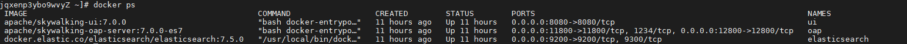

1.2 查看elastic和监控页面是否正常,连接分别为 安装skwwalking服务器ip:9200、安装skwwalking服务器ip:8080,如果遇到端口占用，提前更换：

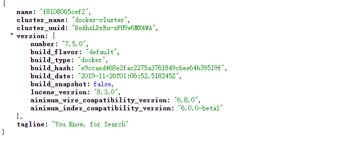

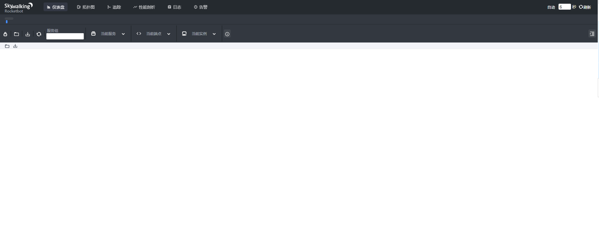

2.上netcore程序,这里先跑两个程序

2.1.新增第一个netcore程序，我这里是net5。

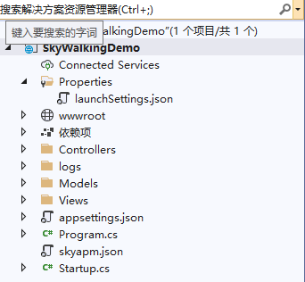

2.2 安装依赖 SkyAPM.Agent.AspNetCore,版本我选最好0.9.0。(有需要先保证安装服务正常，程序监控正常后再着手升级其他的各个版本。)

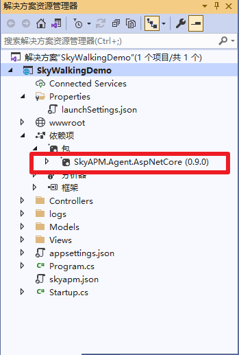

2.3 增加skyapm.json文件,记得属性 **复制到输出目录**里面设置 **始终复制**，防止配置文件修改不生效踩坑。这里需要注意的两个地方是1.ServiceName应该是当前程序的名字，Services是skwwalking服务器ip:11800。

{
 "SkyWalking": {
 "ServiceName": "SkyWalkingDemo",
 "Namespace": "",
 "HeaderVersions": [
 "sw6"
 ],
 "Sampling": {
 "SamplePer3Secs": -1,
 "Percentage": -1.0
 },
 "Logging": {
 "Level": "Debug",
 "FilePath": "logs/skyapm-{Date}.log"
 },
 "Transport": {
 "Interval": 3000,
 "ProtocolVersion": "v6",
 "QueueSize": 30000,
 "BatchSize": 3000,
 "gRPC": {
 "Servers": "skywalking服务器ip:11800",
 "Timeout": 10000,
 "ConnectTimeout": 10000,
 "ReportTimeout": 600000
 }
 }
 }
}

2.4 程序launchSettings.json里面加上一行 ** "ASPNETCORE_HOSTINGSTARTUPASSEMBLIES": "SkyAPM.Agent.AspNetCore"** ，如果用的iis express启动一样需要加到iis express配置下面。如下：

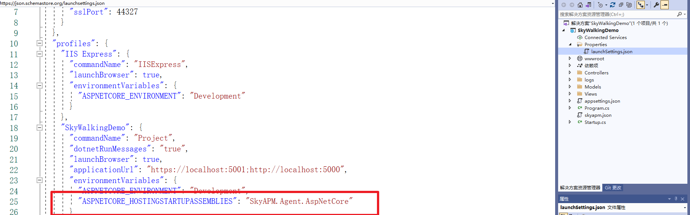

2.5 运行起来后监控画面是这样的：

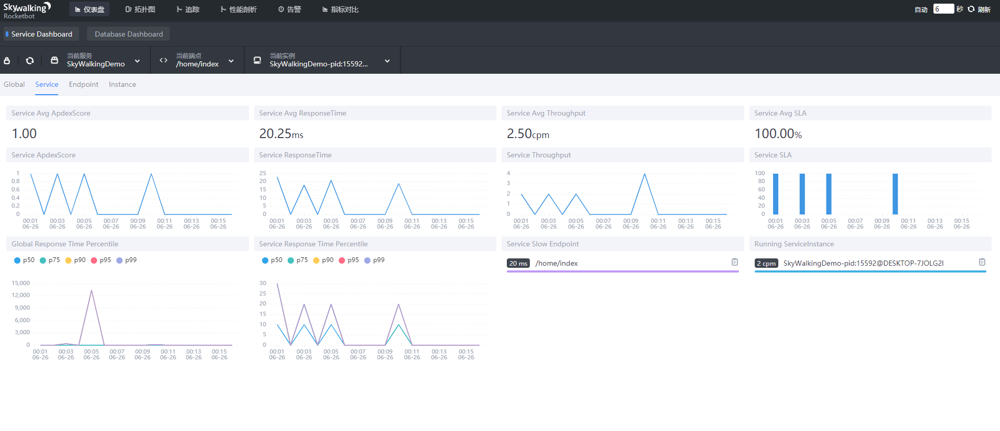

3 再新增一个程序，

3.1 新建程序步骤和2.1是一样的，后面设置不再赘述，启动的地址我改了，比较懒第一个启动后第二个的地址不能用一样的。程序如下：

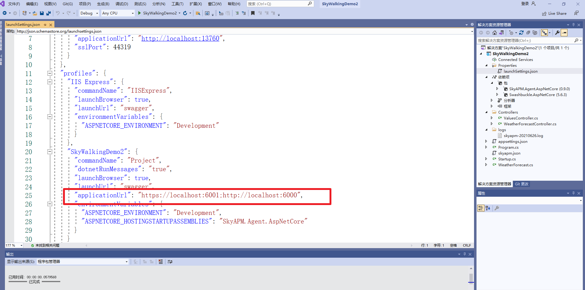

3.2 这里新增了一个controller控制器做测试，比较随便代码如下，做什么很清楚了：

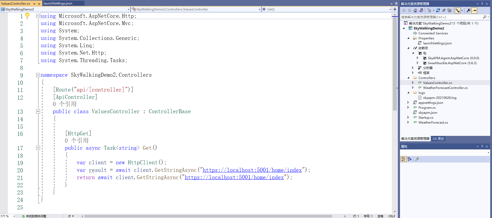

3.3 监控结果是这样的：

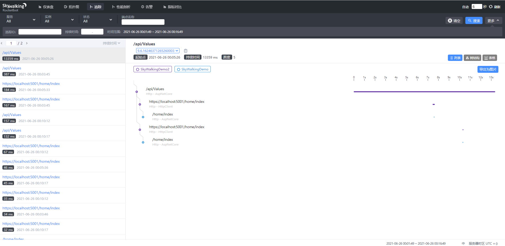

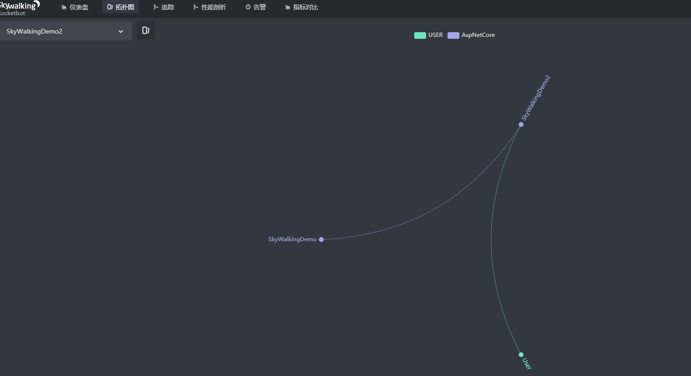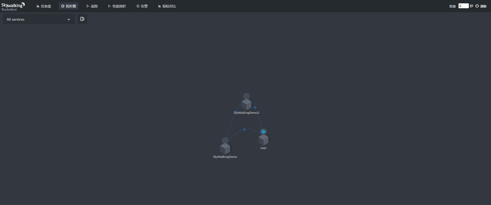

说完了，这里只是一个简单的安装和演示，有实际需要需要自己再做进一步的研究，因为实际项目需要的可多了。

---

*本文档由博客园下载器自动生成*
