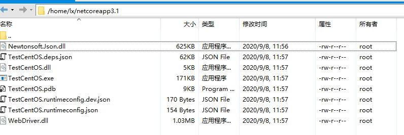
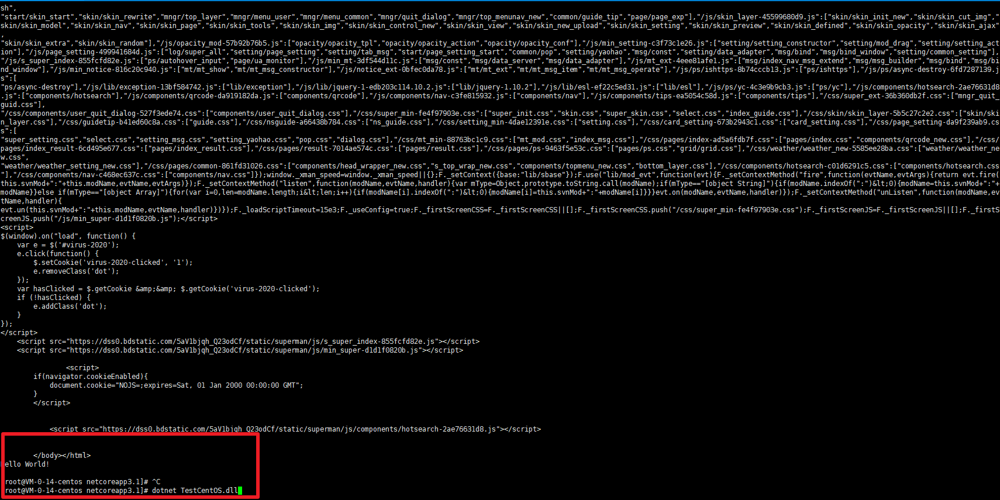

# netcore3.1 程序在cento8下运行selenium

**发布日期:** 2020-09-08  
**原文链接:** https://www.cnblogs.com/morec/p/13631793.html  
**标签:** 无

---

我需要在linux下运行selenium抓取数据，本人不熟悉Python，所以只能用netcore。在带linux界面上运行爬取程序，驱动chromedriver比较简单。界面化安装好chrome，下载chromedriver

放到程序目录下，跑起来没啥问题。

在linux无界面下过程还算顺利。

**第一步**准备好linux系统，本人用的是centos8，下面是centos上准备工作：

1、安装chrome

用下面的命令安装Google Chrome

yum install https://dl.google.com/linux/direct/google-chrome-stable_current_x86_64.rpm

也可以先下载至本地，然后安装

wget https://dl.google.com/linux/direct/google-chrome-stable_current_x86_64.rpm

yum install ./google-chrome-stable_current_x86_64.rpm

安装必要的库

yum install mesa-libOSMesa-devel gnu-free-sans-fonts wqy-zenhei-fonts

2、安装 chromedriver（末尾附chrome和chromedriver的对应版本）

chrome官网

wget https://chromedriver.storage.googleapis.com/2.38/chromedriver_linux64.zip

淘宝源（推荐）

wget http://npm.taobao.org/mirrors/chromedriver/2.41/chromedriver_linux64.zip

将下载的文件解压，放在如下位置

unzip chromedriver_linux64.zip

mv chromedriver /usr/bin/

给予执行权限

chmod +x /usr/bin/chromedriver

以上抄袭度娘不知名博客。

**第二步**准备工作做好后，准备linux下面的netcore环境：

参考aspnetcore文档，执行相应的命令，

sudo dnf install dotnet-sdk-3.1 

sudo dnf install aspnetcore-runtime-3.1

sudo dnf install dotnet-runtime-3.1 重要因为是控制台程序。

[https://docs.microsoft.com/zh-cn/dotnet/core/install/linux-centos](https://docs.microsoft.com/zh-cn/dotnet/core/install/linux-centos)

**第三步**准备代码

using OpenQA.Selenium.Chrome;
using OpenQA.Selenium.Remote;
using System;
using System.IO;

namespace TestCentOS
{
 class Program
 {
 static void Main(string[] args)
 {
 ChromeOptions chromeOptions = new ChromeOptions();
 chromeOptions.AddArguments("--no-sandbox");
 chromeOptions.AddArguments("--disable-dev-shm-usage");
 chromeOptions.AddArguments("--headless");
 RemoteWebDriver driver = new ChromeDriver(chromeOptions);
 
 driver.Url = "https://www.baidu.com";
 Console.WriteLine(driver.PageSource);
 Console.WriteLine("Hello World!");
 Console.Read();
 }
 }
}

目录结构，上传到centos：

**第四步**运行程序，在第一步安装完的chromedriver在 centos 根目录 usr/bin下面，本来拷贝到程序中，发现删掉后一杨可以运行，还是挺顺利的。

---

*本文档由博客园下载器自动生成*
