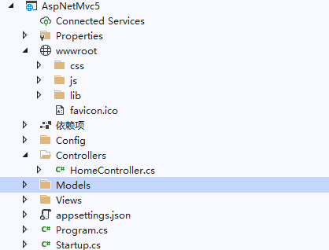
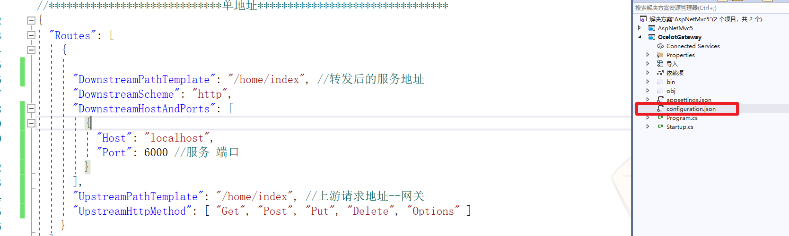
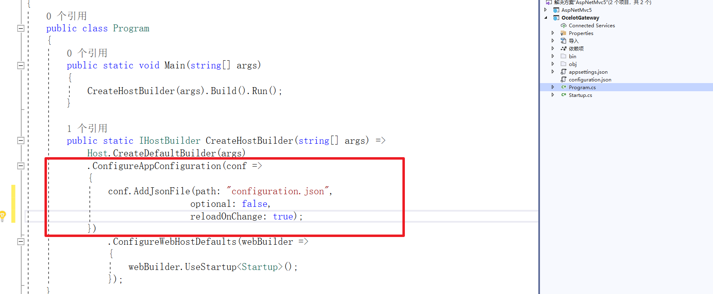
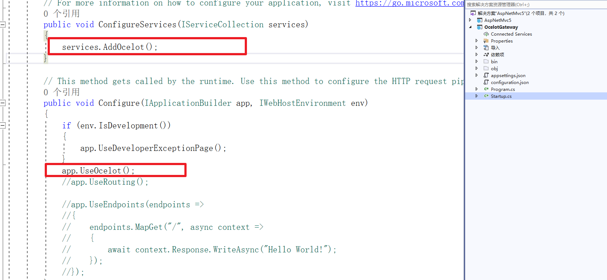
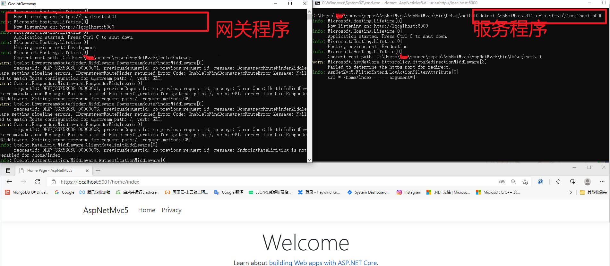

# netcore5下ocelot网关简单使用

**发布日期:** 2021-03-30  
**原文链接:** https://www.cnblogs.com/morec/p/14595607.html  
**标签:** 无

---

1、新建aspnetcoremvc项目，带home控制器的就可以了，测试用能启动就行，代码无需做任何更改。

2、新建空的aspnetcoremvc项目，做如下更改：

 1.. 

2..

3.. 

4.. 

---

*本文档由博客园下载器自动生成*
