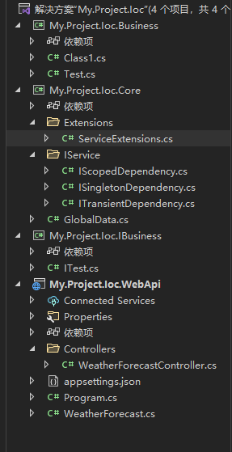
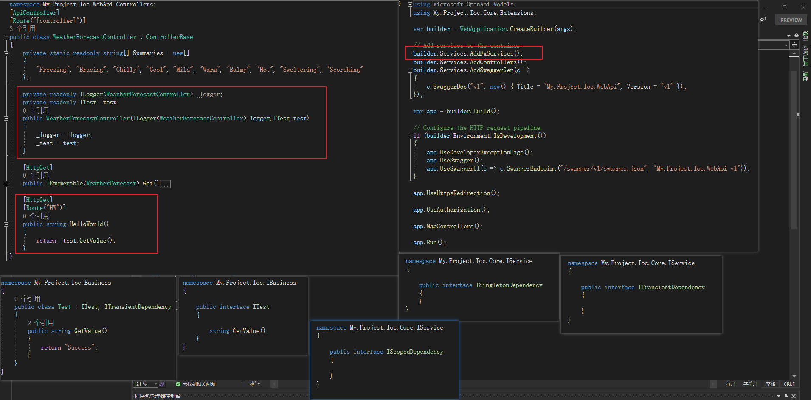

# netcore依赖注入通过反射简化

**发布日期:** 2021-09-03  
**原文链接:** https://www.cnblogs.com/morec/p/15222269.html  
**标签:** 无

---

aspnetcore里面用到许多的service，好多业务代码都要通过Service.AddScoped、Singleton、Transient等注入进去，类太多了写起来和管理起来都很麻烦，所以借鉴了一下github上面的项目稍微删减了一下下，最后会给出参考链接和git源代码。

项目结构如下，

这里面有些约定的东西一定要遵守，否则会出错，还有webapi必须要引用business和ibusiness，只引用ibusiness是不行的。

核心代码如下：

 1 using Microsoft.Extensions.DependencyInjection;
 2 using System;
 3 using System.Collections.Generic;
 4 using System.Linq;
 5 using System.Text;
 6 using System.Threading.Tasks;
 7 using My.Project.Ioc.Core.IService;
 8 
 9 namespace My.Project.Ioc.Core.Extensions
10 {
11 public static partial class ServiceExtensions
12 {
13 /// 

14 /// 自动注入拥有ITransientDependency,IScopeDependency或ISingletonDependency的类
15 /// 

16 /// <param name="services">服务集合</param>
17 /// <returns></returns>
18 public static IServiceCollection AddFxServices(this IServiceCollection services)
19 {
20 Dictionary<Type, ServiceLifetime> lifeTimeMap = new Dictionary<Type, ServiceLifetime>
21 {
22 { typeof(ITransientDependency), ServiceLifetime.Transient},
23 { typeof(IScopedDependency),ServiceLifetime.Scoped},
24 { typeof(ISingletonDependency),ServiceLifetime.Singleton}
25 };
26 
27 GlobalData.AllFxTypes.ForEach(aType =>
28 {
29 lifeTimeMap.ToList().ForEach(aMap =>
30 {
31 var theDependency = aMap.Key;
32 if (theDependency.IsAssignableFrom(aType) && theDependency != aType && !aType.IsAbstract && aType.IsClass)
33 {
34 //注入实现
35 services.Add(new ServiceDescriptor(aType, aType, aMap.Value));
36 
37 var interfaces = GlobalData.AllFxTypes.Where(x => x.IsAssignableFrom(aType) && x.IsInterface && x != theDependency).ToList();
38 //有接口则注入接口
39 if (interfaces.Count > 0)
40 {
41 interfaces.ForEach(aInterface =>
42 { 
43 services.Add(new ServiceDescriptor(aInterface, serviceProvider => serviceProvider.GetService(aType), aMap.Value));
44 });
45 }
46 //无接口则注入自己
47 else
48 {
49 services.Add(new ServiceDescriptor(aType, aType, aMap.Value));
50 }
51 }
52 });
53 });
54 
55 return services;
56 }
57 }
58 }

 1 using System;
 2 using System.Collections.Generic;
 3 using System.IO;
 4 using System.Linq;
 5 using System.Reflection;
 6 using System.Text;
 7 using System.Threading.Tasks;
 8 
 9 namespace My.Project.Ioc.Core
10 {
11 public static class GlobalData
12 {
13 static GlobalData()
14 {
15 string rootPath = Path.GetDirectoryName(Assembly.GetExecutingAssembly().Location);
16 AllFxAssemblies = Directory.GetFiles(rootPath, "*.dll")
17 .Where(x => new FileInfo(x).Name.Contains(FXASSEMBLY_PATTERN))
18 .Select(x => Assembly.LoadFrom(x))
19 .Where(x => !x.IsDynamic)
20 .ToList();
21 
22 AllFxAssemblies.ForEach(aAssembly =>
23 {
24 try
25 {
26 AllFxTypes.AddRange(aAssembly.GetTypes());
27 }
28 catch
29 {
30 
31 }
32 });
33 }
34 
35 /// 

36 /// 解决方案程序集匹配名
37 /// 

38 public const string FXASSEMBLY_PATTERN = "My.Project.Ioc";
39 
40 /// 

41 /// 解决方案所有程序集
42 /// 

43 public static readonly List<Assembly> AllFxAssemblies;
44 
45 /// 

46 /// 解决方案所有自定义类
47 /// 

48 public static readonly List<Type> AllFxTypes = new List<Type>();
49 }
50 }

非核心代码如下：

参考项目[Coldairarrow/Colder.Admin.AntdVue: Admin Fx Based On .NET 5 + Ant Design Vue (github.com)](https://github.com/Coldairarrow/Colder.Admin.AntdVue) ,有兴趣的可以研究下非常不错。当然里面关于aop和缓存方面我有另外的项目例子可以加进去改造[exercise/netcore.demo/AspNetCoreEntityFrameWork at master · liuzhixin405/exercise (github.com)](https://github.com/liuzhixin405/exercise/tree/master/netcore.demo/AspNetCoreEntityFrameWork)

---

*本文档由博客园下载器自动生成*
