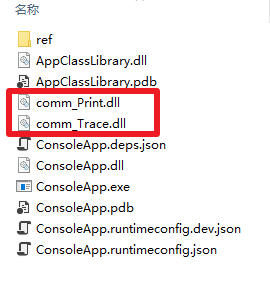
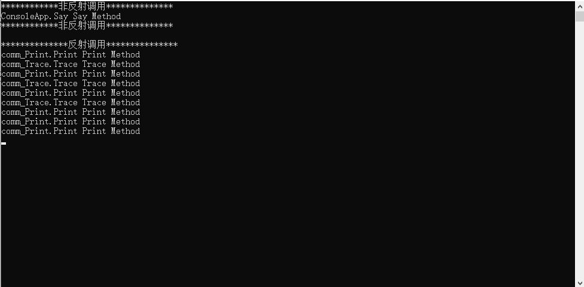

# netcore热插拔dll

**发布日期:** 2021-03-26  
**原文链接:** https://www.cnblogs.com/morec/p/14581268.html  
**标签:** 无

---

项目中有有些场景用到反射挺多的，用到了反射就离不开dll的加载。此demo适用于通过反射dll运行项目中加载和删除，不影响项目。

ConsoleApp：

 1 using AppClassLibrary;
 2 using System;
 3 using System.Collections.Generic;
 4 using System.IO;
 5 using System.Linq;
 6 using System.Runtime.Loader;
 7 using System.Threading;
 8 
 9 namespace ConsoleApp
10 {
11 class Program
12 {
13 static void Main(string[] args)
14 {
15 Console.WriteLine("************非反射调用**************");
16 ICommon common = new Say();
17 common.Invoke();
18 Console.WriteLine("************非反射调用**************");
19 Console.WriteLine();
20 Console.WriteLine("**************反射调用***************");
21 InvokeMethod();
22 Console.WriteLine("**************反射调用***************");
23 Console.Read();
24 }
25 private static void InvokeMethod()
26 {
27 bool IsGo = true;
28 while (IsGo)
29 {
30 Thread.Sleep(3000);
31 List<ICommon> common_List = new List<ICommon>();
32 var path = Directory.GetCurrentDirectory();
33 string[] fileInfos = Directory.GetFiles(path).Where(f => f.Contains("comm")).ToArray();
34 var _AssemblyLoadContext = new AssemblyLoadContext(Guid.NewGuid().ToString("N"), true);
35 Dictionary<string, ICommon> fileInfoList = new Dictionary<string, ICommon>();
36 foreach (var file in fileInfos)
37 {
38 ICommon common;
39 using (var fs = new FileStream(file, FileMode.Open, FileAccess.Read))
40 {
41 var assembly = _AssemblyLoadContext.LoadFromStream(fs);
42 Type type = assembly.GetExportedTypes().Where(t => t.GetInterfaces().Contains(typeof(ICommon))).FirstOrDefault();
43 common = Activator.CreateInstance(type) as ICommon;
44 }
45 FileInfo fileInfo = new FileInfo(file);
46 common.Invoke();
47 }
48 }
49 }
50 }
51 public class Say : ICommon
52 {
53 public void Invoke()
54 {
55 Console.WriteLine($"{this.GetType()} Say Method ");
56 }
57 }
58 }

接口类库：

using System;

namespace AppClassLibrary
{
 public interface ICommon
 {
 void Invoke();
 }
}

comm_Print.dll：

using AppClassLibrary;
using System;

namespace comm_Print
{
 public class Print : ICommon
 {
 public void Invoke()
 {
 Console.WriteLine($"{this.GetType()} Print Method ");
 }
 }
}

comm_Trace.dll: 

using AppClassLibrary;
using System;

namespace comm_Trace
{
 public class Trace : ICommon
 {
 public void Invoke()
 {
 Console.WriteLine($"{this.GetType()} Trace Method ");
 }
 }
}

下面2个dll可以任意添加删除：

删除trace.dll运行结果:

---

*本文档由博客园下载器自动生成*
