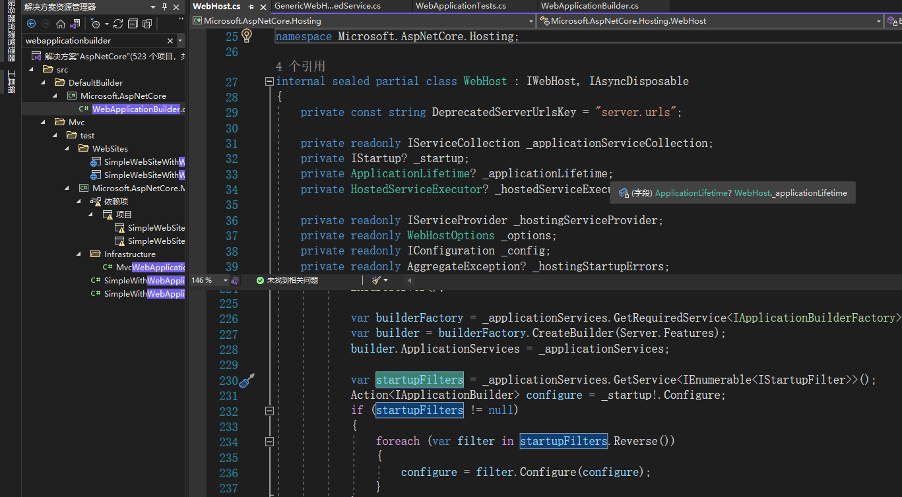
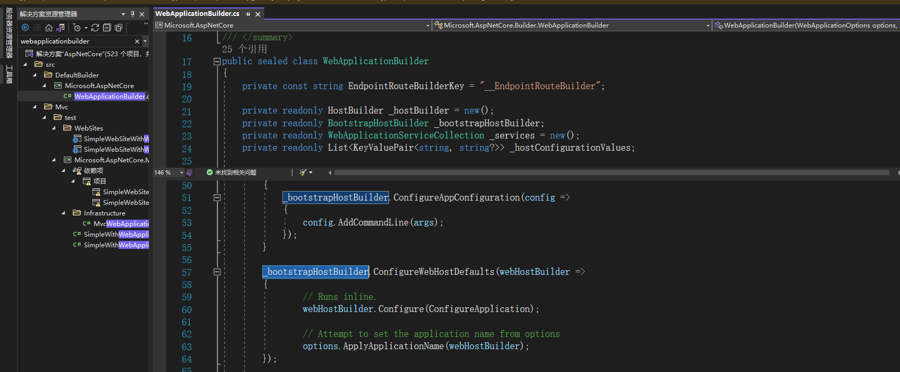

# netcore项目中IStartupFilter使用

**发布日期:** 2021-11-19  
**原文链接:** https://www.cnblogs.com/morec/p/15577629.html  
**标签:** 无

---

背景：

netcore项目中有些服务是在通过中间件来通信的，比如orleans组件。它里面服务和客户端会指定网关和端口，我们只需要开放客户端给外界，服务端关闭端口。相当于去掉host，这样省掉了些指定配置连接和端口，用起来非常方便。

干掉host，下面代码：

```

```
using Microsoft.AspNetCore.Builder;
using Microsoft.AspNetCore.Hosting;
using Microsoft.Extensions.DependencyInjection;
using Microsoft.Extensions.Hosting;
using System;

namespace StartupFilterTest
{
 internal class Program
 {
 static void Main(string[] args)
 {
 #region Net 5

 Host.CreateDefaultBuilder(args)
 .ConfigureServices((hostContext, svc) =>
 {
 svc.AddSingleton<IStartupFilter, MyStartupFilter>();
 })
 //.ConfigureWebHostDefaults(host =>
 //{
 // host.UseStartup<Startup>();
 //})
 .Build().Run(); 
 #endregion

 #region Net 6
 //var builder = WebApplication.CreateBuilder();
 //builder.Services.AddSingleton<IStartupFilter,MyStartupFilter>();
 //var app = builder.Build();
 //app.Run(); 

 //WebApplicationBuilder _bootstrapHostBuilder ConfigureWebHostDefaults
 #endregion

 }
 }
}
```

```

net5里面注释掉的代码就是我们关掉的服务，跑起来相当于纯控制台了。

但是startup里面需要写中间件等代码的指定，这样的话想把Startup文件干掉又不方便。通过找文档发现IStartupFilter可以实现这一块的功能，代替Configure代码块。

```

```
 public void Configure(IApplicationBuilder app, IWebHostEnvironment env)
 {
 
 }
```

```
IStartupFilter 接口只有一个方法《Action<IApplicationBuilder> Configure(Action<IApplicationBuilder> next)》只要实现它就行了,再注入到容器里面去。

```

```
 internal class MyStartupFilter : IStartupFilter
 {
 public Action<IApplicationBuilder> Configure(Action<IApplicationBuilder> next)
 {
 return app =>
 {
 app.Run(async context => { await context.Response.WriteAsync("hello world"); });
 next(app);
 };
 }
 }
```

```
```

```
svc.AddSingleton<IStartupFilter, MyStartupFilter>();
```

```

但是新的问题又来了， 发现程序跑起来完全不会执行到MyStartupFilter里面去，这是为什么呢？喵了下源码发现IStartupFilter接口的实现是放到webhost里面

的，所以只能指定Host了。而且该方法需要指定Startup文件。这样又绕回来了，想精简却被微软的设计绕圈子了。

 

后面发现net6可以实现不需要startup文件,net6代码上图注释部分。net6的program改动挺大，而且起步是WebApplication。通过查看webapplication发现它的builder，webapplicationbuilder里面是通过bootstrapHostBuilder指定了ConfigureWebHostDefaults的调用。

 

 net6可以精简掉Startup文件，但是它的启动直接绑定了webhost，这里跟net5比较连host都不能省了。

兜兜圈圈还是回到原点，因为没有研究它的源码，所以只能了解到这里了。最后两个问题： 1. net6可否不带host运行，2.IStartupFilter和Startup可否隔离host相互独立，不要绑一起。

---

*本文档由博客园下载器自动生成*
