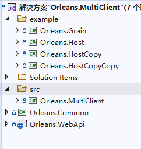
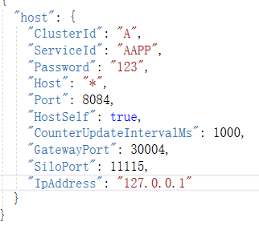
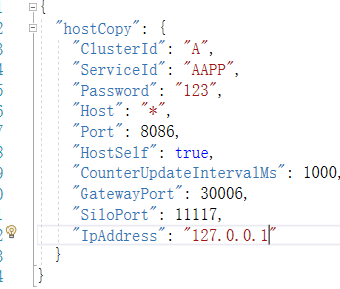
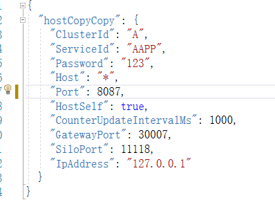
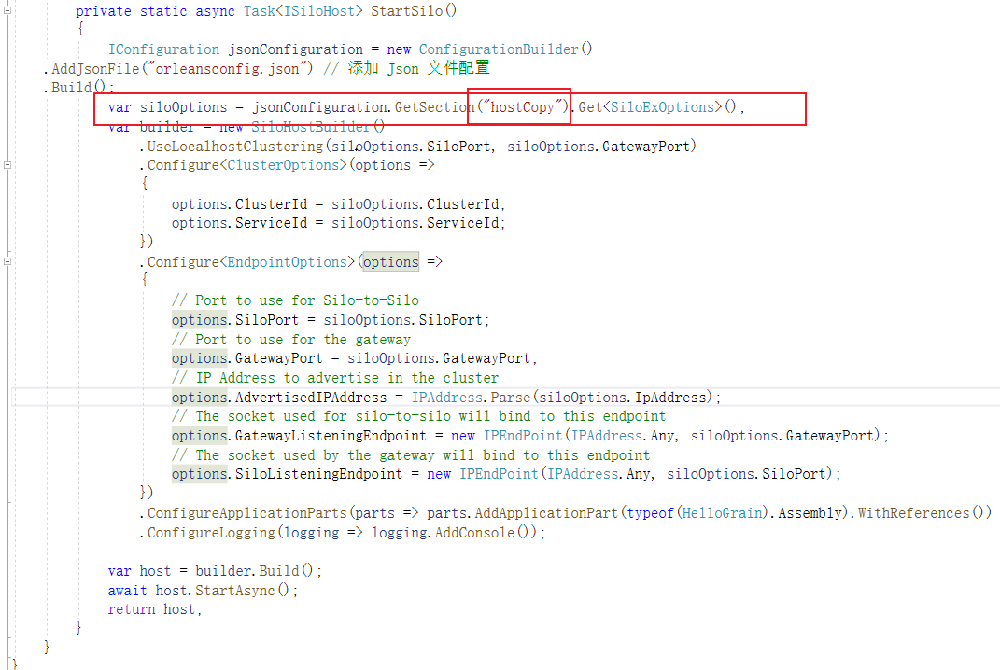
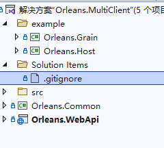
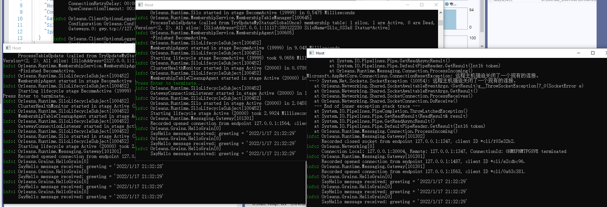

# orleans集群及负载均衡实现

**发布日期:** 2022-01-15  
**原文链接:** https://www.cnblogs.com/morec/p/15806332.html  
**标签:** 无

---

netcore6项目，微服务框架选orleans ，国内似乎没什么项目在用，坑多无资料。
orleans文档可以解决几乎，只能看官方资料。

[Introduction | Microsoft Orleans 中文文档](https://orleans.azurewebsites.net/Documentation/)

服务异常客户端怎么接收,链接释放,内存泄露等各种问题都迎刃而解。
早先弄了几个服务测试，发现同一个请求或者同几个请求，都只集中在一个服务上，而且不管服务多耗时间，都是无限等待一个请求完再下一个，除非一个挂了，下一个就顶上。这显然不是想要的效果
（这里的服务是cpoy改文件就行）。这就是遇到无法负载均衡的问题
，网上翻遍资料，源码test过了一遍，除了Azure提到了无关紧要的负载，已无办法可寻。
晚上打王者突然有了灵感，既然外面获取不到，不如自己创造条件。
很早想过用consul，但是它不是http请求那么简单，所以以自己的能力行不通。那想做负载，为什么不弄几个一样的服务呢，在客户端随机或者循环请求几个服务，而服务的接口应该是一模一样的，只是看起来像不同的服务而已。
结果比想的还要简单，只需要做配置端口，后面请求不需要自己手动去轮询或者随机。
这，也是最终的办法了，虽然会多出来几个服务。（这里是实实在在的新建服务，代码一样，服务名空间名不一样。）

项目中各种配置比这复杂的多，就不多赘述

这是我提的issue：

[how can orleans server response load balancing · Issue #7497 · dotnet/orleans (github.com)](https://github.com/dotnet/orleans/issues/7497)

后续总结，首先谢谢评论的各位。希望都能乐于分享，一个代码demo不光能解决我的问题，有需要的大有人在。只讨论是否有这个东西对那些难以理解，或者个人技术不到位的很难去解释清楚，或者说没有那么清晰。

orleans文档体现是有集群负载，orleans的sample功能很多，但是都没用到。我的project只是拿来作为前后端分离类似微服务consul，仅做请求分离，我的test里面案例写的很清楚。
改进前的效果：
如果我同一个服务无限多开，或者改掉ip、port、gateway,效果都是一个服务端接收请求，其他服务端处于等待，直到一个挂掉后面服务再顶上。
改进后的效果:多个服务端轮询或者随机接收客户端请求。
1、客户端部署多个，服务端部署多个。
2、服务端必须轮询或者随机接收客户端请求，而不是上面情况。

例子在这里：[exercisebook/Orleans at main · liuzhixin405/exercisebook (github.com)](https://github.com/liuzhixin405/exercisebook/tree/main/Orleans)

这个例子是一个服务，但是我给拷贝了三分，改了每份的配置。分别是host、hostcopy、hostcopycopy

三个服务代码其实是一样的，只是每个服务读取的配置文件不一样。这样能达到目的，实现轮询负载，但是更复杂了。因为我有多个服务，每个服务要重新建至少两个项目，虽然项目几乎无差别。

能力有限，能力范围能最终解决方案来了，看代码就知道很精简。

[exercisebook/Orleans/Orleans.MultiClient-TestTwo at main · liuzhixin405/exercisebook (github.com)](https://github.com/liuzhixin405/exercisebook/tree/main/Orleans/Orleans.MultiClient-TestTwo)

 这里只有一个host服务，只需要把host服务发布的文件拷贝一份，每份改掉下面的内容就行：

分别修改配置文件中ip、siloPort、gatewayProt分别按照这个配置文件来配置。
重点注意，1、服务端的配置节点key都是host，保持一致。而且客户端的名字是要区分开的。2、必须先启动服务，后启动此客户端(webapi）

这里不管是第一种解决方案还是第二种都不需要改动任何客户端代码：客户端的配置文件和测试代码如下：

using Microsoft.AspNetCore.Http;
using Microsoft.AspNetCore.Mvc;
using Orleans.Grains;
using System;
using System.Threading.Tasks;

namespace Orleans.WebApi.Controllers
{
 [Route("api/[controller]")]
 [ApiController]
 public class TestMultiClientController : ControllerBase
 {
 private readonly IOrleansClient _orleansClient;
 public TestMultiClientController(IOrleansClient orleansClient)
 {
 _orleansClient = orleansClient;
 }

 [HttpGet]
 public async Task<string> GetOrleans1()
 {
 int sum = 0;
 for (int i = 10; i > 0; i--)
 {
 int temp = i;
 sum += temp;
 await Task.Delay(100);
 var cluster = _orleansClient.GetClusterClient(typeof(IHelloA).Assembly).GetGrain<IHelloA>(0); 
 await cluster.SayHello(DateTime.Now.ToString());
 }
 return sum.ToString();
 }

 }
}

{
 "Logging": {
 "LogLevel": {
 "Default": "Information",
 "Microsoft": "Warning",
 "Microsoft.Hosting.Lifetime": "Information"
 }
 },
 "AllowedHosts": "*",
 "host": {
 "ClusterId": "A",
 "ServiceId": "AAPP",
 "Password": "123",
 "Host": "*",
 "Port": 8084,
 "HostSelf": true,
 "CounterUpdateIntervalMs": 1000,
 "GatewayPort": 30004,
 "SiloPort": 11115,
 "IpAddress": "127.0.0.1"

 },
 "hostCopy": {
 "ClusterId": "A",
 "ServiceId": "AAPP",
 "Password": "123",
 "Host": "*",
 "Port": 8086,
 "HostSelf": true,
 "CounterUpdateIntervalMs": 1000,
 "GatewayPort": 30006,
 "SiloPort": 11117,
 "IpAddress": "127.0.0.1"
 },
 "hostCopyCopy": {
 "ClusterId": "A",
 "ServiceId": "AAPP",
 "Password": "123",
 "Host": "*",
 "Port": 8087,
 "HostSelf": true,
 "CounterUpdateIntervalMs": 1000,
 "GatewayPort": 30007,
 "SiloPort": 11118,
 "IpAddress": "127.0.0.1"
 } //拷贝两份host服务，分别修改配置文件中ip、siloPort、gatewayProt分别按照这个配置文件来配置。
 //重点注意，1、服务端的配置节点key都是host，保持一致。而且客户端的名字是要区分开的。2、必须先启动服务，后启动此客户端(webapi）
}

运行结果都是这样：

有疑问的请先看test代码，再有疑问留言讨论，谢谢！

---

*本文档由博客园下载器自动生成*
