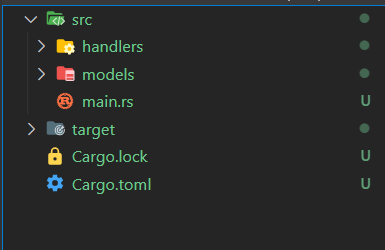
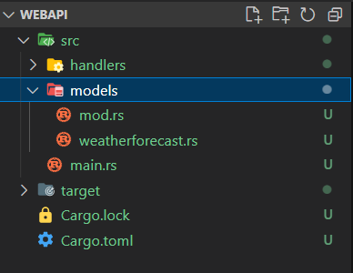
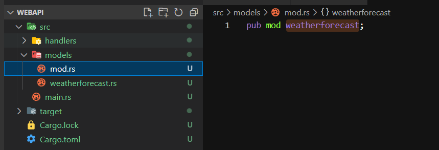
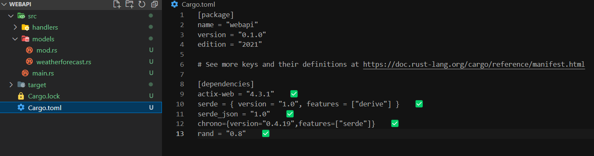
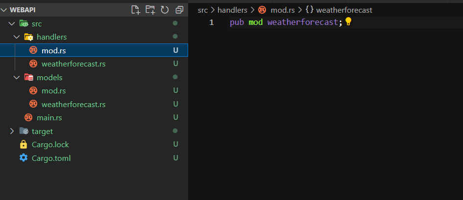
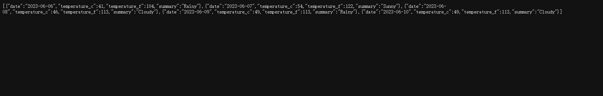

# rust实现weatherforecast的获取天气webapi

**发布日期:** 2023-06-05  
**原文链接:** https://www.cnblogs.com/morec/p/17458331.html  
**标签:** 无

---

rust用来写webapi可能有点大材小用,但是作为入门学习应该说是不错的选择。

cargo new webapi创建一个webapi项目,在src下面新建handler文件夹和models文件夹。

在models文件夹下面建立一个mod.rs和weatherforecast.rs文件。

weatherforecast.rs文件新建我们需要的WeatherForecast类,附上Serialize，Deserialize接口（trait）实现。

use chrono::NaiveDate;
use serde::{Serialize, Deserialize};

#[derive(Debug,Serialize,Deserialize)]
pub struct WeatherForecast{ 
 pub date:NaiveDate,
 pub temperature_c:i32,
 pub temperature_f:i32,
 pub summary:String
}

mod.rs文件作为管理模块，实体类需要导入,有多少实体类都可以放进去，后续就方便从这个模块中导出需要的类。

当然rust的webapi需要导入web开发需要的库，以及项目中需要的库,看名字就大概的猜到是什么作用了。

有了实体类，下面就写下get接口的实现，作为一个webapi架子，只用内存做存储

同样在handlers文件夹下面新建mod.rs和weatherforecast.rs

handlers下面的weatherforecast.rs代码如下

use crate::models::weatherforecast::WeatherForecast;
use actix_web::{get,HttpResponse,Responder};
use chrono::{Duration, Utc};
use rand::Rng;

#[get("/getweatherforecast")]
pub async fn getweatherforecast()->impl Responder{
 let mut rng = rand::thread_rng();
 let summaries: Vec<&str> = vec!["Sunny","Cloudy","Rainy","Stormy"];
 let weather_forecasts:Vec<WeatherForecast> = (1..=5).map(|index|{
 let date = Utc::now().date_naive() + Duration::days(index);
 let temperature_c = rng.gen_range(-20..=55);
 let summary = summaries[rng.gen_range(0..summaries.len())].to_string();
 let temperature_f = 32 + (temperature_c / 5 * 9);
 WeatherForecast{
 date,
 temperature_c,
 temperature_f,
 summary:summary
 }
 }).collect();
 HttpResponse::Ok().json(weather_forecasts)
}

handlers通过use crate::models::weatherforecast::WeatherForecast引用了models的模块，所以在main.rs中需要提前引入，代码如下：

#[path = "models/mod.rs"]
mod models;
#[path = "handlers/mod.rs"]
mod handlers;

use actix_web::{App,HttpServer};
use handlers::*;

#[actix_web::main]
async fn main()->std::io::Result<()> {
 HttpServer::new(||{
 App::new()
 .service(weatherforecast::getweatherforecast)
 }).bind("127.0.0.1:8088")?.run().await
}

到这里代码就写完了，下面运行一下看看效果：访问地址 [127.0.0.1:8088/getweatherforecast](http://127.0.0.1:8088/getweatherforecast)

示例代码如下：

[rust/webapi at main · liuzhixin405/rust · GitHub](https://github.com/liuzhixin405/rust/tree/main/webapi)

---

*本文档由博客园下载器自动生成*
