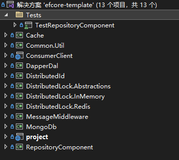

# webapi开发框架实践

**发布日期:** 2023-09-12  
**原文链接:** https://www.cnblogs.com/morec/p/17696164.html  
**标签:** 无

---

项目链接以及目录结构

[liuzhixin405/efcore-template (github.com)](https://github.com/liuzhixin405/efcore-template)



这是一个纯webapi的开发框架。

**1、支持的orm有efcore6、dapper,可以灵活切换数据库。**

```csharp
using Microsoft.CodeAnalysis.CSharp.Syntax;
using Microsoft.CodeAnalysis.Elfie.Model;
using Microsoft.EntityFrameworkCore;
using project.Context;
using project.Repositories;
using project.Services;
using RepositoryComponent.DbFactories;

namespace project.Extensions
{
 public static partial class TheExtensions
 {
 public static void AddDatabase(this WebApplicationBuilder builder)
 {
 ///sqlserver 
```

 if (builder.Configuration["DbType"]?.ToLower() == "sqlserver")
```css
 {
 builder.Services.AddDbContext<ReadProductDbContext>(options => options.UseSqlServer(builder.Configuration["ConnectionStrings:SqlServer:ReadConnection"]), ServiceLifetime.Scoped);
 builder.Services.AddDbContext<WriteProductDbContext>(options => options.UseSqlServer(builder.Configuration["ConnectionStrings:SqlServer:WriteConnection"]), ServiceLifetime.Scoped);

 }
 ///mysql
```

 else if (builder.Configuration["DbType"]?.ToLower() == "mysql")
```css
 {
 builder.Services.AddDbContext<ReadProductDbContext>(options => options.UseMySQL(builder.Configuration["ConnectionStrings:MySql:ReadConnection"]), ServiceLifetime.Scoped);
 builder.Services.AddDbContext<WriteProductDbContext>(options => options.UseMySQL(builder.Configuration["ConnectionStrings:MySql:WriteConnection"]), ServiceLifetime.Scoped);

 }
```

 else
```css
 {
 //throw new ArgumentNullException("δ����ȷ��ע�����ݿ�");
 builder.Services.AddDbContext<ReadProductDbContext>(options => options.UseInMemoryDatabase("test_inmemory_db"), ServiceLifetime.Scoped);
 builder.Services.AddDbContext<WriteProductDbContext>(options => options.UseInMemoryDatabase("test_inmemory_db"), ServiceLifetime.Scoped);

 }

 builder.Services.AddScoped<Func<ReadProductDbContext>>(provider => () => provider.GetService<ReadProductDbContext>() ?? throw new ArgumentNullException("ReadProductDbContext is not inject to program"));
 builder.Services.AddScoped<Func<WriteProductDbContext>>(provider => () => provider.GetService<WriteProductDbContext>() ?? throw new ArgumentNullException("WriteProductDbContext is not inject to program"));

 builder.Services.AddScoped<DbFactory<WriteProductDbContext>>();
 builder.Services.AddScoped<DbFactory<ReadProductDbContext>>();

 builder.Services.AddTransient<IReadProductRepository, ProductReadRepository>();
 builder.Services.AddTransient<IWriteProductRepository, ProductWriteRepository>();
 builder.Services.AddTransient<IProductService, ProductService>();

 builder.Services.AddTransient<ICustomerService, CustomerService>();
 }
 }
}

```

**2、至于消息中间件有rabbitmq、kafka，也是通过配置文件来指定哪一个实现。**

```csharp
using MessageMiddleware.Factory;
using MessageMiddleware.RabbitMQ;

namespace project.Extensions
{
 public static partial class TheExtensions
 {
 public static void AddMq(this WebApplicationBuilder builder)
 {
 var rabbitMqSetting = new RabbitMQSetting
 {
 ConnectionString = builder.Configuration["MqSetting:RabbitMq:ConnectionString"].Split(';'),
```

 Password = builder.Configuration["MqSetting:RabbitMq:PassWord"],
 Port = int.Parse(builder.Configuration["MqSetting:RabbitMq:Port"]),
 SslEnabled = bool.Parse(builder.Configuration["MqSetting:RabbitMq:SslEnabled"]),
 UserName = builder.Configuration["MqSetting:RabbitMq:UserName"],
```css
 };
 var kafkaSetting = new MessageMiddleware.Kafka.Producers.ProducerOptions
 {
```

 BootstrapServers = builder.Configuration["MqSetting:Kafka:BootstrapServers"],
 SaslUsername = builder.Configuration["MqSetting:Kafka:SaslUserName"],
 SaslPassword = builder.Configuration["MqSetting:Kafka:SaslPassWord"],
 Key = builder.Configuration["MqSetting:Kafka:Key"]
```css
 };
 var mqConfig = new MQConfig
 {
```

 ConsumerLog = bool.Parse(builder.Configuration["MqSetting:ConsumerLog"]),
 PublishLog = bool.Parse(builder.Configuration["MqSetting:PublishLog"]),
 Rabbit = rabbitMqSetting,
 Use = int.Parse(builder.Configuration["MqSetting:Use"]),
 Kafka = kafkaSetting
```css
 };
 builder.Services.AddSingleton<MQConfig>(sp => mqConfig);
 builder.Services.AddMQ(mqConfig);
 }
 }
}

```

**3、该项目还集成了mongodb和elasticsearch,在project项目中没有写实现案例，实现起来也很简单。**

**4、下面是分布式雪花id的实现，先注入代码，使用的时候直接使用distributedid即可。**

 builder.Services.AddDistributedLock(x =>
```css
 {
 x.LockType = LockType.InMemory;
 x.RedisEndPoints = new string[] { builder.Configuration["DistributedRedis:ConnectionString"] ?? throw new Exception("$未能获取distributedredis连接字符串")};
 }).AddCache(new CacheOptions
 {
```

 CacheType = CacheTypes.Redis,
 RedisConnectionString = builder.Configuration["DistributedRedis:ConnectionString"] ?? throw new Exception("$未能获取distributedredis连接字符串")
```css
 }).AddDistributedId(new DistributedIdOptions
 {
```

 Distributed = true
```css
 });

```

```csharp
```
 newProduct.Id = _distributedId.NewLongId().ToString();
```

```

**5、缓存使用的是分布式缓存和内存缓存，其中分布式缓存有一般实现和指定序列化格式的实现。**

```csharp
using System.Text;
using System.Text.Json.Serialization;
using MessagePack;
using StackExchange.Redis.Extensions.Core;
using StackExchange.Redis.Extensions.Core.Abstractions;
using StackExchange.Redis.Extensions.Core.Configuration;
using StackExchange.Redis.Extensions.Core.Implementations;

namespace project.Utility.Helper
{
 public class CacheHelper
 {
 private static IRedisClientFactory _factory_with_msgpack;
 private static IRedisDatabase _redis_with_msgpack => _factory_with_msgpack.GetDefaultRedisDatabase();

 private static IRedisClientFactory _factory;
 private static IRedisDatabase _redis => _factory.GetDefaultRedisDatabase();
 public static void Init(IConfiguration configuration)
 {
 var config = configuration.GetSection("Redis").Get<RedisConfiguration>();
 _factory = new RedisClientFactory(new[] { config }, null, new RedisSerializer());
 _factory_with_msgpack = new RedisClientFactory(new[] { config }, null, new RedisMessagepackSerializer());
 }
 static CacheHelper() { }

 public static T Get<T>(string key)
 {
 return _redis.GetAsync<T>(key).GetAwaiter().GetResult();
 }
 public static async Task<T> GetAsync<T>(string key)
 {
 return await _redis.GetAsync<T>(key);
 }
 public static async Task<T> GetAsync_With_Msgpack<T>(string key)
 {
 return await _redis_with_msgpack.GetAsync<T>(key);
 }

 public static string Get(string key)
 {
 return _redis.GetAsync<string>(key).GetAwaiter().GetResult();
 }

 public static bool Set(string key, object value, TimeSpan expiresIn)
 {
 return _redis.AddAsync(key, value, expiresIn).GetAwaiter().GetResult();
 }
 public static async Task<bool> SetAsync(string key, object value, TimeSpan expiresIn)
 {
 return await _redis.AddAsync(key, value, expiresIn);
 }

 public static async Task<bool> SetAsync_With_Msgpack(string key, object value, TimeSpan expiresIn)
 {
 return await _redis_with_msgpack.AddAsync(key, value, expiresIn);
 }

 /// <summary>
 /// 以秒为单位，返回给定 key 的剩余生存时间
 /// </summary>

 public static long GetExpirin(string key)
 {
 var timespan = _redis.Database.KeyTimeToLive(key);
 if (timespan == null) { return 0; }
 return (long)timespan.Value.TotalSeconds;
 }
 public static bool KeyExpire(string key, TimeSpan expiresIn)
 {
 return _redis.Database.KeyExpire(key, expiresIn);
 }
 public static async Task<bool> RemoveKeyAsync(string key)
 {
 return await _redis.Database.KeyDeleteAsync(key);
 }
 public static long RemoveKey(string key)
 {
 var result = _redis.Database.KeyDelete(key);
 return result ? 1 : 0;
 }
 }

 public class RedisSerializer : ISerializer
 {
 public T? Deserialize<T>(byte[] serializedObject)
 {
 var data = Encoding.UTF8.GetString(serializedObject);
 return System.Text.Json.JsonSerializer.Deserialize<T>(data);
 }

 public byte[] Serialize<T>(T? item)
 {
 var data = System.Text.Json.JsonSerializer.Serialize(item);
 return Encoding.UTF8.GetBytes(data);
 }
 }

 public class RedisMessagepackSerializer : ISerializer
 {
 private MessagePackSerializerOptions _options;
 public RedisMessagepackSerializer()
 {
 _options = MessagePackSerializerOptions.Standard.WithCompression(MessagePackCompression.Lz4BlockArray);
 }
 public T? Deserialize<T>(byte[] serializedObject)
 {
 return MessagePackSerializer.Deserialize<T>(serializedObject, _options);
 }

 public byte[] Serialize<T>(T? item)
 {
 return MessagePackSerializer.Serialize(item, _options);
 }
 }
}

```

**6、单元测试、集成测试没有写。**

更细节的需要自己看代码，这应该是一个基本的开发具备的功能。

该项目下载下来可以直接运行。

---

*本文档由博客园下载器自动生成*
