# 使用Logstash工具导入sqlserver数据到elasticSearch及elk分布式日志中心

**发布日期:** 2023-01-15  
**原文链接:** https://www.cnblogs.com/morec/p/17054383.html  
**标签:** 无

---

首先记下这个笔记，Logstash工具导入sqlserver数据到elasticSearch。

因为logstash使用java写的，我本地开发是win11，所以javade jdk必须要安装。具体安装不介绍了，就是网上下个java8，不要去官网要账号什么的,不是java开发不太折腾，目前只用java8，记得JAVA_HOME配置一下环境变量。

java version "1.8.0_66"

Java(TM) SE Runtime Environment (build 1.8.0_66-b18)
Java HotSpot(TM) 64-Bit Server VM (build 25.66-b18, mixed mode)

从sqlserver拉取数据需要用到sqlserver 的jdbc驱动，我这里是官网下载的sqljdbc_6.2.2.1_enu,没用最新版本，个人认为java8不太合适什么都最新的。

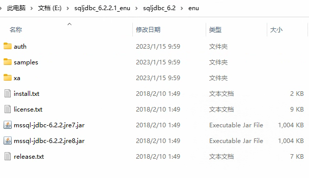

logstash使用的是7.0.0的版本，这里遇到几个问题。

换了几个版本，7.0一下的起不来，8，0以上的也是起不来。

1.存放的目录不能有空格，2.（我的坑）不该去github上下载版本，发现跑不起来。3.版本8.0以上的需要java11支持。

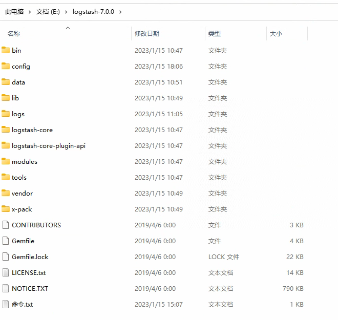

有了这两个包(都是java的)后面就是配置了。首先我在ogstash-7.0.0\lib下面新建文件夹sqlserverdriver,去sqljdbc_6.2.2.1_enu\sqljdbc_6.2\enu文件夹下面拷贝了mssql-jdbc-6.2.2.jre8.jar文件过来

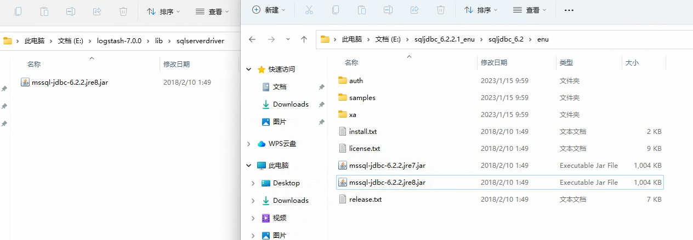

下面就是操作logstash文件夹下面config下面文件了。首先在jvm.options最下面加上权限。

-Djava.library.path=E:\sqljdbc_6.2.2.1_enu\sqljdbc_6.2\enu\auth\x64

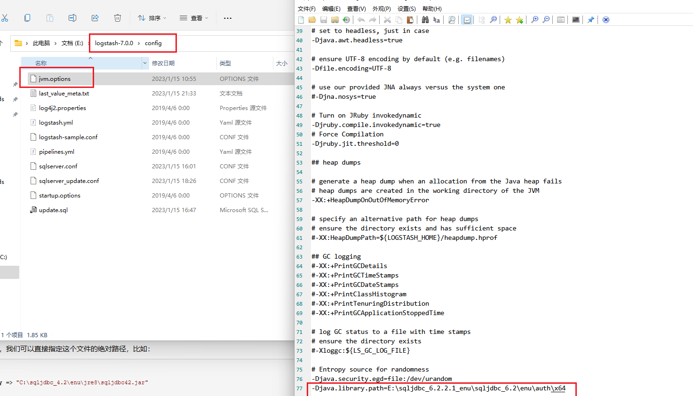

在config文件夹下面新建文件sqlserver_update.conf文件,拷贝下面的内容，每行基本有注释就详不说。

```css
input {
 jdbc {
```

 jdbc_driver_library=>"E:\sqljdbc_6.2.2.1_enu\sqljdbc_6.2\enu/mssql-jdbc-6.2.2.jre8.jar"
```python
 jdbc_driver_class => "com.microsoft.sqlserver.jdbc.SQLServerDriver"
 jdbc_connection_string => "jdbc:sqlserver://sqlserverIP:1433;databaseName=Reptile.NewsLetter"
```

 jdbc_user => "sa"
 jdbc_password => "密码"
 #分页且最大5万次
 jdbc_paging_enabled => "true"
 jdbc_page_size => "50000"
 #时区按照东八
 jdbc_default_timezone =>"Asia/Shanghai"
 last_run_metadata_path => "E:\logstash-7.0.0\config\last_value_meta.txt"
 #启用追踪，则需要指定tracking_column，默认是timestamp()
 use_column_value => true
 # 如果 use_column_value 为真,需配置此参数. track 的数据库 column 名,该 column 必须是递增的. 一般是主键
 tracking_column => id
 #追踪字段的类型，目前只有数字(numeric)和时间类型(timestamp)，默认是数字类型()
 tracking_column_type => numeric 
 #是否记录上次执行结果, 如果为真,将会把上次执行到的 tracking_column 字段的值记录下来,保存到 last_run_metadata_path 指定的文件中
 record_last_run => true
 #statement_filepath => "E:\logstash-7.0.0\config\update.sql" sql可放到独立文件里面去
 #表里有时间也有时间戳 都可用
 statement => "SELECT * FROM [Reptile.NewsLetter].[dbo].[LivesItems] where id > :sql_last_value "
 schedule => "* * * * *"
 #是否清除 last_run_metadata_path 的记录,如果为真那么每次都相当于从头开始查询所有的数据库记录
 clean_run => false 
 #是否将 column 名称转小写
 lowercase_column_names => false
```css
 }
}
output {
 elasticsearch {
 hosts => ["http://my.es.com:9200"] 
```

 index => "nl_livesitem"
 user => "elastic"
 password => "changeme"
```css
 }
}

```

上面的sql可以单独放到一个文件，增量更新可以通过实践、时间戳、id，我这里是id。

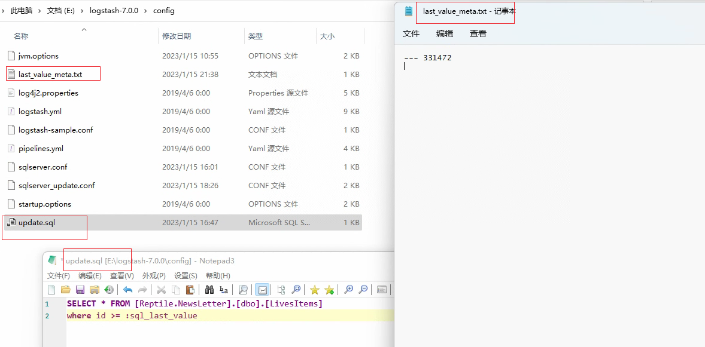

下面就是执行运行命令的时候了

bin\logstash -f config\sqlserver_update.conf ，上面设置的执行时corn是每分钟一次。所以logstash会每分钟去增量查询同步到es。这个服务可以作为windows后台服务，自行百度。

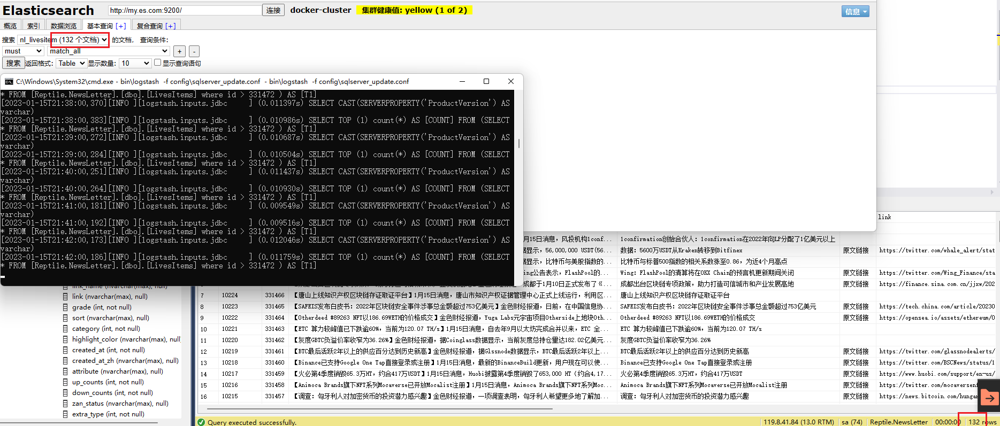

这里es就能实时的拿到数据库的数据。java的生态实在太好了。其实我们也可以通过net来写这个同样的共嗯，无非就是定时的查数据库调用es接口的插入操作。如果公司很依赖这个的话建议还是自己写，不管是版本还是配置还是升级这些都容易踩着坑。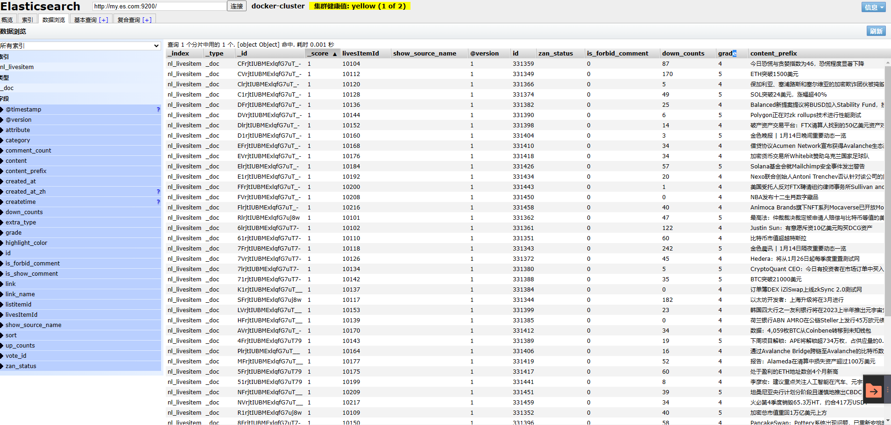

简单总结一下logstash同步数据的要点，首先配置好jdk驱动,其次就是配置文件的配置。一个是bin、一个是config。总归下来很简单的。

下面简单介绍下elk分布式日志中心的搭建和使用

上面的logstash同步es因为是做esde查询所以我单独部署的es系统。跟下面要介绍的elk是独立开来的，不涉及日志操作就隔离开了。

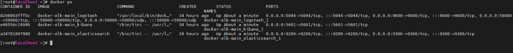

首先在虚拟机目录下面新建了一个elk文件夹。在elk文件夹下面通过wget 和github的下载链接把包下载下来，解压后就成了下面的样子。后面主要做的就是执行docker-compose up -d。github下面有详细介绍这个执行的命令和操作。这里需要踩坑就是docker和docker-compose的版本最好是最新的，太老的话执行docker-compose up -d会报一堆错误。

打开github下docker-elk的源地址

[deviantony/docker-elk: The Elastic stack (ELK) powered by Docker and Compose. (github.com)](https://github.com/deviantony/docker-elk)

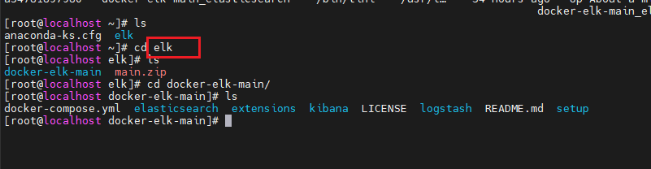

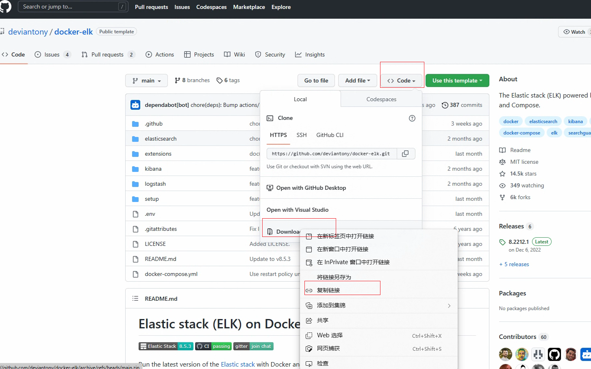

通过查看docker-compose.yml可以看到它的配置，装完后他会默认打开以下这些端口

5000: Logstash TCP input（Logstash数据的接收通道）
9200: Elasticsearch HTTP（ES的http通道）
9300: Elasticsearch TCP transport（ES的TCP通道）
5601: Kibana（UI管理界面）

*打开ip:5601的古管理界面，这里用到了es商业版本，会有默认的登陆账号<em>elastic、<em>密码**changeme 。我这里有测试过所以有产生几条数据。*</em></em>

*<em><em>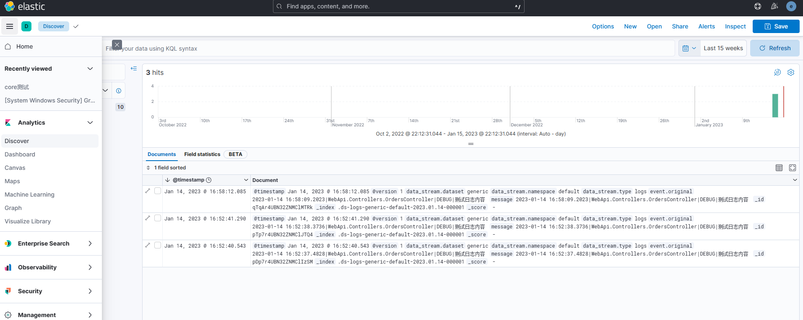*</em></em>

下面新建net7的项目，新建配置文件Nlog.config

```xml
<?xml version="1.0" encoding="utf-8" ?>
<nlog xmlns="http://www.nlog-project.org/schemas/NLog.xsd"
 xmlns:xsi="http://www.w3.org/2001/XMLSchema-instance"
```

 autoReload="true"
 internalLogLevel="Warn"
 internalLogFile="internal-nlog.txt">

```xml
 <extensions>
 <add assembly="NLog.Web.AspNetCore"/>
 </extensions >
 <variable name="logDirectory" value="${basedir}\logs\"/>
 <!--define various log targets-->
 <targets>
 <!--write logs to file-->
 <!--address 填写Logstash数据的接收通道-->
 <target xsi:type="Network"
```

 name="elastic"
 keepConnection="false"
```
 address ="tcp://my.es.com:50000"
 layout="${longdate}|${logger}|${uppercase:${level}}|${message} ${exception}" />
```

 />
```xml
 <target xsi:type="Null" name="blackhole" />
 </targets>
 <rules>
 <!--All logs, including from Microsoft-->
 <!--<logger name="*" minlevel="Trace" writeTo="allfile" />-->
 <!--Skip Microsoft logs and so log only own logs-->
 <logger name="Microsoft.*" minlevel="Trace" writeTo="blackhole" final="true" />
 <logger name="*" minlevel="Trace" writeTo="elastic" />
 </rules>
</nlog>

```

这里i只需要配置logstash接受数据通道50000，加上Program一行代码，当然NLog.Extensions.Logging 、NLog.Web.AspNetCore连个nuget包是需要引用的。

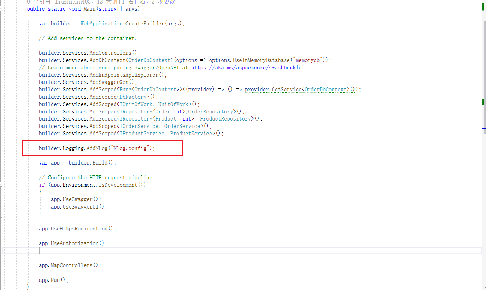

只是测试一下是否可用，所以测试代码就这么一点。

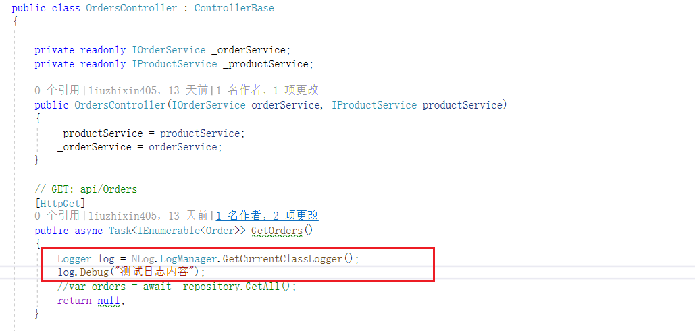

下面就可以运行项目调用swagger的接口了。上面有配置txt输出* internalLogFile="internal-nlog.txt，会在项目中生成该文件，通过该文件可以查看是否链接logstash成功，以及写入。*

*生产项目中用的serilog写入到logstash,使用中很方便。*

*<em>logstash*对于日志量大的保存一个月两个月的日志，性能也很不错，问题排查也的很友好，特别是生产环境。</em>

*<em>NLog*不支持ILogger泛型和微软自带的兼容好像没有serilog那么完美。当然没怎么使用和研究，NLog也有可能是我还没学会怎么用。</em>

---

*本文档由博客园下载器自动生成*
