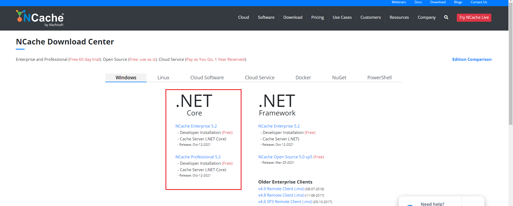
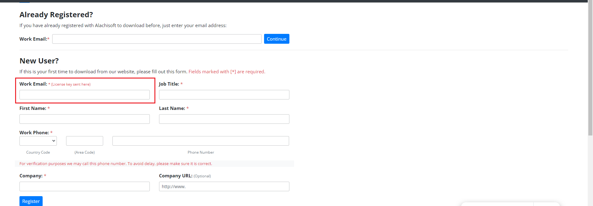
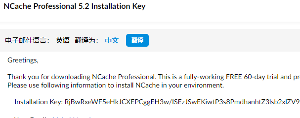
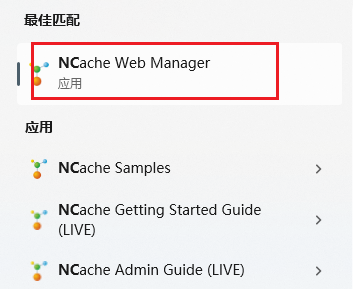
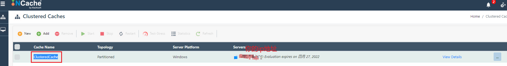
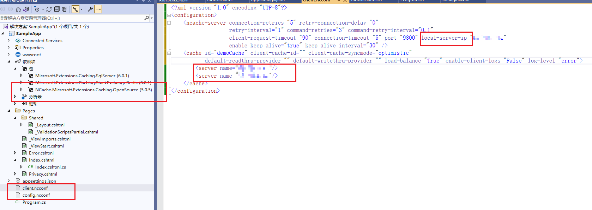
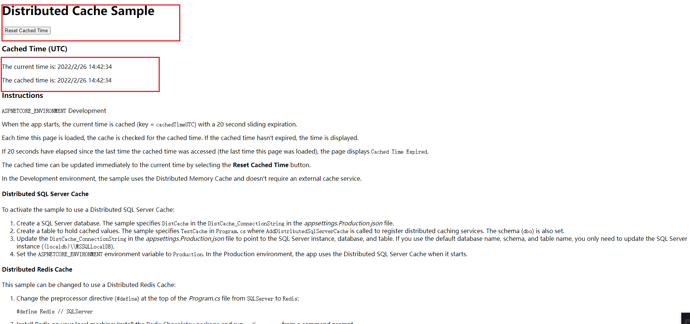

# 分布式缓存NCache使用

**发布日期:** 2022-02-26  
**原文链接:** https://www.cnblogs.com/morec/p/15940922.html  
**标签:** 无

---

NCache作为缓存优点币Redis有优势，但是收费的所以选用的不多吧。下面简单实操一下：

```
首先官网下载组件[NCache Download Center (alachisoft.com)](https://www.alachisoft.com/download-ncache.html)，这里选择企业和专业版都可以，都只有一个月试用期，下一步后统一协议，后弹出第二个界面需要填写一下注册信息。重点是workemail，这里需要工作邮箱，后缀是qq，163的都不行。我用的是zoho的邮箱。

```





下载完毕后需要通过cmd管理员命令去安装msi的文件，因为msi不能通过右键管理员来执行，二这个必须要管理员权限（有疑问 搜索管理员身份运行msi安装），安装过程中需要安装key，注册的邮箱里面有这个。



安装完后会有这几个出现在开始菜单，只需要打开NCache Web Manager,可以打开localhost:8251的管理界面。Cache Name和Servers需要在代码和配置文件中做好配置。





下面新建netcore6 webapi程序，导入NCache的包会自动生成：client.ncconf和config.ncconf两个配置文件，重点修改client.ncconf文件的两处服务ip，还有代码

```csharp
```html
configuration.CacheName = "ClusteredCache"<span>; 指定CacheName名称为上图的Cache Name。</span>
```

```


```csharp
using Alachisoft.NCache.Caching.Distributed;
using Microsoft.Extensions.Caching.Distributed;
using Microsoft.Extensions.Caching.SqlServer;
using Microsoft.Extensions.Caching.StackExchangeRedis;

var builder = WebApplication.CreateBuilder(args);

builder.Services.AddRazorPages();

```

builder.Services.AddNCacheDistributedCache(configuration =>
```css
{
 configuration.CacheName = "ClusteredCache";
 configuration.EnableLogs = true;
 configuration.ExceptionsEnabled = true;
});

var app = builder.Build();

```

#region snippet_Configure
app.Lifetime.ApplicationStarted.Register(() =>
```css
{
 var currentTimeUTC = DateTime.UtcNow.ToString();
 byte[] encodedCurrentTimeUTC = System.Text.Encoding.UTF8.GetBytes(currentTimeUTC);
 var options = new DistributedCacheEntryOptions()
 .SetSlidingExpiration(TimeSpan.FromSeconds(20));
```

 app.Services.GetService<IDistributedCache>()
```
 .Set("cachedTimeUTC", encodedCurrentTimeUTC, options);
});
```

#endregion

if (!app.Environment.IsDevelopment())
```css
{
 app.UseExceptionHandler("/Error");
 app.UseHsts();
}

app.UseHttpsRedirection();
app.UseStaticFiles();

app.UseRouting();

app.UseAuthorization();

app.MapRazorPages();

app.Run();

using Microsoft.AspNetCore.Mvc;
using Microsoft.AspNetCore.Mvc.RazorPages;
using Microsoft.Extensions.Caching.Distributed;
using System.Text;

namespace SampleApp.Pages
{
```

 #region snippet_IndexModel
```csharp
 public class IndexModel : PageModel
 {
 private readonly IDistributedCache _cache;

 public IndexModel(IDistributedCache cache)
 {
 _cache = cache;
 }

 public string? CachedTimeUTC { get; set; }
 public string? ASP_Environment { get; set; }

 public async Task OnGetAsync()
 {
 CachedTimeUTC = "Cached Time Expired";
 var encodedCachedTimeUTC = await _cache.GetAsync("cachedTimeUTC");

```

 if (encodedCachedTimeUTC != null)
```css
 {
 CachedTimeUTC = Encoding.UTF8.GetString(encodedCachedTimeUTC);
 }

 ASP_Environment = Environment.GetEnvironmentVariable("ASPNETCORE_ENVIRONMENT");
```

 if (String.IsNullOrEmpty(ASP_Environment))
```css
 {
 ASP_Environment = "Null, so Production";
 }
 }

 public async Task<IActionResult> OnPostResetCachedTime()
 {
 var currentTimeUTC = DateTime.UtcNow.ToString();
 byte[] encodedCurrentTimeUTC = Encoding.UTF8.GetBytes(currentTimeUTC);
 var options = new DistributedCacheEntryOptions()
 .SetSlidingExpiration(TimeSpan.FromSeconds(20));
 await _cache.SetAsync("cachedTimeUTC", encodedCurrentTimeUTC, options);

 return RedirectToPage();
 }
 }
```

 #endregion
```css
}

```

运行效果图如下：



示例代码：

[exercisebook/NCacheDistCache at main · liuzhixin405/exercisebook (github.com)](https://github.com/liuzhixin405/exercisebook/tree/main/NCacheDistCache)

参考来源：

[ASP.NET Core 中的分布式缓存 | Microsoft Docs](https://docs.microsoft.com/zh-cn/aspnet/core/performance/caching/distributed?view=aspnetcore-6.0#distributed-ncache-cache)

---

*本文档由博客园下载器自动生成*
