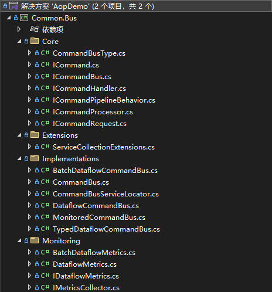
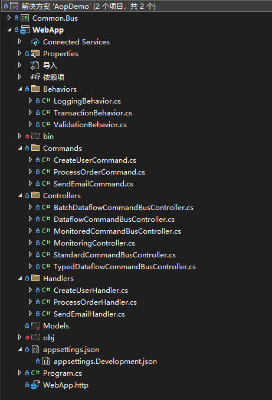

# 命令模式的深度解析：从标准实现到TPL Dataflow高性能架构

**发布日期:** 2025-09-15  
**原文链接:** https://www.cnblogs.com/morec/p/19091348  
**标签:** 无

---

命令模式是对一类对象公共操作的抽象，它们具有相同的方法签名，所以具有类似的操作，可以被抽象出来，成为一个抽象的命令对象。实际操作的调用者就不是和一组对象打交道，它是需要以来这个命令对象的方法签名，并根据这个签名调用相关的方法。

以上是命令模式的大概含义，这里可以联想到事件驱动，command和handler,也可以联想到AOP的思想。联想到数据流的操作我就写了个数据流操作类库。





之前写了一些有关AOP的，但是感觉还是差点意思，补上这次的可能在项目中会弥补一些短板回来，就是灵活性。
但是该项目重点是数据流的处理，所以web端来实现只是一个例子，大量数据的处理最主要的是后台任务吧，通过接口调用只是一个实例展示。

有关数据流这块代码核心如下：

```

```
using System;
using System.Collections.Concurrent;
using System.Collections.Generic;
using System.Linq;
using System.Reflection;
using System.Threading;
using System.Threading.Tasks;
using System.Threading.Tasks.Dataflow;
using Microsoft.Extensions.DependencyInjection;
using Microsoft.Extensions.Logging;
using Common.Bus.Core;
using Common.Bus.Monitoring;

namespace Common.Bus.Implementations
{
 /// <summary>
 /// 基于TPL数据流的高性能CommandBus实现
 /// 支持并行处理、背压控制和监控
 /// </summary>
 public class DataflowCommandBus : ICommandBus, IDisposable
 {
 private readonly IServiceProvider _provider;
 private readonly ILogger<DataflowCommandBus>? _logger;
 private readonly ConcurrentDictionary<Type, Func<object>> _handlerCache = new();
 private readonly ConcurrentDictionary<Type, Func<object[]>> _behaviorsCache = new();
 
 // 数据流网络
 private ActionBlock<DataflowCommandRequest> _commandProcessor = null!;
 
 // 背压控制
 private readonly SemaphoreSlim _concurrencyLimiter;
 private readonly int _maxConcurrency;
 
 // 监控指标
 private long _processedCommands;
 private long _failedCommands;
 private long _totalProcessingTime;

 public DataflowCommandBus(IServiceProvider serviceProvider, ILogger<DataflowCommandBus>? logger = null, 
 int? maxConcurrency = null)
 {
 _provider = serviceProvider;
 _logger = logger;
 _maxConcurrency = maxConcurrency ?? Environment.ProcessorCount * 2;
 _concurrencyLimiter = new SemaphoreSlim(_maxConcurrency, _maxConcurrency);
 
 // 创建数据流网络
 CreateDataflowNetwork();
 }

 private void CreateDataflowNetwork()
 {
 // 创建命令处理器
 _commandProcessor = new ActionBlock<DataflowCommandRequest>(
 async request =>
 {
 try
 {
 await _concurrencyLimiter.WaitAsync();
 var startTime = DateTime.UtcNow;
 
 // 执行完整的命令处理管道
 var result = await ProcessCommandPipeline(request);
 
 var processingTime = DateTime.UtcNow - startTime;
 Interlocked.Add(ref _totalProcessingTime, processingTime.Ticks);
 Interlocked.Increment(ref _processedCommands);
 
 request.TaskCompletionSource.SetResult(result);
 }
 catch (Exception ex)
 {
 Interlocked.Increment(ref _failedCommands);
 _logger?.LogError(ex, "Command processing failed for {CommandType}", request.CommandType.Name);
 request.TaskCompletionSource.SetException(ex);
 }
 finally
 {
 _concurrencyLimiter.Release();
 }
 },
 new ExecutionDataflowBlockOptions
 {
 MaxDegreeOfParallelism = _maxConcurrency,
 BoundedCapacity = _maxConcurrency * 2
 });
 }

 public async Task<TResult> SendAsync<TCommand, TResult>(TCommand command, CancellationToken ct = default) 
 where TCommand : ICommand<TResult>
 {
 var commandType = typeof(TCommand);
 var requestId = Guid.NewGuid();
 var tcs = new TaskCompletionSource<object>();
 
 var request = new DataflowCommandRequest(requestId, commandType, typeof(TResult), command, tcs);
 
 // 发送到数据流网络
 if (!_commandProcessor.Post(request))
 {
 throw new InvalidOperationException("Unable to queue command for processing - system may be overloaded");
 }
 
 try
 {
 var result = await tcs.Task.WaitAsync(ct);
 return (TResult)result;
 }
 catch (OperationCanceledException) when (ct.IsCancellationRequested)
 {
 _logger?.LogWarning("Command {CommandType} was cancelled", commandType.Name);
 throw;
 }
 }

 private async Task<object> ProcessCommandPipeline(DataflowCommandRequest request)
 {
 // 使用反射调用泛型方法
 var method = typeof(DataflowCommandBus).GetMethod(nameof(ProcessCommandPipelineGeneric), BindingFlags.NonPublic | BindingFlags.Instance);
 var genericMethod = method!.MakeGenericMethod(request.CommandType, request.ResultType);
 
 var task = (Task)genericMethod.Invoke(this, new object[] { request })!;
 await task;
 
 var resultProperty = task.GetType().GetProperty("Result");
 return resultProperty?.GetValue(task) ?? throw new InvalidOperationException("Failed to get result from task");
 }

 private async Task<TResult> ProcessCommandPipelineGeneric<TCommand, TResult>(DataflowCommandRequest request) 
 where TCommand : ICommand<TResult>
 {
 // 获取处理器和行为的工厂函数
 var handlerFactory = GetCachedHandler<TCommand, TResult>(request.CommandType);
 var behaviorsFactory = GetCachedBehaviors<TCommand, TResult>(request.CommandType);
 
 // 创建处理器和行为的实例
 var handler = handlerFactory();
 var behaviors = behaviorsFactory();
 
 // 构建处理管道
 Func<Task<TResult>> pipeline = () => ExecuteHandler<TCommand, TResult>(handler, (TCommand)request.Command);
 
 // 按顺序应用管道行为
 foreach (var behavior in behaviors.Reverse())
 {
 var currentBehavior = behavior;
 var currentPipeline = pipeline;
 pipeline = async () => (TResult)await ExecuteBehavior(currentBehavior, (TCommand)request.Command, currentPipeline);
 }
 
 return await pipeline();
 }

 private async Task<object> ExecuteBehavior<TCommand, TResult>(
 ICommandPipelineBehavior<TCommand, TResult> behavior, 
 TCommand command, 
 Func<Task<TResult>> next) 
 where TCommand : ICommand<TResult>
 {
 try
 {
 var result = await behavior.Handle(command, next, CancellationToken.None);
 return result!;
 }
 catch (Exception ex)
 {
 throw new InvalidOperationException($"Error executing behavior {behavior.GetType().Name}: {ex.Message}", ex);
 }
 }

 private Func<ICommandHandler<TCommand, TResult>> GetCachedHandler<TCommand, TResult>(Type commandType) 
 where TCommand : ICommand<TResult>
 {
 return (Func<ICommandHandler<TCommand, TResult>>)_handlerCache.GetOrAdd(commandType, _ =>
 {
 return new Func<ICommandHandler<TCommand, TResult>>(() =>
 {
 using var scope = _provider.CreateScope();
 var handler = scope.ServiceProvider.GetService<ICommandHandler<TCommand, TResult>>();
 if (handler == null)
 throw new InvalidOperationException($"No handler registered for {commandType.Name}");
 return handler;
 });
 });
 }

 private Func<ICommandPipelineBehavior<TCommand, TResult>[]> GetCachedBehaviors<TCommand, TResult>(Type commandType) 
 where TCommand : ICommand<TResult>
 {
 return (Func<ICommandPipelineBehavior<TCommand, TResult>[]>)_behaviorsCache.GetOrAdd(commandType, _ =>
 {
 return new Func<ICommandPipelineBehavior<TCommand, TResult>[]>(() =>
 {
 using var scope = _provider.CreateScope();
 var behaviors = scope.ServiceProvider.GetServices<ICommandPipelineBehavior<TCommand, TResult>>().ToArray();
 return behaviors;
 });
 });
 }

 private async Task<TResult> ExecuteHandler<TCommand, TResult>(ICommandHandler<TCommand, TResult> handler, TCommand command) 
 where TCommand : ICommand<TResult>
 {
 return await handler.HandleAsync(command, CancellationToken.None);
 }

 private async Task<object> ExecuteHandler(object handler, object command)
 {
 var handlerType = handler.GetType();
 var handleMethod = handlerType.GetMethod("HandleAsync");
 
 if (handleMethod == null)
 throw new InvalidOperationException($"Handler {handlerType.Name} does not have HandleAsync method");

 var task = (Task)handleMethod.Invoke(handler, new object[] { command, CancellationToken.None })!;
 await task;
 
 var resultProperty = task.GetType().GetProperty("Result");
 return resultProperty?.GetValue(task) ?? throw new InvalidOperationException("Failed to get result from task");
 }

 private Func<object> GetCachedHandler(Type commandType)
 {
 return _handlerCache.GetOrAdd(commandType, _ =>
 {
 // 获取命令类型实现的ICommand<TResult>接口
 var commandInterface = commandType.GetInterfaces()
 .FirstOrDefault(i => i.IsGenericType && i.GetGenericTypeDefinition() == typeof(ICommand<>));
 
 if (commandInterface == null)
 throw new InvalidOperationException($"Command type {commandType.Name} does not implement ICommand<TResult>");
 
 var resultType = commandInterface.GetGenericArguments()[0];
 var handlerType = typeof(ICommandHandler<,>).MakeGenericType(commandType, resultType);
 
 // 返回一个工厂函数，而不是直接返回处理器实例
 return new Func<object>(() =>
 {
 using var scope = _provider.CreateScope();
 var handler = scope.ServiceProvider.GetService(handlerType);
 if (handler == null)
 throw new InvalidOperationException($"No handler registered for {commandType.Name}");
 return handler;
 });
 });
 }

 private Func<object[]> GetCachedBehaviors(Type commandType)
 {
 return _behaviorsCache.GetOrAdd(commandType, _ =>
 {
 // 获取命令类型实现的ICommand<TResult>接口
 var commandInterface = commandType.GetInterfaces()
 .FirstOrDefault(i => i.IsGenericType && i.GetGenericTypeDefinition() == typeof(ICommand<>));
 
 if (commandInterface == null)
 throw new InvalidOperationException($"Command type {commandType.Name} does not implement ICommand<TResult>");
 
 var resultType = commandInterface.GetGenericArguments()[0];
 var behaviorType = typeof(ICommandPipelineBehavior<,>).MakeGenericType(commandType, resultType);
 
 // 返回一个工厂函数，而不是直接返回行为实例
 return new Func<object[]>(() =>
 {
 using var scope = _provider.CreateScope();
 var behaviors = scope.ServiceProvider.GetServices(behaviorType).Where(b => b != null).ToArray();
 return behaviors!;
 });
 });
 }

 // 监控和统计方法
 public DataflowMetrics GetMetrics()
 {
 return new DataflowMetrics
 {
 ProcessedCommands = Interlocked.Read(ref _processedCommands),
 FailedCommands = Interlocked.Read(ref _failedCommands),
 TotalProcessingTime = TimeSpan.FromTicks(Interlocked.Read(ref _totalProcessingTime)),
 AverageProcessingTime = _processedCommands > 0 
 ? TimeSpan.FromTicks(Interlocked.Read(ref _totalProcessingTime) / _processedCommands)
 : TimeSpan.Zero,
 AvailableConcurrency = _concurrencyLimiter.CurrentCount,
 MaxConcurrency = _maxConcurrency,
 InputQueueSize = _commandProcessor.InputCount
 };
 }

 public void ClearCache()
 {
 _handlerCache.Clear();
 _behaviorsCache.Clear();
 }

 public void Dispose()
 {
 _commandProcessor?.Complete();
 _concurrencyLimiter?.Dispose();
 }
 }

 // 辅助类
 internal class DataflowCommandRequest
 {
 public Guid Id { get; }
 public Type CommandType { get; }
 public Type ResultType { get; }
 public object Command { get; }
 public TaskCompletionSource<object> TaskCompletionSource { get; }

 public DataflowCommandRequest(Guid id, Type commandType, Type resultType, object command, TaskCompletionSource<object> tcs)
 {
 Id = id;
 CommandType = commandType;
 ResultType = resultType;
 Command = command;
 TaskCompletionSource = tcs;
 }
 }

}
```

```

这里如果不是数据流方式可以使用通用模式：

```

```
using System;
using System.Collections.Concurrent;
using System.Collections.Generic;
using System.Linq;
using System.Text;
using System.Threading.Tasks;
using Microsoft.Extensions.DependencyInjection;
using Common.Bus.Core;

namespace Common.Bus.Implementations
{
 public class CommandBus : ICommandBus
 {
 private readonly IServiceProvider _provider;
 private readonly ConcurrentDictionary<Type, Func<object>> _handlerCache = new();
 private readonly ConcurrentDictionary<Type, Func<object[]>> _behaviorsCache = new();
 private readonly ConcurrentDictionary<Type, Func<object, object, CancellationToken, Task<object>>> _pipelineCache = new();

 public CommandBus(IServiceProvider serviceProvider)
 {
 _provider = serviceProvider;
 }

 // 添加清理缓存的方法，用于测试或动态重新加载
 public void ClearCache()
 {
 _handlerCache.Clear();
 _behaviorsCache.Clear();
 _pipelineCache.Clear();
 }

 public async Task<TResult> SendAsync<TCommand, TResult>(TCommand command, CancellationToken ct = default) where TCommand : ICommand<TResult>
 {
 var commandType = typeof(TCommand);
 
 // 获取缓存的Handler
 var handler = GetCachedHandler<TCommand, TResult>(commandType);
 
 // 获取缓存的Pipeline
 var pipeline = GetCachedPipeline<TCommand, TResult>(commandType);
 
 // 执行Pipeline
 var result = await pipeline(handler, command, ct);
 return (TResult)result;
 }

 private ICommandHandler<TCommand, TResult> GetCachedHandler<TCommand, TResult>(Type commandType) where TCommand : ICommand<TResult>
 {
 var handlerFactory = (Func<object>)_handlerCache.GetOrAdd(commandType, _ =>
 {
 return new Func<object>(() =>
 {
 using var scope = _provider.CreateScope();
 var handler = scope.ServiceProvider.GetService(typeof(ICommandHandler<TCommand, TResult>));
 if (handler == null)
 throw new InvalidOperationException($"No handler registered for {commandType.Name}");
 return handler;
 });
 });
 return (ICommandHandler<TCommand, TResult>)handlerFactory();
 }

 private ICommandPipelineBehavior<TCommand, TResult>[] GetCachedBehaviors<TCommand, TResult>(Type commandType) where TCommand : ICommand<TResult>
 {
 var behaviorsFactory = (Func<object[]>)_behaviorsCache.GetOrAdd(commandType, _ =>
 {
 return new Func<object[]>(() =>
 {
 using var scope = _provider.CreateScope();
 var behaviors = scope.ServiceProvider.GetServices<ICommandPipelineBehavior<TCommand, TResult>>().ToArray();
 return behaviors.Cast<object>().ToArray();
 });
 });
 return behaviorsFactory().Cast<ICommandPipelineBehavior<TCommand, TResult>>().ToArray();
 }

 private Func<object, object, CancellationToken, Task<object>> GetCachedPipeline<TCommand, TResult>(Type commandType) where TCommand : ICommand<TResult>
 {
 return _pipelineCache.GetOrAdd(commandType, _ =>
 {
 var behaviors = GetCachedBehaviors<TCommand, TResult>(commandType);
 
 // 预构建Pipeline，避免每次调用时重新构建
 return async (handler, command, ct) =>
 {
 if (handler == null || command == null)
 throw new ArgumentNullException("Handler or command cannot be null");
 
 var typedHandler = (ICommandHandler<TCommand, TResult>)handler;
 var typedCommand = (TCommand)command;

 // 如果没有behaviors，直接调用handler
 if (behaviors.Length == 0)
 {
 var result = await typedHandler.HandleAsync(typedCommand, ct);
 return (object)result!;
 }

 // 使用递归方式构建pipeline，减少委托创建
 var pipelineResult = await ExecutePipeline(typedHandler, typedCommand, behaviors, 0, ct);
 return (object)pipelineResult!;
 };
 });
 }

 private async Task<TResult> ExecutePipeline<TCommand, TResult>(
 ICommandHandler<TCommand, TResult> handler, 
 TCommand command, 
 ICommandPipelineBehavior<TCommand, TResult>[] behaviors, 
 int behaviorIndex, 
 CancellationToken ct) where TCommand : ICommand<TResult>
 {
 if (behaviorIndex >= behaviors.Length)
 {
 return await handler.HandleAsync(command, ct);
 }

 var behavior = behaviors[behaviorIndex];
 return await behavior.Handle(command, () => ExecutePipeline(handler, command, behaviors, behaviorIndex + 1, ct), ct);
 }
 }
}
```

```

其他批量操作、带监控等模式就参考其他代码：
[exercisebook/AOP/EventBusAOP/AopNew at main · liuzhixin405/exercisebook](https://github.com/liuzhixin405/exercisebook/tree/main/AOP/EventBusAOP/AopNew)

一下是项目更详细介绍，如有错误多多指正：

<div># CommandBus AOP 项目

这是一个基于AOP（面向切面编程）的CommandBus项目，使用TPL Dataflow进行数据流处理优化，支持多种CommandBus实现和实时监控。

## CommandBus实现类型

### 1. Standard CommandBus

- **类型**: `CommandBusType.Standard`

- **特点**: 标准同步处理，适合简单场景

- **控制器**: `StandardCommandBusController`

### 2. Dataflow CommandBus

- **类型**: `CommandBusType.Dataflow`

- **特点**: 基于TPL Dataflow的异步并发处理，适合高并发场景

- **控制器**: `DataflowCommandBusController`

### 3. Batch Dataflow CommandBus

- **类型**: `CommandBusType.BatchDataflow`

- **特点**: 支持批量处理，适合大批量数据场景

- **控制器**: `BatchDataflowCommandBusController`

### 4. Typed Dataflow CommandBus

- **类型**: `CommandBusType.TypedDataflow`

- **特点**: 强类型安全，适合复杂业务场景

- **控制器**: `TypedDataflowCommandBusController`

### 5. Monitored CommandBus

- **类型**: `CommandBusType.Monitored`

- **特点**: 包含性能监控，适合生产环境

- **控制器**: `MonitoredCommandBusController`

这里有一个扩展点behavior，可以注入前后时间，当前代代码只做了业务前的拦截，业务后的可以如法炮制。这样的话就是一个aop，那么跟aop切面编程又有什么区别和共同点呢？

```

```
 // 构建处理管道
 Func<Task<TResult>> pipeline = () => ExecuteHandler<TCommand, TResult>(handler, (TCommand)request.Command);
 
 // 按顺序应用管道行为
 foreach (var behavior in behaviors.Reverse())
 {
 var currentBehavior = behavior;
 var currentPipeline = pipeline;
 pipeline = async () => (TResult)await ExecuteBehavior(currentBehavior, (TCommand)request.Command, currentPipeline);
 }
 
 return await pipeline();
 }
```

```

</div>

## 🟢 共同点

- 
**目标一致**：都是把 **横切关注点**（Logging、Validation、Transaction、Caching 等）从业务逻辑里抽离出来。

- 
**调用链模式**：无论是 AOP 的 **拦截器链**，还是 CommandBus 的 **Behavior 管道**，最终都是一层层包装，最后执行真正的业务逻辑。

- 
**可插拔**：可以动态增加/减少某个横切逻辑，而不用改业务代码。

<hr data-start="400" data-end="403">
## 🔵 区别

<div class="group w-fit _tableWrapper_1rjym_13 flex flex-col-reverse">
<table class="w-fit min-w-(--thread-content-width)" data-start="414" data-end="906">
<thead data-start="414" data-end="463">
<tr data-start="414" data-end="463"><th data-start="414" data-end="419" data-col-size="sm">特性</th><th data-start="419" data-end="438" data-col-size="sm">AOP (动态代理 / 拦截器)</th><th data-start="438" data-end="463" data-col-size="md">CommandBus + Behavior</th></tr>
</thead>
<tbody data-start="510" data-end="906">
<tr data-start="510" data-end="583">
<td data-start="510" data-end="517" data-col-size="sm">触发方式</td>
<td data-start="517" data-end="544" data-col-size="sm">**方法调用时拦截**（通过代理/动态代理实现）</td>
<td data-start="544" data-end="583" data-col-size="md">**命令执行时经过管道**（需要显式通过 CommandBus 调用）</td>
</tr>
<tr data-start="584" data-end="642">
<td data-start="584" data-end="589" data-col-size="sm">范围</td>
<td data-start="589" data-end="609" data-col-size="sm">**通用**（任何类方法都能拦截）</td>
<td data-start="609" data-end="642" data-col-size="md">**限定在 Command 处理**（CQRS 场景特化）</td>
</tr>
<tr data-start="643" data-end="762">
<td data-start="643" data-end="650" data-col-size="sm">技术实现</td>
<td data-start="650" data-end="687" data-col-size="sm">依赖 **DI 容器拦截**、**中间件** 或 **编译期注入**</td>
<td data-start="687" data-end="762" data-col-size="md">依赖 **Pipeline 模式**，类似 MediatR 的 `IPipelineBehavior<TRequest,TResponse>`</td>
</tr>
<tr data-start="763" data-end="837">
<td data-start="763" data-end="769" data-col-size="sm">灵活度</td>
<td data-start="769" data-end="805" data-col-size="sm">更通用，可以横跨全项目（比如给 Service 层所有方法加日志）</td>
<td data-start="805" data-end="837" data-col-size="md">针对性更强，主要是 Command/Query 的执行链</td>
</tr>
<tr data-start="838" data-end="906">
<td data-start="838" data-end="844" data-col-size="sm">侵入性</td>
<td data-start="844" data-end="868" data-col-size="sm">低，业务代码不用改（只要接口/虚方法即可）</td>
</tr>
</tbody>
</table>

## **性能对比总结**

<div class="_tableContainer_1rjym_1">
<div class="group w-fit _tableWrapper_1rjym_13 flex flex-col-reverse">
<table class="w-fit min-w-(--thread-content-width)" data-start="786" data-end="990">
<thead data-start="786" data-end="828">
<tr data-start="786" data-end="828"><th data-start="786" data-end="791" data-col-size="sm">维度</th><th data-start="791" data-end="803" data-col-size="sm">AOP（动态代理）</th><th data-start="803" data-end="828" data-col-size="sm">CommandBus + Behavior</th></tr>

</thead>
<tbody data-start="872" data-end="990">
<tr data-start="872" data-end="901">
<td data-start="872" data-end="879" data-col-size="sm">调用开销</td>
<td data-start="879" data-end="891" data-col-size="sm">需要动态代理/反射</td>
<td data-start="891" data-end="901" data-col-size="sm">普通方法调用</td>

</tr>
<tr data-start="902" data-end="929">
<td data-start="902" data-end="909" data-col-size="sm">可扩展性</td>
<td data-start="909" data-end="916" data-col-size="sm">全局通用</td>
<td data-start="916" data-end="929" data-col-size="sm">局部（命令/查询）</td>

</tr>
<tr data-start="930" data-end="952">
<td data-start="930" data-end="937" data-col-size="sm">性能损耗</td>
<td data-start="937" data-end="944" data-col-size="sm">相对较高</td>
<td data-start="944" data-end="952" data-col-size="sm">相对较低</td>

</tr>
<tr data-start="953" data-end="990">
<td data-start="953" data-end="958" data-col-size="sm">场景</td>
<td data-start="958" data-end="971" data-col-size="sm">横切关注点，通用功能</td>
<td data-start="971" data-end="990" data-col-size="sm">CQRS 业务管道，高性能场景</td>

</tr>

</tbody>

</table>

 两者一句话总结：

- 
**AOP 更通用，但性能稍差**（尤其高并发、核心链路要慎用）。

- 
**CommandBus + Behavior 更高效，但应用范围窄**（主要适合命令/查询处理管道）。

</div>

</div>

</div>

---

*本文档由博客园下载器自动生成*
