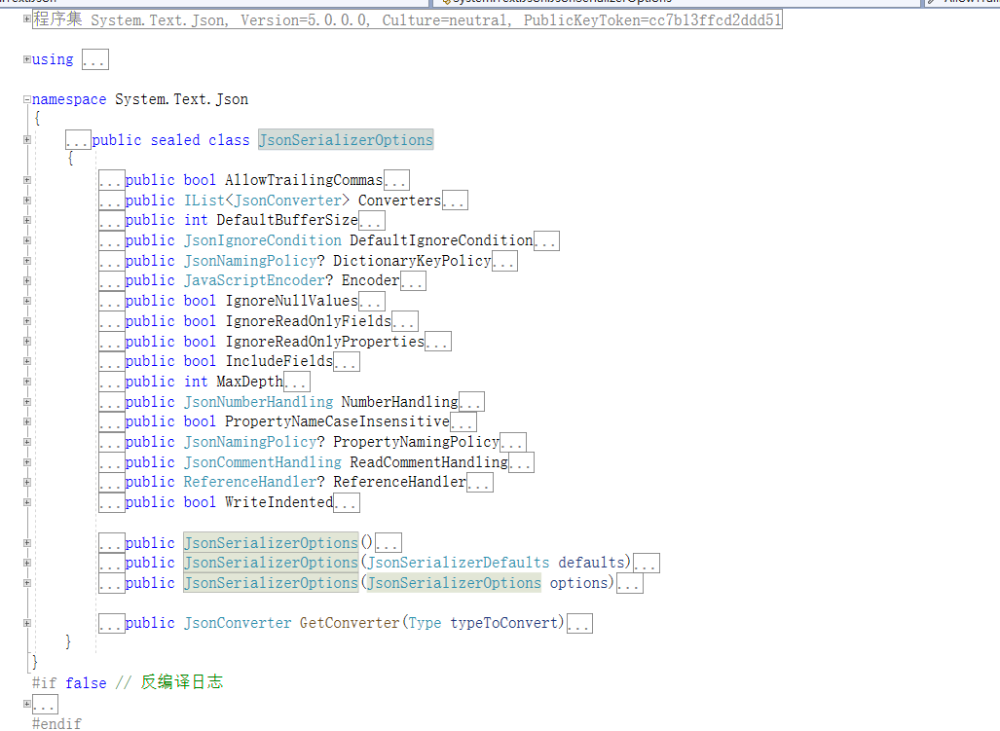

# 微软的Serialize和Newtonsoft的SerializeObject比较

**发布日期:** 2022-01-13  
**原文链接:** https://www.cnblogs.com/morec/p/15799866.html  
**标签:** 无

---

微软的序列化反序列化组件出来已有好几年了，刚出来的时候各种吐槽。最近在优化代码，比较了一下微软的Serialize和Newtonsoft的SerializeObject，感觉大部分场景下可以用微软的序列化组件了，Newtonsoft第三方可能被我放弃掉。测试有交换顺序，也有多次测试。

```

```
 1 using Newtonsoft.Json;
 2 using System;
 3 using System.Diagnostics;
 4 namespace JsonTest
 5 {
 6 internal class Program
 7 {
 8 static void Main(string[] args)
 9 {
10 var count = 10_000;
11 var elapsedMilliseconds = Serialize(count, () =>
12 {
13 JsonConvert.SerializeObject(new WeatherForecast
14 {
15 Date = DateTime.Now,
16 Summary = "Hot",
17 TemperatureCelsius = 88
18 });
19 });
20 Console.WriteLine($"serialize object count:{count}, newtonsoft used: {elapsedMilliseconds} seconds");
21 
22 elapsedMilliseconds = Serialize(count, () =>
23 {
24 System.Text.Json.JsonSerializer.Serialize(new WeatherForecast
25 {
26 Date = DateTime.Now,
27 Summary = "Hot",
28 TemperatureCelsius = 88
29 });
30 });
31 Console.WriteLine($"serialize object count:{count}, textjson used : {elapsedMilliseconds} seconds");
32 
33 Console.WriteLine("***************************************************");
34 
35 count = 10_000_000;
36 elapsedMilliseconds = Serialize(count, () =>
37 {
38 JsonConvert.SerializeObject(new WeatherForecast
39 {
40 Date = DateTime.Now,
41 Summary = "Hot",
42 TemperatureCelsius = 88
43 });
44 });
45 Console.WriteLine($"serialize object count:{count}, newtonsoft used: {elapsedMilliseconds} seconds");
46 
47 elapsedMilliseconds = Serialize(count, () =>
48 {
49 System.Text.Json.JsonSerializer.Serialize(new WeatherForecast
50 {
51 Date = DateTime.Now,
52 Summary = "Hot",
53 TemperatureCelsius = 88
54 });
55 });
56 Console.WriteLine($"serialize object count:{count}, textjson used : {elapsedMilliseconds} seconds");
57 Console.ReadKey();
58 
59 /*
60 serialize object count:10000, newtonsoft used: 288 seconds
61 serialize object count:10000, textjson used : 45 seconds
62 ***************************************************
63 serialize object count:10000000, newtonsoft used: 10324 seconds
64 serialize object count:10000000, textjson used : 5681 seconds
65 */
66 }
67 
68 static long Serialize(int count, Action action)
69 {
70 Stopwatch stopwatch = Stopwatch.StartNew();
71 for (int i = count; i > 0; i--)
72 {
73 action();
74 }
75 stopwatch.Stop();
76 var result = stopwatch.ElapsedMilliseconds;
77 stopwatch.Reset();
78 return result;
79 }
80 }
81 internal class WeatherForecast
82 {
83 public DateTimeOffset Date { get; set; }
84 public int TemperatureCelsius { get; set; }
85 public string Summary { get; set; }
86 }
87 }
```

```

当然如果加上JsonSerializerOptions，而且全部配置起来性能就会有所下降，毕竟这么多配置在这呢，但是这样也会更加灵活。



下面是反序列化的例子，速度和序列化比较差不多。

```

```
 1 using Newtonsoft.Json;
 2 using System;
 3 using System.Collections.Generic;
 4 using System.Diagnostics;
 5 using System.Linq;
 6 using System.Text;
 7 using System.Threading.Tasks;
 8 
 9 namespace JsonTest
10 {
11 internal class App
12 {
13 static void Main(string[] args)
14 {
15 var jsonStr = "{\"Date\":\"2019 - 08 - 01T00: 00:00 - 07:00\",\"TemperatureCelsius\":25,\"Summary\":\"Hot\",\"DatesAvailable\":[\"2019 - 08 - 01T00: 00:00 - 07:00\",\"2019 - 08 - 02T00: 00:00 - 07:00\"],\"TemperatureRanges\":{\"Cold\":{\"High\":20,\"Low\":-10},\"Hot\":{\"High\":60,\"Low\":20}},\"SummaryWords\":[\"Cool\",\"Windy\",\"Humid\"]}";
16 var count = 10_000;
17 var elapsedMilliseconds = Derialize(count, () =>
18 {
19 JsonConvert.DeserializeObject<Student>(jsonStr);
20 });
21 Console.WriteLine($"deserialize object count:{count}, newtonsoft used: {elapsedMilliseconds} seconds");
22 
23 elapsedMilliseconds = Derialize(count, () =>
24 {
25 System.Text.Json.JsonSerializer.Deserialize<Student>(jsonStr);
26 });
27 Console.WriteLine($"deserialize object count:{count}, textjson used : {elapsedMilliseconds} seconds");
28 
29 Console.WriteLine("***************************************************");
30 
31 count = 10_000_000;
32 elapsedMilliseconds = Derialize(count, () =>
33 {
34 JsonConvert.DeserializeObject<Student>(jsonStr);
35 });
36 Console.WriteLine($"deserialize object count:{count}, newtonsoft used: {elapsedMilliseconds} seconds");
37 
38 elapsedMilliseconds = Derialize(count, () =>
39 {
40 System.Text.Json.JsonSerializer.Deserialize<Student>(jsonStr);
41 });
42 Console.WriteLine($"deserialize object count:{count}, textjson used : {elapsedMilliseconds} seconds");
43 /*
44 deserialize object count:10000, newtonsoft used: 263 seconds
45 deserialize object count:10000, textjson used : 56 seconds
46 ***************************************************
47 deserialize object count:10000000, newtonsoft used: 29726 seconds
48 deserialize object count:10000000, textjson used : 12422 seconds
49 
50 */
51 Console.ReadKey();
52 }
53 static long Derialize(int count, Action action)
54 {
55 Stopwatch stopwatch = Stopwatch.StartNew();
56 for (int i = count; i > 0; i--)
57 {
58 action();
59 }
60 stopwatch.Stop();
61 var result = stopwatch.ElapsedMilliseconds;
62 stopwatch.Reset();
63 return result;
64 }
65 
66 }
67 
68 internal class Student
69 {
70 public DateTime BarthDay { get; set; }
71 public int Age { get; set; }
72 public string Name { get; set; }
73 }
74 }
```

```

微软文档里面有各种介绍，不再详述！

 [从 Newtonsoft.Json 迁移到 System.Text.Json - .NET | Microsoft Docs](https://docs.microsoft.com/zh-cn/dotnet/standard/serialization/system-text-json-migrate-from-newtonsoft-how-to?pivots=dotnet-6-0)

---

*本文档由博客园下载器自动生成*
