# 记一次aspnetcore发布部署流程初次使用k8s

**发布日期:** 2024-07-05  
**原文链接:** https://www.cnblogs.com/morec/p/18285969  
**标签:** 无

---

主题：

aspnetcorewebapi项目，提交到gitlab，通过jenkins(gitlab的ci/cd)编译、发布、推送到k8s。

关于gitlab、jenkins、k8s安装，都是使用docker启动服务。

首先新建一个项目,为了方便浏览就把swaggerr非开发环境不展示去掉

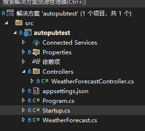

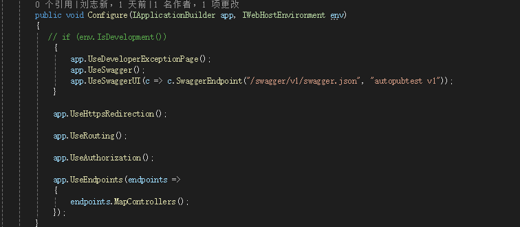

下面就是需要准备Dockerfile和k8s.yaml文件，这里不应该用net5，过时了。

FROM mcr.microsoft.com/dotnet/aspnet:5.0-buster-slim AS base
COPY . /app
WORKDIR /app
EXPOSE 5000/tcp
ENV ASPNETCORE_URLS http://*:5000/
ENV TZ=Asia/Shanghai

# Work around for broken dotnet restore
ADD http://ftp.us.debian.org/debian/pool/main/c/ca-certificates/ca-certificates_20210119_all.deb .
RUN dpkg -i ca-certificates_20210119_all.deb

# soft link
RUN ln -snf /usr/share/zoneinfo/$TZ /etc/localtime && echo $TZ > /etc/timezone
RUN ln -s /lib/x86_64-linux-gnu/libdl-2.24.so /lib/x86_64-linux-gnu/libdl.so

# install System.Drawing native dependencies
RUN apt-get update \
 && apt-get install -y --allow-unauthenticated \
 ca-certificates \
 && update-ca-certificates \
 libgdiplus \
 && rm -rf /var/lib/apt/lists/*
 
ENTRYPOINT ["dotnet", "autopubtest.dll"]

apiVersion: apps/v1
kind: Deployment
metadata:
 name: {deployName}
 labels:
 app: {deployName}
 namespace: default
spec:
 replicas: 2
 selector:
 matchLabels:
 app: {deployName}
 template:
 metadata:
 labels:
 app: {deployName}
 spec:
 nodeSelector:
 group: web
 containers:
 - name: {containerName}
 image: {imageRegistry}/{imageName}:{imageTag}
 volumeMounts:
 - name: config-volume
 mountPath: /app/appsettings.Production.json
 subPath: appsettings.Production.json
 env:
 - name: ASPNETCORE_ENVIRONMENT
 value: Production
 ports:
 - containerPort: 5000
 volumes:
 - name: config-volume
 configMap:
 name: autopubtest-config
 imagePullSecrets:
 - name: docker-secret
---

kind: Service
apiVersion: v1
metadata:
 name: {serviceName}
 labels:
 app: {serviceName}
 namespace: default
spec:
 selector:
 app: {deployName}
 ports:
 - name: {serviceName}
 port: 5000
 protocol: TCP
 targetPort: 5000

这里需要注意的是configMap的name是我们需要再K8S里面建的appsettings.环境.json文件

```csharp
 configMap:
 name: autopubtest-config

```
 一切准备就绪，本地需要有docker环境，就能验证dockerfile是否有报错，我本地是dockerdesktop。

下面就先把代码提交到gitlab，我是用develop自建分支，而且我用的是http

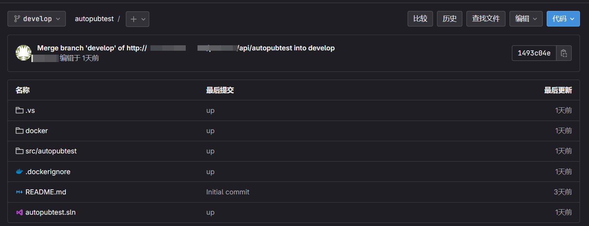

 这里gitlab

# [v17.1.1](https://gitlab.com/gitlab-org/gitlab-foss/-/tags/v17.1.1)

有一个问题就是默认会把容器的id当成请求的ip地址，通过git 的git或者http拉取代码这里都会有问题，进入gitlab的容器内部找到 /etc/gitlab/gitlab.rb找到external_url注释掉的一行，改下你实际的地址和端口就行。

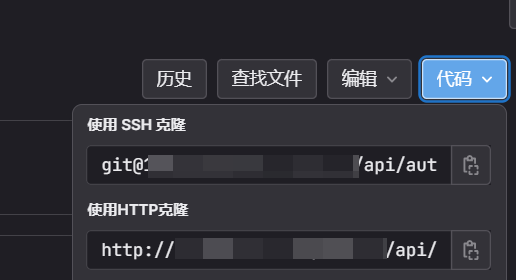

 这里稍微提一下gitlab的ci/cd，本篇主要是jenkins。

gitlab安装完默认密码存放在 /etc/gitlab/initial_root_password ，默认用户root

```csharp
networks:指定唯一，在服务器中新建一个networks，方便一个网段通信，如果是分开的服务器就是用ip或者其他。
register runner的时候手敲，ip指定gitlab容器的内网ip，查看命令 docker inspect docker容器id，类似这样的，下面提示就是成功注册一个runner
Registering runner... succeeded runner=

```
gitlab-runner register \
 --url http://gitlab的docker的ip \
 --registration-token gitlab runners中的token \
 --executor docker \
 --description "My Docker Runner" \
 --docker-image "alpine:latest"

```csharp
这里是安装gitlab和gitlab-runner的docker-compose.yml 

```
version: '3.3'
services:
 gitlab:
 image: gitlab/gitlab-ce:latest
 container_name: gitlab
 ports:
 - "80:80"
 networks:
 - my-network

 gitlab-runner:
 image: gitlab/gitlab-runner:latest
 container_name: gitlab-runner
 restart: always
 volumes:
 - /var/run/docker.sock:/var/run/docker.sock
 networks:
 - my-network

networks:
 my-network:
 driver: bridge

只要在项目中新增.gitlab-ci.yml,再把类似jenkins的shell操作放到文件中就可以了。这里有一个测试的文件，tags很重要，注册runner的时候指定需要的，再在文件中配置了，就会按照流程。

stages: # List of stages for jobs, and their order of execution
 - build
 - test
 - deploy

build-job: # This job runs in the build stage, which runs first.
 stage: build
 tags: # Add the tags here
 - docker
 - linux
 script:
 - echo "Compiling the code..."
 - echo "Compile complete."

unit-test-job: # This job runs in the test stage.
 stage: test # It only starts when the job in the build stage completes successfully.
 tags: # Add the tags here
 - docker
 - linux
 script:
 - echo "Running unit tests... This will take about 60 seconds."
 - sleep 60
 - echo "Code coverage is 90%"

lint-test-job: # This job also runs in the test stage.
 stage: test # It can run at the same time as unit-test-job (in parallel).
 tags: # Add the tags here
 - docker
 - linux
 - fast
 script:
 - echo "Linting code... This will take about 10 seconds."
 - sleep 10
 - echo "No lint issues found."

deploy-job: # This job runs in the deploy stage.
 stage: deploy # It only runs when *both* jobs in the test stage complete successfully.
 tags: # Add the tags here
 - docker
 - linux
 - fast
 environment: production
 script:
 - echo "Deploying application..."
 - echo "Application successfully deployed."

上面仅仅只是一个测试完整流程文件，不涉及docker打包操作,需要docker打包的话runner就需要安装，安装模式有几种，自行查资料。

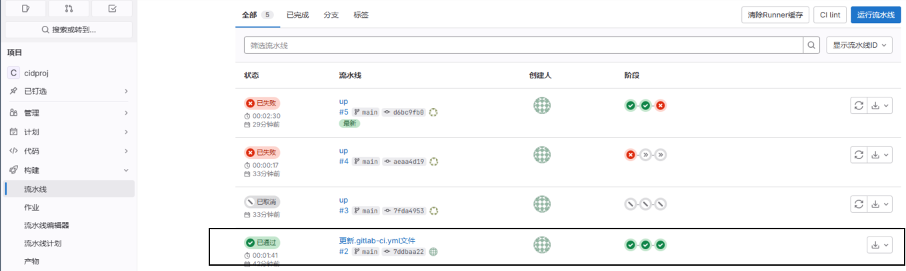

下面介绍jenkins的操作

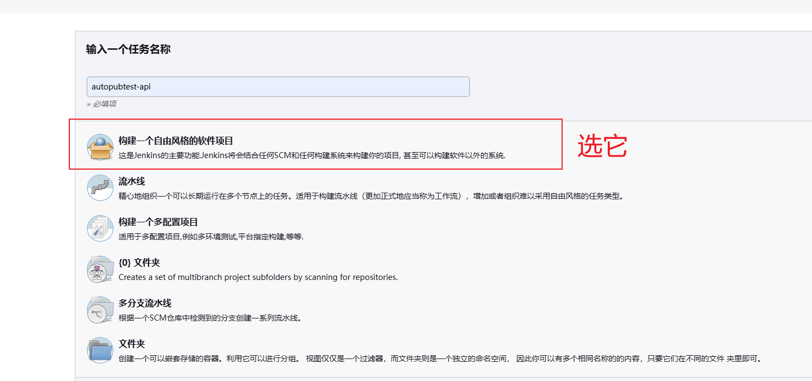

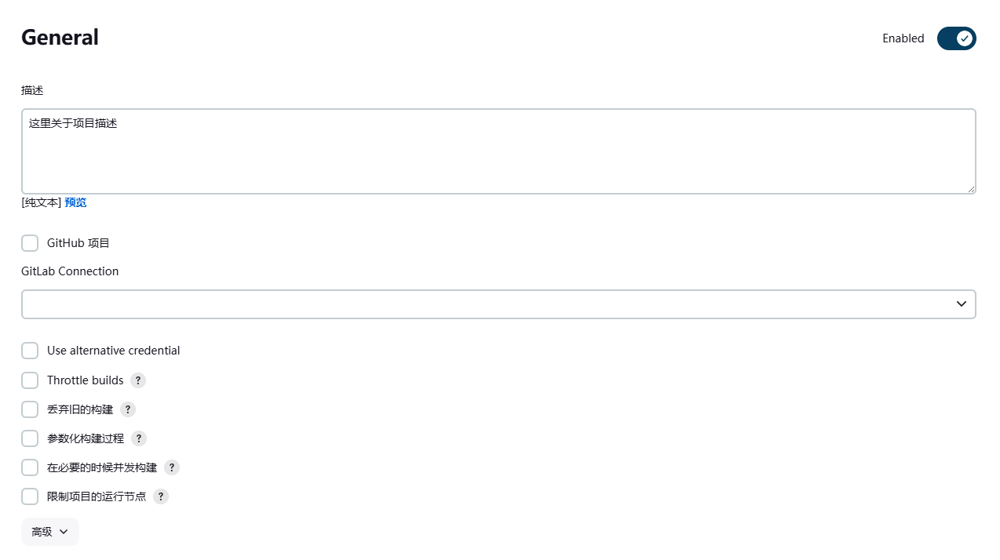

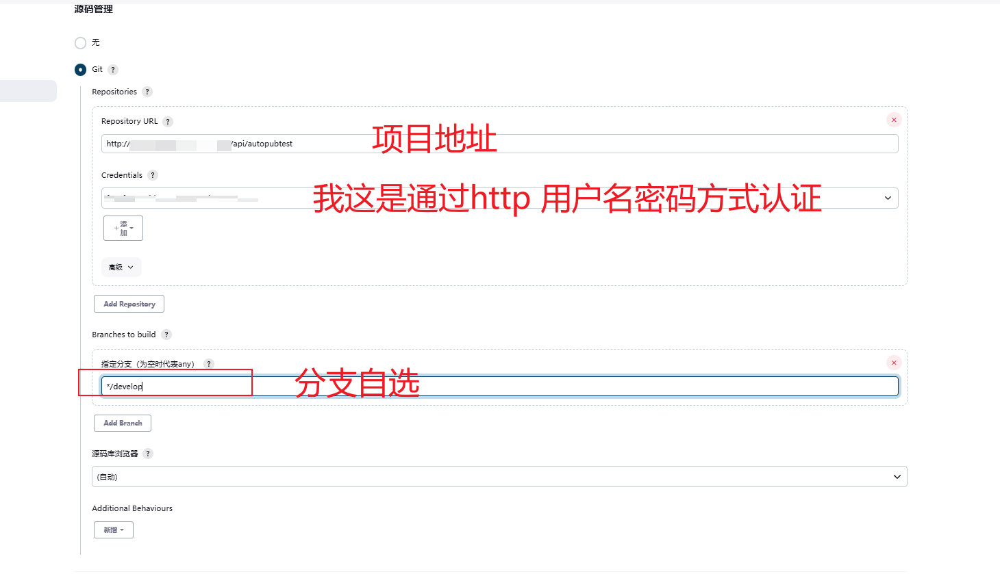

 这里提一提，通过git拉取代码，需要在jenkins的容器内部生成.ssh的公钥私钥，公钥添加到gitlab的ssh中，私钥就放到jenkins的全局变量中，Credentials就可以选择你的验证方式了。

下面的选择会影响你拉取代码，第一个设置你有可能需要在jenkins容器内部拉取一次代码，最后一个设置可以通过http拉。

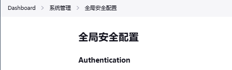

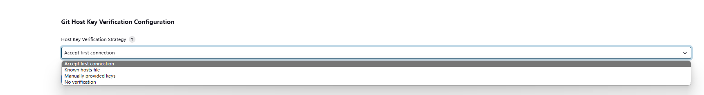

 下面继续：

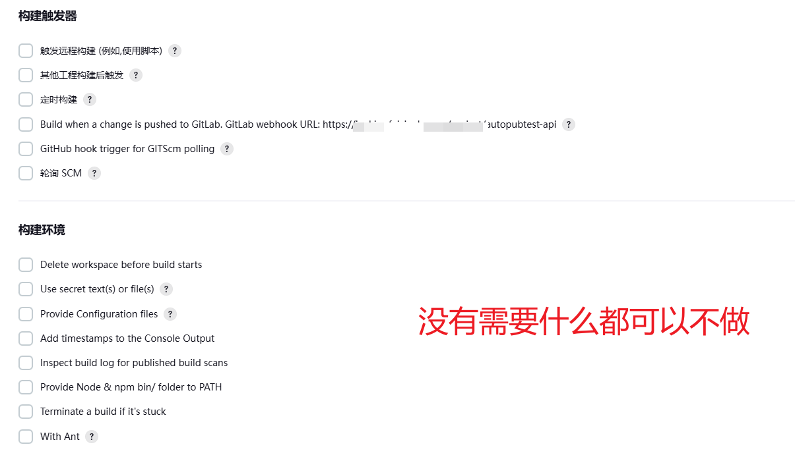

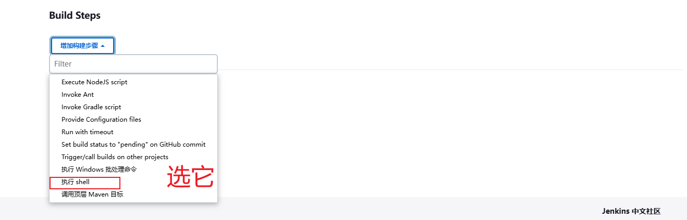

 这里我有三个步骤，编译，发布，K8S拉取镜像

第一部分

#!/bin/bash

echo "========== 当前 Branch: $GIT_BRANCH =========="
echo "========== Commit Hash: $GIT_COMMIT =========="

cd $WORKSPACE/src/autopubtest/
 dotnet restore 

if [ -d $WORKSPACE/publish ]; then
 rm -rf $WORKSPACE/publish
fi

dotnet publish -c Release -o $WORKSPACE/publish --no-restore

if [ $? -ne 0 ]; then
 echo "!!!!!!!!!!编译失败!!!!!!!!!!"
 exit 1
else
 echo "<<<<<<<<<<编译成功>>>>>>>>>>"
fi

第二部分

#!/bin/bash
ob=`echo $jobName|tr 'A-Z' 'a-z'|cut -d '.' -f 2`
imageName="autopubtest-api"
#imageTag=$TagName
imageTag=`echo "$GIT_COMMIT" | cut -b1-8`
pushRegistry=镜像仓库/项目名
 
echo "========== 开始构建镜像 =========="

docker login -u 仓库账号 -p 仓库密码 $pushRegistry
cd $WORKSPACE/publish
docker build --rm -t $imageName:$imageTag -f $WORKSPACE/docker/Dockerfile .

if [ $? -ne 0 ]; then
 echo "!!!!!!!!!!镜像构建失败!!!!!!!!!!"
 exit 1
else
 echo "<<<<<<<<<<镜像构建成功 $imageName:$imageTag>>>>>>>>>>"
fi

docker tag $imageName:$imageTag $pushRegistry/$imageName:$imageTag
docker push $pushRegistry/$imageName:$imageTag

if [ $? -ne 0 ]; then
 echo "!!!!!!!!!!镜像发布失败!!!!!!!!!!"
 exit 1
else
 echo "<<<<<<<<<<镜像发布成功 $imageName:$imageTag>>>>>>>>>>"
fi

docker rmi $imageName:$imageTag
docker rmi $pushRegistry/$imageName:$imageTag

第三部分

projectName="autopubtest-api"
#imageTag=$TagName
imageTag=`echo "$GIT_COMMIT" | cut -b1-8`
deployName=$projectName
serviceName=$projectName
containerName=$projectName
imageName=$projectName
git_message=`git log --format=format:%s -1 ${GIT_COMMIT}`
pullRegistry=仓库地址/项目名

cat $WORKSPACE/docker/k8s.yaml | sed 's|'extensions/v1beta1'|'apps/v1'|g; s|{imageRegistry}|'$pullRegistry'|g; s|{imageName}|'$imageName'|g; s|{imageTag}|'$imageTag'|g; s|{deployName}|'$deployName'|g; s|{serviceName}|'$serviceName'|g; s|{containerName}|'$containerName'|g' > $WORKSPACE/docker/k8s.value
sed -i '/^---/,$d' $WORKSPACE/docker/k8s.value

kubectl apply -f $WORKSPACE/docker/k8s.value 
if [ $? -ne 0 ]; then
 echo "!!!!!!!!!!更新失败，Deployment $deployName 可能不存在，尝试创建该Deployment!!!!!!!!!!"
 kubectl create -f $WORKSPACE/docker/k8s.value 
fi

构建的日志就略过，这里使用的是harbor仓库，注需要注意，docker login需要登陆harbor的仓库，在harbor主机host通过ip地址映射一个随意取名的域名，不要用ip，否则触发https安全检查。

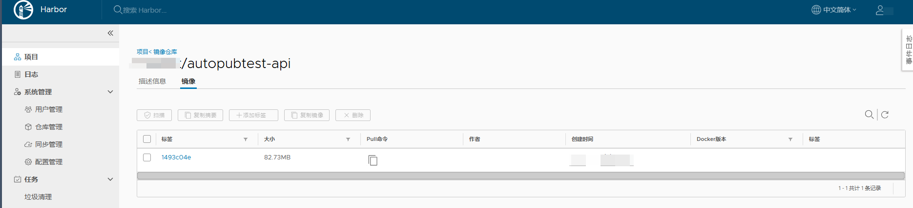

 jenkins的第三步，会触发k8s去pull仓库镜像。关于jenkins和k8s的关联就是把k8s主机的config文件拷贝到jenkins的 ./var/jenkins_home/root/.kube/config

当K8S拉取镜像后，服务正常启动。

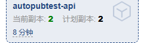

 配置字典里新建autopubtest的appsettings.Production.json文件，该名称需要与k8s。yaml的对应起来autopubtest-config

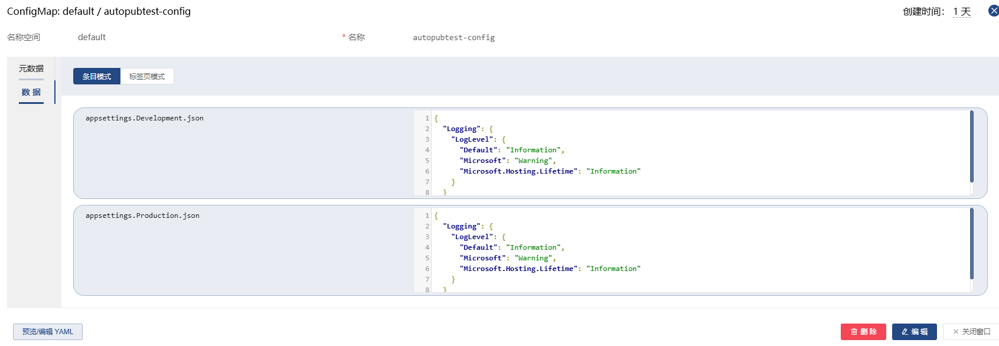

新建下面的服务

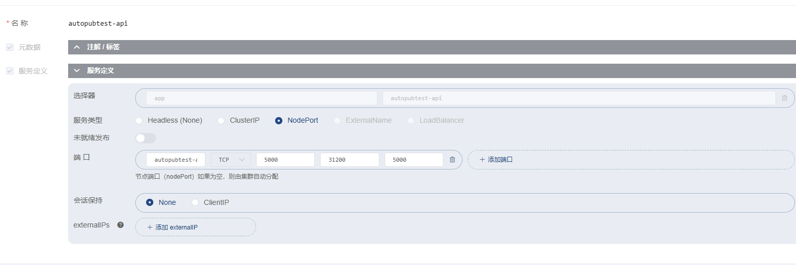

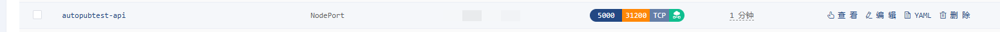

 下面就能正常使用接口了

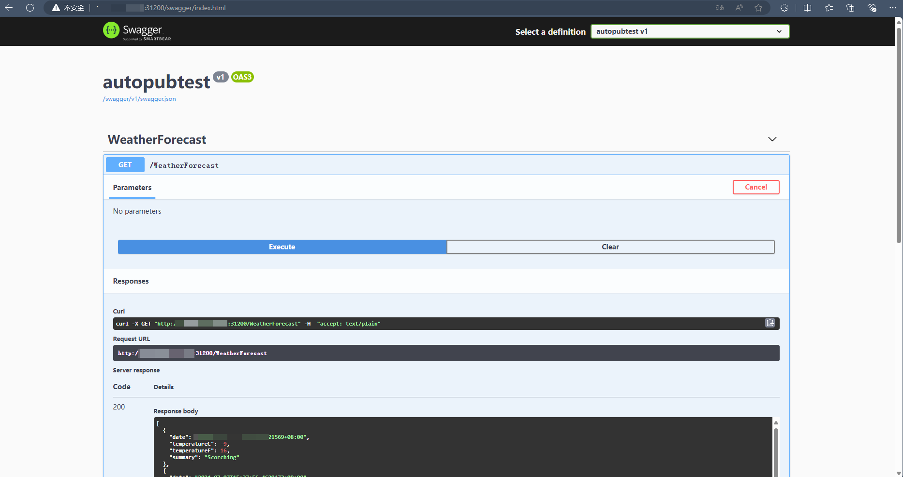

---

*本文档由博客园下载器自动生成*
