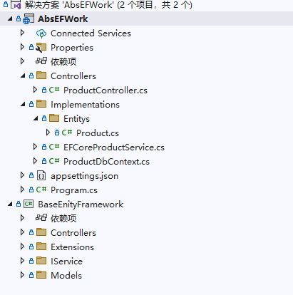
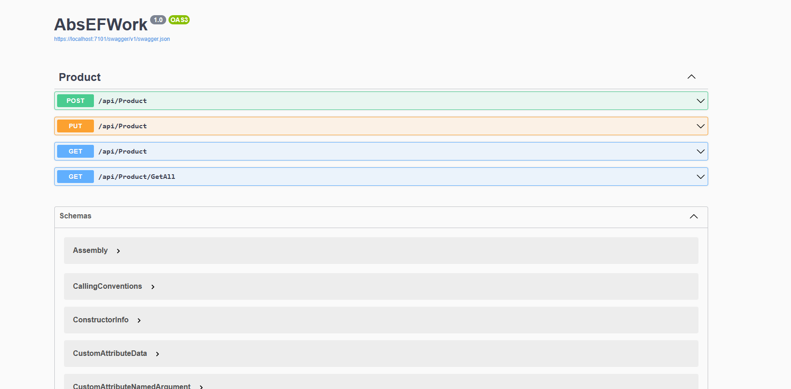

# 面向接口编程实践之aspnetcoreapi的抽象

**发布日期:** 2023-04-18  
**原文链接:** https://www.cnblogs.com/morec/p/17330706.html  
**标签:** 无

---

最为一名越过菜鸟之后的开发，需要做接口开发。下面做一个纯粹的接口编程的实例demo，仅仅是一个webapi接口的抽象。

下面是代码接口,AbsEFWork是webapi，BaseEntityFramework是一个接口库。

先介绍一下webapi的实现，代码是从底层往上层写的，阅读代码的习惯应该是自上向下。

 public class ProductController : CustomController<Product>
 {
 public ProductController(IEFCoreService<Product> efCoreService) : base(efCoreService)
 {
 }
 }

控制器代码很简单的实现了CustomController，数据载体是Product。

using BaseEntityFramework.Implementations;
using BaseEntityFramework.Implementations.Entitys;
using BaseEntityFramework.IService;
using Microsoft.EntityFrameworkCore;

namespace BaseEntityFramework
{
 public class Program
 {
 public static void Main(string[] args)
 {
 var builder = WebApplication.CreateBuilder(args);

 // Add services to the container.

 builder.Services.AddControllers();
 builder.Services.AddDbContext<ProductDbContext>(options => options.UseInMemoryDatabase("memorydb"));
 // Learn more about configuring Swagger/OpenAPI at https://aka.ms/aspnetcore/swashbuckle
 builder.Services.AddEndpointsApiExplorer();
 builder.Services.AddSwaggerGen();
 builder.Services.AddScoped<IEFCoreService<Product>, EFCoreProductService>();
 var app = builder.Build();

 // Configure the HTTP request pipeline.
 if (app.Environment.IsDevelopment())
 {
 app.UseSwagger();
 app.UseSwaggerUI();
 }

 app.UseHttpsRedirection();

 app.UseAuthorization();

 app.MapControllers();

 app.Run();
 }
 }
}

Program启动程序需要实现IEFCoreService的注入，以及ProductDbContext 的内存实现。

这样就可以启动一个swagger

对于product数据存储的具体实现，实体类product和dbcontext必须要自己去实现它。

 public class Product:IEntity
 {
 [Key]
 public int Id { get; set; }
 public string Name { get; set; }
 public string Description { get; set; }

 [Column(TypeName = "decimal(28,16)")]
 public decimal Price { get; set; }
 }

using BaseEntityFramework.Implementations.Entitys;
using Microsoft.EntityFrameworkCore;

namespace BaseEntityFramework.Implementations
{
 public class ProductDbContext:DbContext
 {
 public ProductDbContext(DbContextOptions<ProductDbContext> dbContextOptions):base(dbContextOptions)
 {

 } 
 public DbSet<Product> Products { get; set; }
 }
}

查看上面的控制器代码，有注入IEFCoreService<Product>的业务代码，对于接口肯定是需要一个实现，这里可以再次封装一个抽象的基类来(温馨提示：重复的代码，必须优化)，我这里暂时没做处理。

using BaseEntityFramework.Implementations.Entitys;
using BaseEntityFramework.IService;
using BaseEntityFramework.Models;
using Microsoft.EntityFrameworkCore;
using System.Linq.Expressions;

namespace BaseEntityFramework.Implementations
{
 public class EFCoreProductService : IEFCoreService<Product>
 {
 private readonly ProductDbContext _dbContext;
 public EFCoreProductService(ProductDbContext productDbContext)
 {
 _dbContext = productDbContext;
 }

 public async Task<bool> Add(Product entity)
 {
 _dbContext.Products.Add(entity);
 var result = await _dbContext.SaveChangesAsync();
 return result != 0;
 }

 public Task<bool> Delete(Product entity)
 {
 throw new NotImplementedException();
 }

 public async Task<IEnumerable<Product>> GetAll()
 {
 var result =await _dbContext.Products.ToListAsync();
 return result;
 }

 public Task<Product> GetEntity(Expression<Func<Product, bool>> expression)
 {
 throw new NotImplementedException();
 }

 public async Task<IReadOnlyCollection<Product>> GetList(Expression<Func<Product, bool>> expression)
 {
 var result = await _dbContext.Products.Where(expression).ToListAsync();
 return result.AsReadOnly();
 }

 public Task<PageResult<Product>> GetPageResult<Req>(PageInput<Req> pagInput) where Req : new()
 {
 throw new NotImplementedException();
 }

 public Task<bool> Update(Product entity)
 {
 throw new NotImplementedException();
 }
 }
}

上面的代码很简单易懂，最大的好处就是可以复用。实体类和 dbcontext越多这个简简单单的结构就越是有用。

BaseEntityFramework的核心逻辑就是把业务代码做了抽象，做了一个统一的模板，不管 是从那方便说都只有好处。而且作为开发只关心自己的业务代码这一块。

 public interface IEFCoreService<T> where T:IEntity
 {
 Task<bool> Add(T entity) ;
 Task<bool> Delete(T entity);
 Task<bool> Update(T entity);
 Task<IReadOnlyCollection<T>> GetList(Expression<Func<T,bool>> expression) ;
 Task<PageResult<T>> GetPageResult<Req>(PageInput<Req> pagInput) where Req:new();
 Task<T> GetEntity(Expression<Func<T, bool>> expression);
 Task<IEnumerable<T>> GetAll();
 }

以上的实例只是一个简单的demo,项目中需要做框架的话这或许是一个开始，需要做的远远不止这些。

源代码：

[liuzhixin405/AbsEFWork (github.com)](https://github.com/liuzhixin405/AbsEFWork)

---

*本文档由博客园下载器自动生成*
